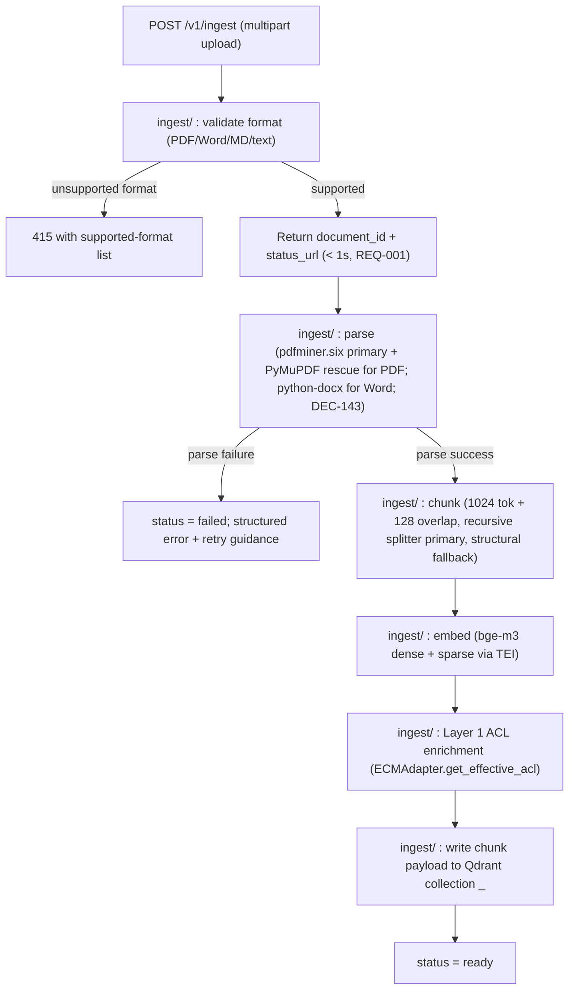
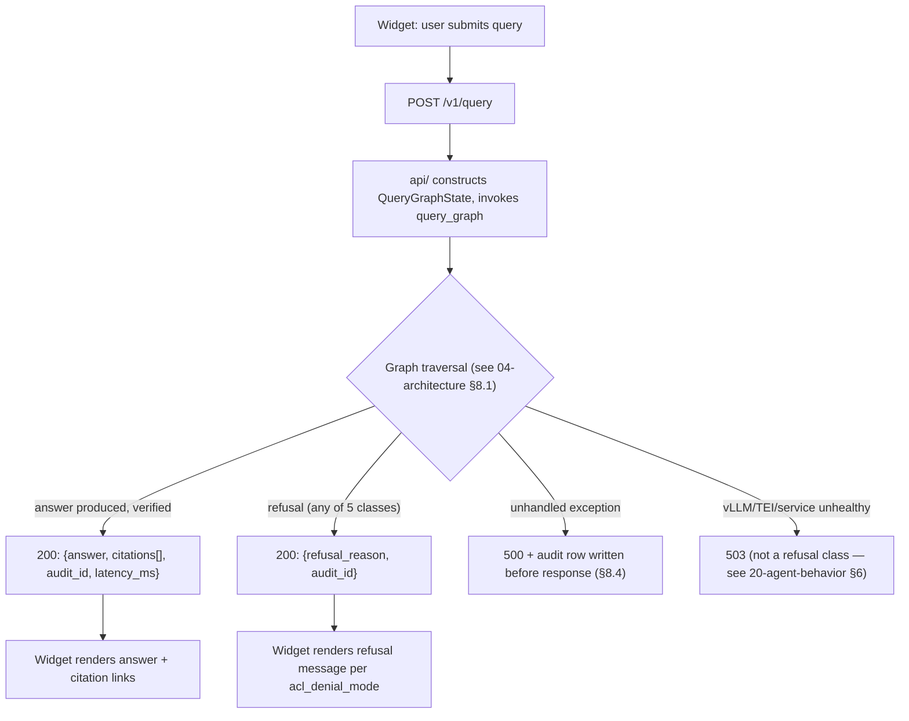
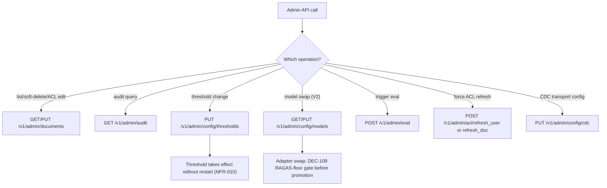
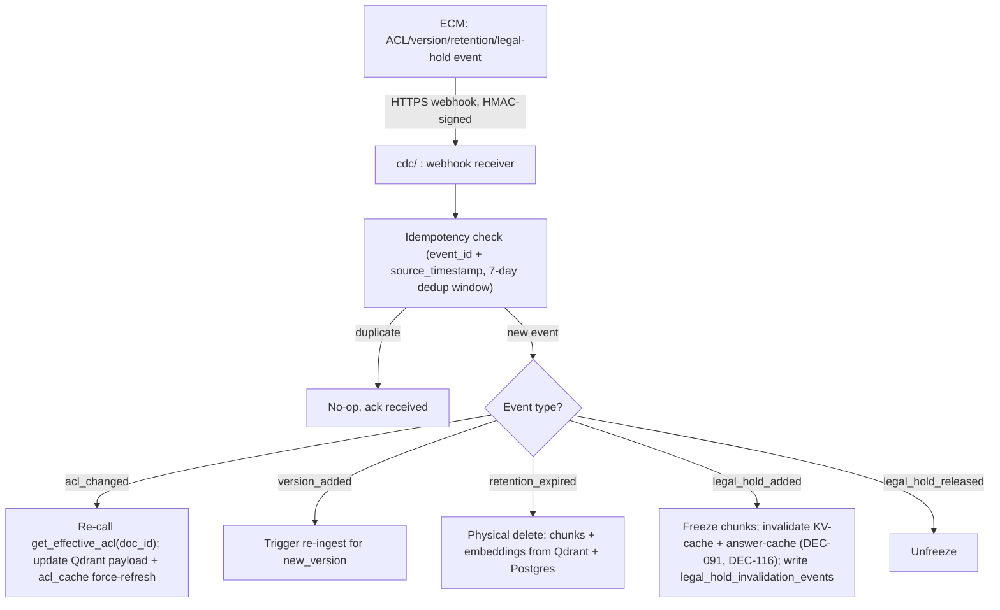
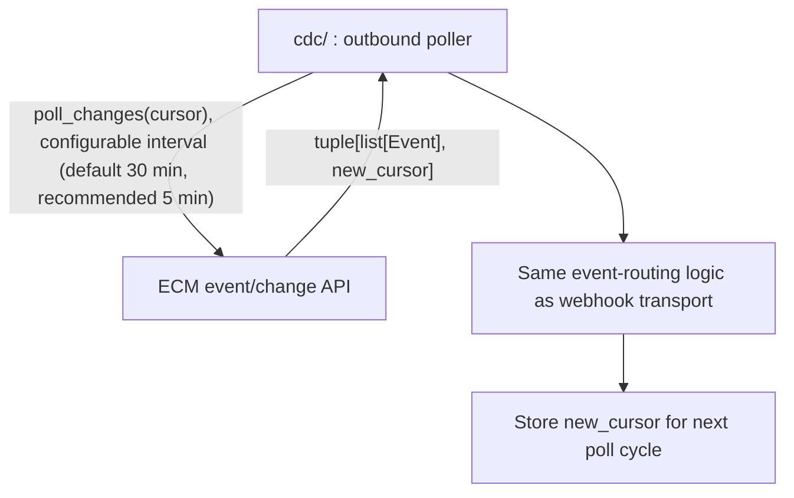
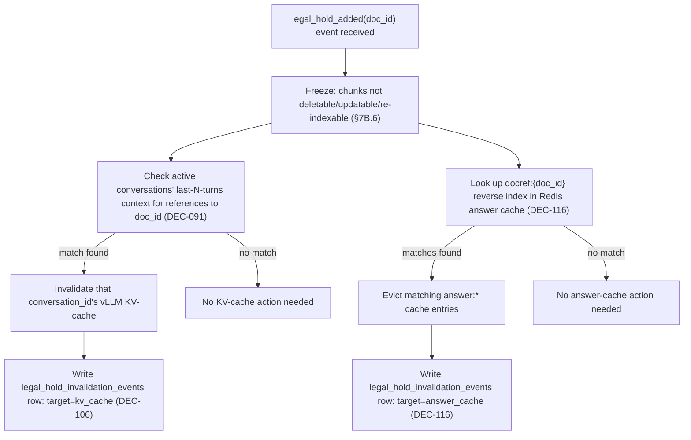
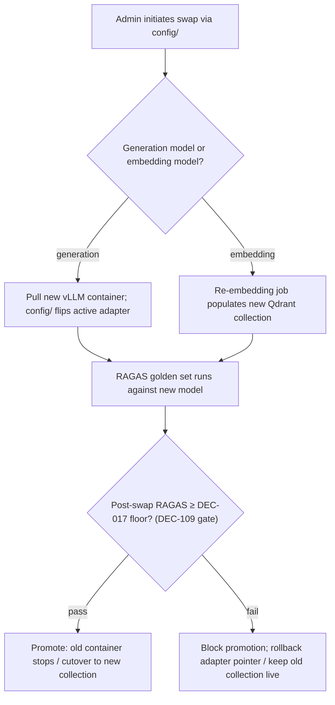

# 03 — Workflows

> Stage 7 (`spec-writer`) deliverable. Documents user/system/operational workflows as sequences and state transitions. Cross-references `04-architecture.md` (module map, pipeline detail) and `20-agent-behavior.md` (turn pipeline, failure taxonomy) rather than duplicating their content — this file's job is the *workflow* view (who does what, in what order, what happens on failure), not re-deriving architecture.

## Plain-English Summary

Six workflows matter: getting a document into the system, asking a question and getting an answer, an admin managing documents/ACL/thresholds, the ECM telling GroundedDocs something changed (two transport variants), a document going under legal hold, and an operator swapping a model. Each has a happy path, an error path, and — because this product's core promise is refusal-over-guessing — a "the system correctly declines" path that is not an error at all.

## Goals

- Give an implementer the sequence of steps for every cross-module workflow without re-deriving them from `04-architecture.md`'s module map
- Make error/recovery/retry behavior explicit per workflow, not just per module
- Provide Mermaid diagrams for the workflows with the most cross-module complexity

## Non-Goals

- Re-deriving the LangGraph node-internal pipeline detail — that's `04-architecture.md` §8.1 and `20-agent-behavior.md` §2.1
- UI screen flows — MVP has no standalone UI beyond the widget (`91-stage3-ux-skip.md`)
- V2/V3 workflows (ReAct, review queue, A/B traffic split) — noted where relevant but not detailed

## Context

Every workflow below assumes the with-ECM canonical MVP path (DEC-053) unless marked as the `§5A` no-ECM variant.

## Workflow 1 — Document Ingest

### User Journey Map

Admin (or the vendor's automated ECM sync) uploads a document → system parses, chunks, embeds, indexes → document becomes queryable.

### System Workflow Map

### Happy Path

1. Admin/vendor calls `POST /v1/ingest`; receives `document_id` + `status_url` within 1 second (REQ-001)
2. Client polls `GET /v1/ingest/{document_id}` for status: `pending` → `parsing` → `indexing` → `ready`
3. A 100-page born-digital PDF reaches `ready` in ≤ 60s on reference hardware (REQ-002)

### Error Paths

| Failure point | Behavior |
|---|---|
| Unsupported format at upload | HTTP 415 with the supported-format list; no `document_id` issued |
| Parse failure (`pdfminer.six` fails, PyMuPDF rescue also fails) | `status = failed`; structured error body with retry guidance; no partial chunks written |
| Embedding service (TEI) unreachable during ingest | Job requeues via `job_queue` (`SKIP LOCKED`, DEC-038); admin sees `status = pending` with an ops-visible retry count, not a silent hang |
| ECM `get_effective_acl()` unreachable at ingest | Ingest blocks — a chunk must never be written to Qdrant without Layer 1 ACL payload (NFR-012 adjacent: writing a chunk with no ACL payload would default to universally-visible, the opposite of fail-closed). Job requeues with backoff |

### State Transitions

`pending → parsing → indexing → ready` (happy path); any state `→ failed` on unrecoverable error. See `05-data-model.md`'s `documents.lifecycle_state` for the separate whole-document lifecycle (this ingest-status state machine is per-job, not persisted on the `documents` row itself — it lives in `job_queue`).

### Recovery and Retry Behavior

Ingest jobs are durable (Postgres `job_queue`, DEC-038) — a `docker compose restart` mid-ingest resumes from the last completed step, not from scratch, because each step (parse/chunk/embed/index) writes its intermediate result before advancing the job status. This is the RC-T6-02-adjacent "ingest resume" behavior; the concrete resume mechanics (which step boundaries are checkpointed) are detailed in `10-build-plan.md`'s ingest-pipeline task (Phase 2 of this Stage 7 generation).

## Workflow 2 — Query / Answer Turn

This is the hot path. Full node-internal detail is `04-architecture.md` §8.1 and `20-agent-behavior.md` §2.1 — this section is the workflow-level view: who initiates, what the caller sees, and the three possible terminal outcomes (answer, refusal, error).

### User Journey Map

End user types a question in the embedded widget → sees a cited answer, an honest refusal, or (rarely) an error → optionally clicks a citation to see the source.

### System Workflow Map

### Happy Paths

- **Answered**: query → parallel `[safety_input ∥ retrieve]` → `acl/` join → `rerank/` → `generate/` → `safety_output/` → `verify/` (mechanical + NLI) → `audit/` → 200 with answer + citations
- **Refused, honestly**: any of the 5 refusal classes (`no_recall`, `low_grounding`, `access_denied`, `policy_blocked`, `verification_unavailable`) — all returned as HTTP 200 with a typed `refusal_reason`, never as an error (DEC-042). This is a **happy path**, not a failure — refusal-on-low-confidence is the product's core differentiator, not a degraded outcome

### Error Paths

See `20-agent-behavior.md` §6 (behavior-under-failure table) for the complete, authoritative list — not duplicated here. Workflow-level summary: HTTP-error outcomes (503 for vLLM/TEI unhealthy, 504 for generation timeout, 500 for unhandled exceptions) are distinct from refusal-class outcomes (which are always HTTP 200). The widget must render these two categories differently — a 503 is "try again later," a `no_recall` refusal is "the system answered honestly that it doesn't know."

### Permission and Role Paths

- Bearer JWT (RS256/ES256/EdDSA) or admin API key on every authenticated endpoint (NFR-009)
- `access_denied` refusal path: Layer 2 live-trim removes the last grounded chunk → user sees either the real reason (`transparent` mode, default) or a masked `no_recall` (`opaque` mode) per customer configuration (DEC-042, DEC-069) — the audit log always records the real reason regardless of mode

### State Transitions

Conversation-level: `conversation_id` persists across turns via server-reconstructed history (last N=5 turns from `audit_events`, §2.4) — no client-supplied history is ever trusted.

### Notifications and Background Jobs

- ECM audit write-back (`write_audit_access`) runs async, best-effort, after the response has already been returned to the user (REQ-045) — retried with exponential backoff; persistent failure surfaces as an ops alert, never blocks or delays the user-facing response (NFR-013)

### Recovery and Retry Behavior

- Client may retry a `504` (generation timeout) with the same `conversation_id` — the server-side history reconstruction means a retry is not "starting over," it correctly picks up the prior turns
- A `verification_unavailable` refusal (circuit breaker tripped, DEC-063) is not itself retriable in a way that would help — the client should back off and retry after the circuit breaker's configured window, not immediately

## Workflow 3 — Admin Operations

### User Journey Map

Enterprise admin manages document lifecycle, ACL, refusal thresholds, and runs eval — via `06-api-contracts.md`'s Admin API surface (no admin console UI in MVP; V2 territory).

### System Workflow Map

### Happy Paths

- Document lifecycle: upload → list → per-document ACL edit → soft-delete (configurable retention) — REQ-010
- Threshold config: `PUT /v1/admin/config/thresholds` takes effect for new turns without a service restart (NFR-010)
- Eval trigger: `POST /v1/admin/eval` runs the golden-set suite (smoke or full ring, DEC-078); result available via the same run history queried by `10-build-plan.md`'s quality gates

### Error Paths

- ACL edit conflicting with an in-flight query: no special handling required — Layer 2's live JIT re-check (§7B.4) means an ACL edit takes effect on the *next* query naturally, without needing to interrupt in-flight requests
- Model swap attempted while a prior swap's RAGAS-floor check is still running: the second swap request is rejected with a 409-style conflict (only one swap-in-progress per role at a time, enforced by `model_versions`'s partial unique active-row constraint at the database level, `07-database.md`)

### Permission and Role Paths

Admin API key (or admin-scoped JWT) required on every endpoint in this surface (NFR-009); no anonymous admin access. **Admin-scoped JWT claim enforcement is not yet shipped** — see `06-api-contracts.md`'s Authentication section, DEC-145, `TASK-040`.

## Workflow 4 — ECM CDC Sync

Two transport variants, both first-class MVP topologies (DEC-102): webhook (default when network segmentation allows) and poll-only (outbound-only, for segmented networks).

### System Workflow Map — Webhook Transport

### System Workflow Map — Poll-Only Transport

### Happy Paths

- Webhook path: event delivery → applied state → ≤ 60s end-to-end (DEC-056)
- Poll-only path: applied within the configured interval + one poll-cycle jitter — this is the accepted SLA for this topology, not a degraded state (NFR-032); no ops alert fires for latency within the configured interval
- Weekly (admin-configurable) full reconciliation crawl catches drift neither transport's differential window would catch (DEC-090) — detect + ops alert only, no auto-remediation in MVP

### Error Paths

- Webhook delivery failure → 30-minute re-poll fallback (DEC-051, DEC-056) → sustained failure triggers an ops alert (NFR-016) so the customer knows the retention SLA has temporarily degraded
- Duplicate/out-of-order event delivery → idempotency key dedup within a 7-day window (RC-T8-01) prevents double-processing
- ECM API unreachable during a poll cycle → cursor is not advanced; next poll cycle retries from the same cursor (no event loss, at the cost of a delayed poll)

### Recovery and Retry Behavior

Both transports reuse the same underlying `job_queue`-backed retry mechanism (Postgres `SKIP LOCKED`, DEC-038) — a CDC processing failure requeues rather than silently drops the event.

## Workflow 5 — Legal Hold Freeze + Cache Invalidation

This workflow spans three stores and is worth its own diagram given how many prior review rounds (DEC-091, DEC-106, DEC-116) had to close gaps here.

### Why This Workflow Exists as a Named Sequence

A document being frozen in the vector store does not, by itself, stop already-generated content from being re-served — via either (a) a live conversation's KV-cache still holding the frozen document's content from an earlier turn, or (b) the Redis answer cache still holding a cached answer that cited the frozen document. Both are closed (DEC-091 for (a), DEC-116 for (b)) and both must complete, and be independently audited, for the freeze to be litigation-hold-safe.

### Error Paths

- Cache invalidation action succeeds but the `legal_hold_invalidation_events` audit write fails: this is itself an ops-alerting condition (see `07-database.md`'s transaction-consistency note) — silent success with no audit trail is the one outcome this workflow must never produce
- `legal_hold_added` arrives mid-reindex for the same document version: the reindex is aborted for that chunk (§7B.6); the freeze wins

## Workflow 6 — Model / Embedding Swap (V2, LCC Tier 3)

Included here for completeness even though the *service* is V2 (REQ-033/034 automation) — the schema and gate are MVP (DEC-059, DEC-109).

### Happy Path

Swap → RAGAS re-run → pass → promote. Rollback (on either an explicit admin decision or an automatic RAGAS-floor failure) completes within ≤ 60 seconds for the embedding case (REQ-034 acceptance criterion) and ≤ 10 seconds for the generation-model case (REQ-033 acceptance criterion).

### Error Path

RAGAS floor failure → swap is blocked from becoming the new default, per the DEC-109 quality gate extension — this is new behavior as of Round 6's Fix Audit; previously only safety-rail model swaps had this explicit pass/fail gate (DEC-092), and generation/embedding swaps only produced a delta report with no stated blocking threshold.

## Dependencies

- `04-architecture.md` §5 (module map), §7B (two-layer auth + CDC), §8.1 (turn pipeline node detail), §9.3 (LCC Tier 3 procedure)
- `20-agent-behavior.md` §2.1, §6 (turn pipeline + failure taxonomy — authoritative source, not duplicated here)
- `05-data-model.md` (entity lifecycle this workflow file narrates)
- `06-api-contracts.md` (this phase — endpoint shapes referenced above)
- `13-decision-log.md` DEC-038, DEC-042, DEC-051, DEC-053, DEC-056, DEC-059, DEC-063, DEC-069, DEC-090, DEC-091, DEC-096, DEC-102, DEC-106, DEC-109, DEC-116

## Decision References

DEC-038, DEC-042, DEC-045, DEC-046, DEC-051, DEC-053, DEC-056, DEC-059, DEC-063, DEC-064, DEC-069, DEC-071, DEC-090, DEC-091, DEC-096, DEC-102, DEC-106, DEC-109, DEC-116
