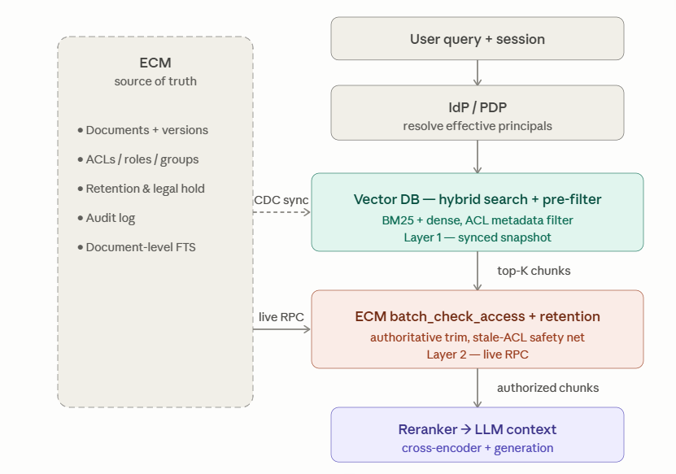
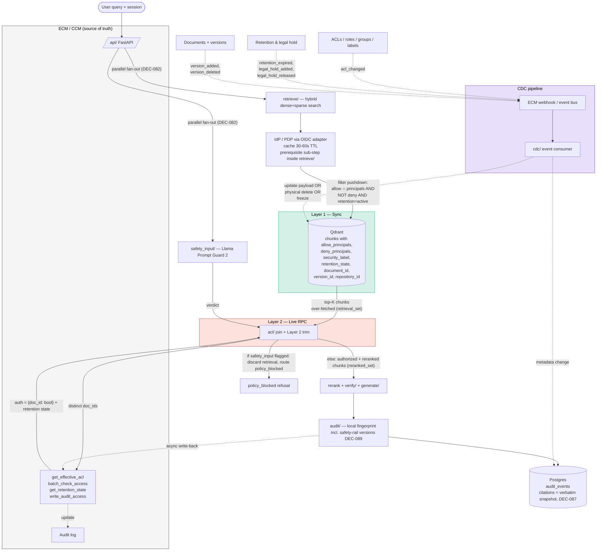

# 04 — Architecture

> Stage 4 deliverable produced by `software-architect` + `ai-agent-architect` roles (run inline).
> Reads `confirmed-context.md`, `01-product-brief.md`, `02-requirements.md`, `90-stage1-trend-research.md`.
> Decisions pinned in `13-decision-log.md` DEC-032 through DEC-041.

## 1. Plain-English summary

GroundedDocs is built from open-source primitives wired into a typed-state graph. The customer runs everything on their own hardware as a small set of docker-compose services: a FastAPI server (orchestrating a LangGraph 1.2.x pipeline), a vLLM-served generation model, two TEI-served embedding/rerank models, two safety-rail models (`Llama Prompt Guard 2` input + `Llama Guard 3 8B` output), `NeMo Guardrails` for declarative policy, a Qdrant vector store, a Postgres database, and a Redis (or Valkey) cache. A query flows through a LangGraph traversal — **input rail → retrieval → ACL trim → rerank → generation → output rail → verification** (citation + NLI + refusal policy) → audit log. Verification is the differentiator — the only node that checks a generated answer's claims against the retrieved evidence (citation + NLI). It is **not** the only rejection point: `safety_input/` and `safety_output/` (layered safety rails, §4.3) also produce a `policy_blocked` refusal, before retrieval and before verification respectively (DEC-082). Under V2 (REQ-020), `verify/` can also feed a failed-claim list back to `generate/` via a typed graph edge to drive mid-flight rewriting.

Reference stack at the customer-hardware floor (DEC-041 + DEC-079, supersedes DEC-052's 16 GB on layered-rails adoption; embedding choice revised by DEC-086, sparse-source corrected by DEC-142): one GPU ≥ 24 GB VRAM, 64 GB RAM, 200 GB SSD, running an English-optimized open-weight generation model (`Llama-3.1-8B-Instruct` int4 or `Mistral-Small-24B-Instruct` int4 reference; `Qwen2.5-7B-Instruct` int4 as fallback) + `bge-m3` embedding for dense retrieval (**DEC-086**: reverted from `bge-large-en-v1.5` for stronger dense-retrieval quality and 8192-token context) + a dedicated SPLADE-architecture model for sparse retrieval (**DEC-142, 2026-07-15**: bge-m3's own sparse output is not servable via TEI — see the Embedding rows below) + `bge-reranker-v2-m3` (English-effective) rerank + `deberta-v3-base-mnli` NLI + `Llama Prompt Guard 2` + `Llama Guard 3 8B` + NeMo Guardrails + Qdrant + Postgres 16 + Redis 7.x (or Valkey 8.x). Dev environment is cloud-rented per DEC-068 / DEC-074 (¥800-1,200 solo floor / ¥2,000-3,000 team envelope) using the same image.

## 2. Architecture summary (the 5-line elevator) — revised Round 2 (2026-06-29)

1. **Stack**: Python 3.14 (re-pinned 2026-07-11, DEC-134 — was 3.12; DEC-033's 3.12 choice was not stale, this is a deliberate re-decision matching the actual Phase 1 execution environment) + FastAPI + **LangGraph 1.2.x** (version corrected 2026-07-08, DEC-131 — was "0.2.x", already stale when DEC-075 pinned it) + vLLM + TEI + Qdrant + Postgres 16 + **Redis / Valkey** + docker-compose.
2. **Hybrid storage** (DEC-034 + DEC-076): Postgres carries relational + audit + persistent queue; Redis carries hot-path cache (prompt / answer / ACL / embedding) + optional in-request queue.
3. **`verify/` is the hot path** (DEC-005, DEC-037, DEC-075): citation check + NLI + refusal **inside a LangGraph node** with a feedback edge back to `generate/` reserved for V2 REQ-020.
4. **Layered safety rails in MVP** (DEC-077): `Llama Prompt Guard 2` input rail + `Llama Guard 3 8B` output rail + `NeMo Guardrails` orchestration rail + structural separators + server-reconstructed history.
5. **Built from scratch at the node-internal level, framework-orchestrated at the pipeline level** (DEC-032 + DEC-075). RAGFlow / LlamaIndex Haystack are still rejected as the *outer* scaffold (positioning + REQ-033 compatibility); LangGraph is adopted as the *orchestration* scaffold (mid-flight rewriting + V2 ReAct compatibility).

## 3. Build approach decision (DEC-032)

### 3.1 Options compared

Four candidates, scored 1–5 across seven dimensions (5 = best). DEC-057 added two columns (AI auditability, compliance alignment difficulty) so the rationale reflects the dual driver of differentiation + provable compliance. Full comparison preserved here for review traceability.

| Dimension | A. From scratch (chosen) | B. LlamaIndex scaffold | C. Haystack scaffold | D. Fork RAGFlow |
|---|---|---|---|---|
| Differentiator depth (verify/) | **5** | 3 | 3 | 2 |
| Solo 3-month feasibility (DEC-026) | 4 | 5 | 3 | 5 / 1 (long-run) |
| Learning value (DEC-068 intent) | **5** | 3 | 3 | 2 |
| Long-term maintenance | **5** | 2 | 3 | 1 |
| Customer install footprint | **5** | 3 | 2 | 2 |
| **AI auditability** (per DEC-057) — can every model + threshold + prompt at answer time be reconstructed from audit | **5** | 2 | 3 | 2 |
| **Compliance alignment difficulty** (per DEC-057) — effort to map system features to SOX / HIPAA / AU Privacy Act / NDB controls | **5** | 2 | 3 | 1 |
| **Total** | **34** | 20 | 20 | 15 |

### 3.2 Why from-scratch wins despite the obvious objection

> **Round 2 supersede (DEC-075, 2026-06-29)**: this section's rationale #2 ("frameworks resist mid-flight rewriting") is **retired**. 2026 senior-architect default for per-claim verification is graph orchestration (LangGraph 1.2.x, LlamaIndex Workflows 1.0, Burr) — see `92-stage5-review-memos.md` R2-HL-01 + `92a-stage5r2-benchmark.md` §Topic 1 / Gap 2.
>
> **Round 3 framing refinement (DEC-082 + S5, 2026-06-29)**: **The orchestration layer is modeled as a typed execution graph. LangGraph 1.2.x is the current runtime implementation** (version corrected 2026-07-08, DEC-131 — this framing was written specifically to survive exactly this kind of runtime-version drift; only the version literal moved, not the framing itself)**.** Alternative runtimes (LlamaIndex Workflows 1.0, Burr) are documented as zero-cost swaps because the node implementations are framework-agnostic Python — node internals (retrieve logic, verify algorithms, ACL adapters, audit semantics) do not import LangGraph primitives. This framing protects against runtime obsolescence and keeps GroundedDocs's positioning truthful when describing its build-vs-frameworks posture.
>
> GroundedDocs adopts LangGraph 1.2.x for pipeline orchestration **today** while keeping build-from-scratch for node internals. Rationales #1 / #3 / #4 below survive at the node level.

The objection is "frameworks save time". For the node-internal surface, that trades off against four hard requirements:

1. **REQ-005 (citation verification) lives on the generation hot path**. In a framework's default output pipeline, inserting NLI + mechanical checks is awkward. The `verify/` node implementation is hand-rolled inside the LangGraph node; only orchestration is delegated.
2. **REQ-020 (claim decomposition) is now a natural graph extension.** Under DEC-075, mid-flight rewriting becomes a feedback edge from `verify/` back to `generate/` with the failed-claim list as state. LangGraph's typed state + edge routing is purpose-built for this. The original "frameworks resist mid-flight rewriting" framing was outdated — 2026 production-grade graph frameworks are designed for it.
3. **REQ-035 (audit context fingerprint)** requires capturing model + embedding + prompt versions at every turn. The `audit/` node owns this capture; LangGraph's state envelope passes the fingerprint between nodes without abstraction-layer interference.
4. **LCC services (DEC-028)** sell the ability to swap models without disrupting the customer. The `config/` model adapter abstraction (REQ-033) lives inside the `generate/` and `embed/` nodes — orthogonal to the orchestration framework.

The surface area we own is bounded (10 node implementations, ~200–500 LOC each, plus the LangGraph state schema). This is smaller than the integration code we would write *against* a higher-level RAG framework (LlamaIndex, Haystack, LangChain runnable composition).

### 3.3 Why fork RAGFlow was the most tempting and the most dangerous

Fork RAGFlow gets the first demo running fastest. It also:

- Forces our positioning to live inside someone else's UI and prompt scaffold (dilutes the brand)
- Makes every upstream change a merge problem
- Conflicts directly with REQ-033 model adapter abstraction (RAGFlow has its own)
- Turns the "OSS first wave" channel (DEC-025) into "you are a RAGFlow distribution", not "you are GroundedDocs"

Rejected.

## 4. Tech stack

### 4.1 By layer

> **English-only reference stack per DEC-052** — generation and NLI rows are re-selected to drop multilingual overhead. DEC-013 / DEC-037 multilingual rationale superseded. **Embedding row reverted to `bge-m3` per DEC-086** (DEC-052's embedding-model narrowing to `bge-large-en-v1.5` is superseded; DEC-014's embedding pin is reinstated) — see the row below for why.
>
> **Round 2 supersede (DEC-075 / DEC-076 / DEC-077, 2026-06-29)**: Orchestration row updated to LangGraph 1.2.x. Cache layer row added (Redis / Valkey) per DEC-076. Three safety-rail rows added (input rail, output rail, orchestration rail) per DEC-077. Hardware-floor row revised per DEC-079 (16 GB → 24 GB). Observability row carries roadmap-risk annotation (Langfuse acquired by ClickHouse 2026-01).
>
> **Round 4 supersede (DEC-086..093, 2026-07-03)**: Embedding row reverted to `bge-m3` (DEC-086, restores hybrid dense+sparse retrieval for REQ-003). Rerank row backend clarified: ONNX Runtime is now the MVP default (DEC-093), not an optional tuning step. Safety: output rail row gains a quantization-validation gate note (DEC-092). Safety: orchestration rail row's "no GPU footprint" claim is scoped to the MVP-shipped declarative-only ruleset (see row note).

| Layer | Choice | Why | Notes |
|---|---|---|---|
| Language | Python 3.14 (re-pinned DEC-134, was 3.12) | OSS LLM ecosystem is Python-native; DEC-033, version re-pinned DEC-134 | Type hints + Pydantic everywhere |
| API | FastAPI | Async, OpenAPI auto-gen, fits REQ-008; DEC-033 | One process; uvicorn |
| **Pipeline orchestration** | **LangGraph 1.2.x (typed-state DAG with feedback edges)** | **DEC-075; 2026 production default for per-claim verification loops per `92a-stage5r2-benchmark.md` §Topic 1** | **State envelope carries query, retrieval set, draft answer, citations, verify result, audit fingerprint; feedback edge from `verify/` → `generate/` realises REQ-020** |
| LLM serving | vLLM HTTP mode | DEC-012; production default per trend research §4 | Single GPU; PagedAttention; prompt-cache + KV-cache reuse mandatory (DEC-054) |
| Generation model (floor rig) | `Mistral-Small-24B-Instruct` int4 (AWQ) — MVP reference | DEC-041 + DEC-079 (24 GB floor); ~14 GB VRAM | Alternate: `Llama-3.1-8B-Instruct` int4 (~5 GB VRAM) for headroom-constrained installs |
| Generation model (degraded) | `Qwen2.5-7B-Instruct` int4 or `Phi-4` | DEC-079 degraded mode | Documented latency/quality disclaimer |
| Embedding (dense) | `bge-m3` via TEI, dense output only | DEC-035 + **DEC-086 (reverts DEC-052's embedding narrowing)** | Separate container; `bge-large-en-v1.5` (the interim English-only pick) was dense-only too but weaker on dense-retrieval quality and context length, which is why DEC-086 reverted to `bge-m3` — **not** because `bge-m3` serves sparse via TEI (it doesn't; see the sparse row below). ColBERT-style multi-vector is also a `bge-m3` capability not exposed via TEI (same root cause as the sparse gap) |
| Embedding (sparse) | A dedicated SPLADE-architecture model via TEI, in its own deployment (**DEC-142, 2026-07-15**; e.g. TEI's own README example `naver/efficient-splade-VI-BT-large-query` — exact production model TBD at deployment time) | **DEC-142** | Separate container from the dense embedding model. **Corrects a claim this table previously carried**: "TEI serves dense + sparse only" (added 2026-07-13, cross-model review R.26, citing `huggingface/text-embeddings-inference#141`) — that review caught that ColBERT isn't exposed via TEI but concluded sparse was fine; re-reading the same issue's full comment thread (not just its existence) during `document-ingest-pipeline` Issue 01's implementation found a contributor stating plainly that bge-m3's sparse output needs the same unexposed `last_hidden_state` ColBERT does — TEI cannot serve **either** of bge-m3's non-dense outputs, only its dense one. REQ-003's hybrid dense+sparse retrieval now draws its two scores from two independently-trained models (bge-m3 dense + this SPLADE model), not one jointly-trained model — DEC-142 records the accepted trade-off and the alternatives considered |
| Rerank | `bge-reranker-v2-m3` via TEI (English-effective despite multilingual name), **ONNX Runtime backend (MVP default per DEC-093)** | DEC-035 + DEC-093 | Separate container; the model is multilingual but performs well on English-only retrieval; no English-only replacement currently outperforms it at 2026. TEI's default (non-ONNX) backend is a documented **non-default fallback only** — see NFR-027 |
| Vector store | Qdrant single-node | DEC-034 (partial; vector store unchanged); dense + sparse + payload filter | One collection per `(corpus_id, embedding_model_version)` — double-collection naming convention at MVP per DEC-059 |
| Relational store | Postgres 16 | DEC-034 | Documents, ACL, audit (with `context_fingerprint` non-null columns per DEC-060), persistent queue |
| **Cache / hot-path store** | **Redis 7.x or Valkey 8.x (OSS fork)** | **DEC-076 (supersedes DEC-034 partial); 2026 mature default for self-hosted RAG above ≤2 concurrent** | **Used for: (a) prompt cache, (b) answer cache keyed by `(query_hash, ACL_set, model_version)` with a secondary `doc_id → cache-key` reverse index for legal-hold targeted invalidation (DEC-109), (c) ACL cache with TTL (§7B.5), (d) embedding cache. Valkey recommended due to Redis 2024 license change** |
| Persistent task queue | Postgres `SKIP LOCKED` | DEC-038; durable jobs (ingest, CDC re-poll) | Sufficient through V2 |
| In-request work queue (optional) | Redis stream / list | DEC-076 — for low-latency in-request fan-out only | Persistent jobs stay on Postgres; Redis-backed queue is opt-in |
| Doc parsing | `pdfminer.six` + PyMuPDF + python-docx | DEC-036, **DEC-143** | **`pdfminer.six` primary + PyMuPDF rescue for PDF (corrected 2026-07-15 — Unstructured.io's PDF module has a hard, unconditional torch/OCR dependency, see DEC-143); python-docx direct for Word, unchanged. Unstructured.io itself has zero remaining role in either format** |
| Chunking | 1024-token chunks + 128-token overlap + recursive splitter primary, structural splitter fallback | DEC-065 | `chunk_id` immutable per `(document_id, version_id, sequence)` |
| NLI (faithfulness check) | `deberta-v3-base-mnli` (English-only baseline) | DEC-037 (superseded by DEC-052); **CPU-resident by design, not GPU-resident (confirmed DEC-109, resolves prior §4.2.2 GPU-subtotal contradiction)** | English-only allows smaller base model in place of large; AutoGDA-adapted variant in V2; ≤600ms warm NLI budget (§7B.12) is achievable CPU-side for a base-class DeBERTa model with batching, so GPU residency is not required |
| **Safety: input rail** | **`Llama Prompt Guard 2` (int4)** | **DEC-077; prompt-injection / jailbreak detection on inbound query and retrieved chunk content; ~1.5 GB VRAM** | **2026 layered-rail default per `92a-stage5r2-benchmark.md` §Topic 9. Runs on the same GPU as `verify/`** |
| **Safety: output rail** | **`Llama Guard 3 8B` int4 **AWQ quantization** (DEC-082 supersedes DEC-077 quantization detail)** | **DEC-077 + DEC-082; harmful-output classification on draft answer pre-emit; ~2.5 GB VRAM (was ~5 GB at standard int4)** | **2026 layered-rail default. Output rail decision feeds `verify/` refusal path. Customer-side swap to `ShieldGemma 2B` / `Llama Guard 3 1B` / BERT-class fine-tune supported via the `SafetyRailAdapter` Protocol (§4.3, REQ-050). Per DEC-092: the AWQ quantization (and any future adapter quantization change) ships as MVP default only after a documented hazard-detection accuracy-preservation check against the unquantized baseline** |
| **Safety: orchestration rail** | **NeMo Guardrails (CPU/RAM, declarative policy DSL)** | **DEC-077; declarative policy enforcement layered above LangGraph node decisions** | **No GPU footprint *for the MVP-shipped configuration* (declarative rules only — no LLM self-check rails, no embedding-based topical rails). If a customer enables NeMo's LLM-backed rail types, GPU/VRAM usage no longer holds at zero and must be re-budgeted against §4.2.2. Composes with LangGraph by intercepting graph state transitions; integration pattern in `20-agent-behavior.md`** |
| AuthN/AuthZ | JWT bearer + admin API key | NFR-009; OIDC adapter MVP-only per DEC-048 | SAML / Kerberos / LDAP → V2 roadmap (would require a token-exchange sidecar in front for MVP) |
| JWT signature algorithms | RS256, ES256, EdDSA allowed; HS* and none rejected | DEC-061 | JWKS rotation via endpoint (non-air-gap) or pre-imported static bundle (air-gap, DEC-062) |
| Container orchestration | docker-compose | NFR-001, REQ-011 | Helm + HA in V3 (REQ-026) |
| Widget | Web Component + iframe (dual) | DEC-040, REQ-009 | Same JS source, two shipping modes; CSP / postMessage origin / frame-ancestors configured per §12.5 |
| Eval | RAGAS + custom golden-set runner | DEC-016, REQ-013, REQ-014; **goldset 150-200 + 50-prompt smoke subset per DEC-078** | DeepEval CI in V2; standalone "NLI accuracy" metric per `23-evals` |
| **Eval judge model (RAGAS faithfulness/answer_relevancy scorer)** | **`Qwen2.5-14B-Instruct` int4 (GGUF), CPU inference via `llama.cpp`** | **DEC-130; distinct vendor/family from both generation-model candidates (Meta `Llama-3.1-8B-Instruct` / Mistral AI `Mistral-Small-24B-Instruct`), satisfying `92a-stage5r2-benchmark.md` §Topic 5's non-negotiable** | Invoked only by `cli eval run` (offline/manual — weekly regression, pre-demo gate, CI, Stage 8 audit acceptance); never GPU-resident, never a docker-compose service, no query-hot-path latency budget. Distinct from the NLI verifier row above, which decouples grounding *checking* from generation, not RAGAS *judging* |
| Observability | OpenTelemetry GenAI semantic conventions → Postgres `otel_spans` (default) | DEC-016; OTEL GenAI conventions per `92a-stage5r2-benchmark.md` §Topic 6 | OTLP exporter env-var available for customer-side collectors (§12.3); **Langfuse V2 carries roadmap risk** (acquired by ClickHouse 2026-01; self-hosted roadmap uncertain) — contingency = Phoenix Arize or LangSmith; TruLens V3 |
| Dev rig | RunPod template + Network Volume | DEC-068 (¥800-1,200/month solo floor) / DEC-074 (¥2,000-3,000/month team envelope) | Same docker-compose image |

### 4.2 Hardware compatibility matrix (NFR-001 + DEC-041 + DEC-052 + DEC-079)

> **Round 2 supersede (DEC-079, 2026-06-29)**: Floor VRAM **lifted back from 16 GB to 24 GB** to accommodate DEC-077 layered safety rails (Llama Prompt Guard 2 ~1.5 GB + Llama Guard 3 8B ~5 GB) on top of the English-only stack. Approximate VRAM budget at floor: generation 5 GB + embed 1.3 GB + rerank 1.1 GB + NLI 0.7 GB + Prompt Guard 2 1.5 GB + Llama Guard 3 5 GB + KV cache + headroom 6-8 GB ≈ **20-22 GB**. 24 GB tier covers this with margin. DEC-052's 16 GB figure is **superseded** for shipping MVP; 16 GB is no longer a supported tier.
>
> **Round 4 supersede (DEC-086, 2026-07-03)**: Embedding row reverts `bge-large-en-v1.5` (~1.3 GB) → `bge-m3` (~2.2 GB, 568M params vs 335M) to restore hybrid dense+sparse retrieval. Net VRAM impact ≈ **+0.9 GB** against the DEC-082 allocation (see §4.2.2 for the recalculated table). The 24 GB floor absorbs this with reduced but still-positive headroom; see §4.2.2's revised headroom figure and the concurrency caveat it carries.
>
> **Post-Stage-8 correction (DEC-142, 2026-07-15)**: hybrid retrieval's sparse side no longer comes from `bge-m3` (TEI cannot serve it — see the Embedding rows in §4.1's tech-stack table). A **second** TEI-served model (a dedicated SPLADE model) is now required for sparse embedding, on top of `bge-m3`'s existing dense-only allocation below. §4.2.2's allocation table has **not** been recalculated for this yet — the additional VRAM line item is a known, open gap, not assumed to fit within the existing ~1.7 GB warm-cache headroom. Do not treat §4.2.2's current Subtotal/Headroom figures as accounting for the sparse model until this is closed.

| Tier | GPU | RAM | Storage | Generation model | Safety rails footprint | RAGAS gates | Recommended for |
|---|---|---|---|---|---|---|---|
| **Floor (reference)** | ≥ 24 GB VRAM | 64 GB | 200 GB SSD | `Llama-3.1-8B-Instruct` int4 OR `Mistral-Small-24B-Instruct` int4 | Llama Prompt Guard 2 (~1.5 GB) + Llama Guard 3 8B (~5 GB) + NeMo Guardrails (CPU only) | DEC-017 thresholds expected to hold | All customer demos, normal production at MVP |
| **Comfort** | ≥ 32 GB VRAM | 96 GB | 500 GB SSD | `Mistral-Small-24B-Instruct` int4 (preferred quality) | Same rails + larger KV cache headroom for >2 concurrency post-DEC-076 Redis cache hits | DEC-017 thresholds met with headroom | Demos targeting larger corpora or stricter customers; lifts concurrency above the 24 GB floor cap |
| **Performance** | ≥ 48 GB VRAM | 128 GB | 1 TB SSD | `Llama-3.1-70B-Instruct` int4 (V2 option) | Same rails + room for V2 layered eval (DeepEval CI in same host) | DEC-017 thresholds exceeded | LCC Tier 4 LTS engagements |
| **Degraded (GPU) — NOT SUPPORTED** *(corrected 2026-07-05 review finding, DEC-100)* | ~~16-20 GB VRAM~~ | — | — | — | — | — | **Removed**: every cataloged 16-20 GB GPU (Tesla T4, A2, RTX A4000) is explicitly rejected by §4.2.1's GPU sub-matrix as "insufficient for DEC-077 rails." This row previously claimed degraded-mode support for that same hardware, directly contradicting §4.2.1. The sub-matrix's per-model rejection is authoritative (finer-grained, DEC-079-dated); this row is retired rather than reconciled, because no actual GPU exists in the 16-20 GB window that isn't already on the rejection list. **24 GB is the hard GPU floor — there is no supported sub-24GB GPU tier.** |
| **CPU-only (degraded-edge)** | none | 32 GB | 100 GB SSD | `Phi-4` | NeMo Guardrails only; no LLM-class rails | Not committed | Documented support; latency violates NFR-005. **This is now the only documented sub-24GB-floor fallback** (GPU-based degraded tier retired above) |

This matrix is the customer-facing "will it run on my hardware" answer. RISK-013 mitigation is built around this. **Measured VRAM occupancy will be added in Stage 7** (`09-deployment-ops`) after a one-shot cloud-rig validation run covering the full DEC-077 layered-rail stack.

#### 4.2.1 GPU model sub-matrix (per RC-T1-06, revised under DEC-079)

| GPU class | Examples | Floor tier (≥24 GB)? | Comfort tier (≥32 GB)? | Notes |
|---|---|---|---|---|
| Consumer | RTX 4090 (24 GB), RTX 5090 (32 GB) | ✓ | ✓ (5090 only) | Most enterprise IT will not deploy in production rooms; OK for demo, evaluator hardware, internal use. **RTX 3060 / 4060 Ti / A4500 20 GB are now out of MVP support under DEC-079** |
| Workstation | RTX 6000 Ada (48 GB), RTX A5000 (24 GB), A5500 (24 GB) | ✓ | ✓ (A6000 / 6000 Ada only) | Common in enterprise dev workstations; reliable for AU/NZ mid-size customers |
| Server-grade | NVIDIA L40S (48 GB), A10 (24 GB), A100 (40/80 GB), H100 (80 GB), L4 (24 GB) | ✓ | ✓ (L40S, A100, H100) | Default for AU/NZ public sector + finance; certified for ACSC Essential Eight environments. A10/L4 sit exactly at the floor |
| Older/restricted | Tesla T4 (16 GB), A2 (16 GB), RTX A4000 (16 GB) | **✗ (insufficient for DEC-077 rails)** | — | No longer supported under DEC-079. Customer pre-install conversation should refuse these explicitly. **This rejection is authoritative** (DEC-100, 2026-07-05): §4.2's hardware matrix no longer carries a conflicting "Degraded (GPU)" tier for this VRAM range — CPU-only is the sole documented sub-24GB fallback |

Customer pre-install conversation must confirm GPU class. `09-deployment-ops` ships a `gpu-check` script that validates against the DEC-079 floor.

**Procurement note (consumer-tier cards)**: RTX 4090 / 5090 satisfy the technical VRAM floor, but some enterprise IT governance policies restrict GeForce/RTX consumer-class cards to non-production use (vendor driver licensing historically distinguishes consumer from datacenter/workstation deployment). `09-deployment-ops` should flag this to customers during the pre-install conversation as a procurement-policy question, separate from the technical floor — a customer's internal IT governance may require workstation-tier (A5000/A6000) or server-tier (L40S/A10) hardware even where a consumer card is technically sufficient.

#### 4.2.2 VRAM allocation policy at the 24 GB floor (Round 3, DEC-082, S0.a)

> The 24 GB floor accommodates all required models, but concurrent VRAM usage under load (vLLM KV-cache + 2 safety rails + TEI containers + headroom) is the real pinch point per `feedback.txt` S0.a. Explicit allocation discipline + eviction policy avoid runtime contention.
>
> **Round 4 revision (DEC-086, 2026-07-03)**: embedding row updated from `bge-large-en-v1.5` (~1.3 GB) to `bge-m3` (~2.2 GB) to restore hybrid dense+sparse retrieval (REQ-003). Subtotal and headroom recalculated below; headroom is now tighter, which sharpens (not just restates) the pre-existing KV-cache pressure concern — see the new admission-control note after the eviction policy.
>
> **Round 6 correction (DEC-109, 2026-07-06)**: the NLI row was previously counted in "Subtotal (all GPU-resident)" despite §4.1 and §9.1 both documenting `deberta-v3-base-mnli` as CPU-resident, not GPU-resident. This table is corrected to exclude NLI from the GPU subtotal; NLI's ~0.7 GB is host-RAM, not VRAM. Headroom recalculated accordingly (was ~5.0 GB cold / ~1.0 GB warm including the erroneous NLI GPU line; now ~5.7 GB cold / ~1.7 GB warm with NLI correctly excluded).

**Allocation table (24 GB floor tier, with DEC-082 int4 AWQ Llama Guard 3 8B, DEC-086 `bge-m3` embedding)**:

> **Known gap (DEC-142, 2026-07-15, not yet closed)**: this table has one row for "embedding" (`bge-m3`, dense-only as of DEC-142). Sparse embedding now requires a **second**, separate TEI-served SPLADE model (§4.1's Embedding (sparse) row) with its own VRAM footprint, not yet added below. Subtotal/Headroom figures in this table pre-date that requirement — treat both as understated until a SPLADE model is picked and its VRAM cost measured, not as a safe current baseline.

| Component | Cold-cache | Warm-cache (peak concurrency) |
|---|---|---|
| vLLM generation (Llama-3.1-8B int4) | ~5 GB | ~5 GB |
| vLLM KV-cache | ~6 GB | ~10-12 GB (grows with prompt cache + concurrent conversations) |
| Llama Prompt Guard 2 (int4) | ~1.5 GB | ~1.5 GB |
| Llama Guard 3 8B (**int4 AWQ**, DEC-082) | **~2.5 GB** (was ~5 GB) | ~2.5 GB |
| TEI `bge-m3` dense embedding (**DEC-086**, was `bge-large-en-v1.5` ~1.3 GB) | **~2.2 GB** (GPU-resident) or ~0 GB (CPU-affine when idle) | ~2.2 GB |
| TEI sparse embedding (SPLADE model, **DEC-142**) | **not yet sized — open gap, see note above** | **not yet sized — open gap, see note above** |
| TEI bge-reranker-v2-m3 | ~1.1 GB (GPU-resident) or ~0 GB (CPU-affine when idle) | ~1.1 GB |
| deberta-v3-base-mnli (NLI) | **host RAM, not VRAM (DEC-109) — excluded from GPU subtotal below** | **host RAM, not VRAM (DEC-109)** |
| **Subtotal (all GPU-resident)** | **~18.3 GB + unsized SPLADE row** (was ~19.0 GB including NLI in error, DEC-109 correction) | **~22.3 GB + unsized SPLADE row** (was ~23.0 GB including NLI in error, DEC-109 correction) |
| Headroom | ~5.7 GB minus unsized SPLADE row (was ~5.0 GB pre-correction) | **~1.7 GB minus unsized SPLADE row** (was ~1.0 GB pre-correction, DEC-109) — **this headroom was already thin; DEC-142 has not confirmed a SPLADE model fits inside it** |

**RAGAS eval judge model excluded from this table (DEC-130)**: `Qwen2.5-14B-Instruct` int4 GGUF runs CPU-only via `llama.cpp`, invoked ephemerally by `cli eval run`, not as a persistent service — it never occupies VRAM and is not part of this floor-tier allocation. This is a deliberate design constraint, not an oversight: at ~1.7 GB warm-cache headroom, a GPU-resident 14B-class int4 judge (~8-9 GB) would not fit without evicting an online-serving component. Host RAM impact (~9-10 GB for Q4 quantization) is absorbed within the 64 GB floor RAM tier alongside the CPU-resident NLI model and other host-RAM services.

**Co-residency rules**:

- vLLM and safety-rail models share the same GPU. Two integration options documented in `09-deployment-ops`: (a) separate vLLM instances per model (clean isolation; higher VRAM overhead from duplicated runtime); (b) single vLLM instance with model-parallel scheduling (lower overhead; requires vLLM ≥ 0.6 multi-model serving support — validated in MVP)
- TEI containers (embedding + reranker) run in **CPU-affine** mode when idle; weights move to GPU on demand. NFR-027 ONNX Runtime backend (MVP default per DEC-093) reduces GPU residency time further

**Eviction policy under VRAM pressure**:

- Trigger: `vLLM-KV-cache` pressure > 85 % VRAM for > 5 s
- Action: evict `Llama Prompt Guard 2` (input rail) between queries; re-load latency budgeted ~80 ms (counted against `safety_input` cold-cache delta in §7B.12). Output rail (`Llama Guard 3 8B int4 AWQ`) is **not** evicted because it is on every query's hot path
- Floor: never evict the generation model; if eviction policy cannot satisfy the next query, reject with `verification_unavailable` and surface ops alert

**Admission-control caveat (added 2026-07-03, review finding; headroom figure corrected 2026-07-06 per DEC-109)**: evicting Llama Prompt Guard 2 frees only ~1.5 GB, which does not materially relieve pressure that is actually driven by **KV-cache growth under multi-conversation concurrency** (the ~1.7 GB warm-cache headroom above is consumed primarily by KV-cache scaling toward its ~10-12 GB high end, not by the small safety-rail models). The eviction policy alone is not a sufficient concurrency-safety mechanism at the 5-8 in-flight warm-cache target claimed in §9.4/NFR-005. Until an explicit admission-control mechanism (bound new query admission to measured VRAM headroom, independent of the eviction trigger) is designed in `09-deployment-ops`, treat the 5-8 in-flight figure as aspirational rather than guaranteed at the 24 GB floor tier; the 32 GB comfort tier is the safer target for sustained 5-8 in-flight demos.

### 4.3 SafetyRailAdapter contract (Round 3, DEC-082 + REQ-050, S2.1)

> 2026 best-practice (per `feedback.txt` S2.1) avoids vendor lock-in to a specific guard model. The `SafetyRailAdapter` Protocol mirrors REQ-033's adapter pattern for generation / embedding / rerank models.

**Protocol (Python typing.Protocol)**:

```python
from typing import Protocol, Literal
from dataclasses import dataclass

@dataclass(frozen=True)
class SafetyVerdict:
    flagged: bool
    categories: list[str]           # e.g., ["jailbreak", "prompt_injection"] for input rail; ["s1_violence", "s4_hate"] for output rail
    confidence: float               # 0..1
    raw_response: dict              # adapter-specific payload for audit forensics

class SafetyRailAdapter(Protocol):
    def classify(self, text: str, *, context: dict | None = None) -> SafetyVerdict: ...
    def health(self) -> bool: ...
    def model_version(self) -> str: ...
    def rail_kind(self) -> Literal["input", "output"]: ...
```

**Default MVP implementations**:

- `LlamaPromptGuard2Adapter` (input rail) — wraps the Llama Prompt Guard 2 86M model on the vLLM host
- `LlamaGuard3AWQAdapter` (output rail) — wraps Llama Guard 3 8B int4 AWQ on the vLLM host

**Documented alternative implementations (customer-side swap)**:

- `ShieldGemma2BAdapter` (output rail) — wraps ShieldGemma 2B int4 (~1.5 GB VRAM, faster; less mature ecosystem; requires customer RAGAS regression to validate)
- `BERTFineTuneAdapter` (output rail) — wraps a customer-fine-tuned BERT-class model on top of `roberta-large-mnli` (~0.5 GB VRAM, fastest; requires labeled-data corpus + customer training)
- `OllamaServedAdapter` — generic adapter for any model served via Ollama (lowest-effort customer add)

**Adapter selection at install time**: `config/safety_rails.yaml` specifies the adapter class + model identifier; swap is config-only (REQ-050 acceptance criterion). Goldset regression (per `23-evals-guardrails.md §2.2` Round 3 expansion) validates the swap before promotion to production.

**Quantization / adapter-change validation gate (DEC-092, added 2026-07-03; extended DEC-109, 2026-07-06)**: the RAGAS golden-set regression referenced above validates retrieval/grounding quality (faithfulness, citation hit-rate), **not safety-classifier detection accuracy** — RAGAS metrics do not measure jailbreak-detection or hazard-classification recall. Any change to a safety-rail model's weights (including a quantization change, such as DEC-082's int4 → int4 AWQ switch for `LlamaGuard3AWQAdapter`) must additionally pass a documented before/after hazard-detection accuracy comparison (F1/recall on a red-team test set, e.g. a HarmBench-derived subset) before shipping as the MVP default. This is distinct from, and in addition to, the `23-evals-guardrails.md §2.2` SafetyRailAdapter swap-regression prompts, which verify *protocol contract* and *verdict-to-refusal mapping* correctness, not detection-accuracy parity across adapters.

**Gate extended to all swappable model classes (DEC-109, 2026-07-06)**: this same discipline — a mandatory, documented before/after quality-preservation check, distinct from the generic RAGAS-delta reporting already required by REQ-033/REQ-034's acceptance criteria — now also applies to (a) **generation model adapter swaps** (REQ-033: e.g. `Llama-3.1` → `Llama-3.2`, `Mistral-Small` → `Mistral-Medium`, or a quantization change to the serving model) and (b) **embedding model version swaps** (REQ-034: e.g. an `embedding_model_version` bump feeding the blue/green re-embedding pipeline). Previously, only safety-rail models carried an explicit pass/fail quality gate; generation and embedding swaps were only required to "produce comparable structured deltas" via RAGAS, with no stated threshold that would block a regression from shipping. The gate for these two classes is: the pre- and post-swap RAGAS report (already required by REQ-033/REQ-034) must show no metric regression below the DEC-017 MVP floor before the swap is promoted to production — this reuses the existing RAGAS delta report REQ-033/REQ-034 already produce; it does not require a new red-team test set (RAGAS metrics are the right quality signal for generation/embedding, unlike for safety-rail detection accuracy, which RAGAS cannot measure).

**Verdict-to-refusal mapping**:

- Input-rail `flagged=true` → `policy_blocked` refusal; query never reaches `retrieve/` (graph state routes via `acl/` join discard per DEC-082)
- Retrieval-rail (runs inside `acl/`'s Layer 2 join step, after PDP trim, per §8.1) per-chunk `flagged=true` → that chunk is dropped from the authorized set before `rerank/`, no refusal by itself (DEC-096); if the drop rate across `acl_trimmed_set` exceeds a configured threshold, the query refuses with `verification_unavailable` — this trigger is folded into DEC-042's canonical definition of that refusal class (DEC-096)
- Output-rail `flagged=true` → `policy_blocked` refusal; draft answer is discarded pre-emit; V2 may route to `regenerate` feedback edge (REQ-052) once before refusing
- `audit_events` captures the full `SafetyVerdict.raw_response` for forensics (DEC-077), **including the per-chunk `retrieval_safety_verdicts` list** from the retrieval-rail scan (DEC-096, added DEC-105, 2026-07-05) — not just the singular `safety_input_verdict`/`safety_output_verdict`; without this, a disputed chunk-drop decision could not be reconstructed from audit

## 5. Module map (canonical with-ECM MVP path per DEC-053)

> **Round 2 supersede (DEC-075 + DEC-076 + DEC-077, 2026-06-29)**: orchestration is no longer "`api/` directly orchestrates the chain". The chain is now a **typed execution graph** (LangGraph 1.2.x is the current runtime implementation per §3.2 framing) named `query_graph` owned by `api/`. `api/` constructs the graph state from the HTTP request, invokes `query_graph.invoke(state)`, and returns the terminal state to the caller. New nodes: `safety_input/` (Llama Prompt Guard 2), `safety_output/` (Llama Guard 3), `policy/` (NeMo Guardrails). New backing service: **Redis / Valkey** (cache + optional in-request queue). New feedback edge: `verify/` → `generate/` carries the failed-claim list as state (V2 REQ-020). The base-MVP linear flow below is preserved as the "happy-path traversal" — graph state transitions follow the same module sequence but with the new node insertions and feedback edges.
>
> **Round 3 supersede (DEC-082, 2026-06-29)**: the `safety_input/` and `retrieve/` nodes are now **parallel fan-out edges** from `api/` (notation: `[safety_input/ ∥ retrieve/]`), joined at `acl/`. If `safety_input/` flags the query, the `acl/` join discards the retrieval result and routes to `policy_blocked` refusal. `safety_input` latency is masked under retrieval latency (~250 ms warm), saving ~150 ms on the warm-cache hot path. The `verify/` node is explicitly bifurcated into a `mechanical_fast_path` (≤1 ms, regex/dict) with early-exit on failure and a `nli_slow_path` (≤600 ms warm) that only runs if mechanical passed.

Thirteen pre-existing modules plus four new nodes/services introduced in Round 2/3 (three safety-rail nodes — `safety_input/`, `safety_output/`, `policy/` — plus the `cache/` backing service). Each module is allowed to call **only** in the directions shown. **`api/` constructs and invokes the typed execution graph `query_graph`** (LangGraph 1.2.x runtime) — no module short-circuits the response on its own; `verify/` returns a refusal decision into the graph state which `api/` then returns to the caller.

### 5.0 New node + service overview (DEC-075 / DEC-076 / DEC-077 / DEC-082)

| New node / service | Role | Where in the graph | Backing |
|---|---|---|---|
| `safety_input/` | Inbound prompt-injection + jailbreak detection | First node after `api/` constructs state; blocks malicious queries before retrieve | Llama Prompt Guard 2 (int4, on the GPU host) |
| `safety_output/` | Harmful-content classification on draft answer | After `generate/`, before `verify/` | Llama Guard 3 8B (int4, on the GPU host) |
| `policy/` | Declarative policy enforcement (category routing, refusal escalation, audit triggers) | Composes with graph state transitions — intercepts node-to-node moves | NeMo Guardrails (CPU/RAM) |
| `cache/` (Redis / Valkey) | (a) prompt cache, (b) answer cache `(query_hash, ACL_set, model_version)` + `doc_id` reverse index for legal-hold invalidation (DEC-109, §7B.5), (c) ACL cache with TTL (§7B.5), (d) embedding cache | Read in `retrieve/`, `acl/`, `generate/`, `verify/`; write at end of each node | Redis 7.x or Valkey 8.x container (DEC-076) |

**Retrieval-rail scan is not a separate node** *(clarified DEC-096, 2026-07-05 review finding)*: the indirect-injection scan over retrieved chunks (§12.2 point 2, DEC-077) runs **inside `acl/`'s Layer 2 join step**, after PDP trim and before `rerank/` — see §8.1's pipeline pseudocode, which already specified this ordering. It is Llama Prompt Guard 2 batched over `acl_trimmed_set` (never the raw pre-Layer-2 `retrieval_set` — same authorized-data-only principle as DEC-088). This was previously undocumented in the module map, call-direction table, typed state schema, and latency budget below, even though §8.1 already assumed it; those are now aligned to §8.1 rather than introducing a redundant `safety_retrieval/` node.

The base linear sequence remains the happy-path traversal:

```
                ┌────────────────────────────────────┐
                │      Widget (iframe + WebComponent) │   REQ-009, DEC-040
                └──────────────────┬─────────────────┘
                                   │ HTTPS
                                   ▼
┌──────────────────────────────────────────────────────────────────┐
│   api/         FastAPI routes — orchestrator of the chain        │
│   - /v1/query              /v1/ingest                            │
│   - /v1/admin/documents    /v1/admin/eval   /v1/admin/audit      │
│   - JWT bearer (RS256/ES256/EdDSA, DEC-061) + admin API key      │
│   - JWKS via OIDCAdapter or static pre-import (DEC-062)          │
│   - Rate limit per token (NFR-017)                               │
└──────┬────────────────────────────────────┬──────────────────────┘
       │ (query path)                       │ (ingest path)
       ▼                                    ▼
┌──────────────┐                  ┌──────────────────────────┐
│  retrieve/   │                  │  ingest/                 │
│  - hybrid q  │                  │  - parse  (pdfminer.six) │
│  - Layer 1   │                  │  - chunk  (1024 + 128,   │
│    filter    │                  │            DEC-065)      │
│    pushdown  │                  │  - embed  (TEI English   │
│    (§7B.3)   │                  │            embedding)    │
│  REQ-003     │                  │  - Layer 1 metadata      │
└──────┬───────┘                  │    write (acl, retention,│
       │ top-K (over-fetched)     │    version_id, etc.)     │
       ▼                          │  - index  (Qdrant collec │
┌──────────────────────────┐      │    per emb_model_version,│
│  acl/   (Layer 2 trim)   │      │    DEC-059)              │
│  - batch_check_access    │      └──────────┬───────────────┘
│    via ECMAdapter        │                 │
│  - get_retention_state   │                 ▼
│  - retrieval-rail scan   │      ┌──────────────────────────┐
│    (Llama PG2, batched,  │      │  Qdrant + Postgres       │
│    post-PDP-trim, §8.1,  │      │  (chunks, docs, ACL,     │
│    DEC-077/DEC-096)      │      │   model_versions, prompt │
│  - circuit breaker       │      │   templates, audit)      │
│    (DEC-063, NFR-016)    │      └────────────┬─────────────┘
│  REQ-036, REQ-037, §7B.4 │                   ▲
└──────┬───────────────────┘                   │
       │ authorized, filtered chunks           │
       ▼                                       │
┌──────────────┐                               ▲
│  rerank/     │ (TEI bge-reranker-v2-m3)      │
└──────┬───────┘                               │
       │                                       │
       ▼                                       │
┌──────────────┐                               │
│  generate/   │                               │
│  - prompt    │                               │
│  - vLLM call │                               │
│  - parse cit │                               │
│  REQ-004     │                               │
└──────┬───────┘                               │
       │                                       │
       ▼                                       │
┌──────────────────────────────────────────────┐
│  verify/   ⭐ DIFFERENTIATOR ⭐               │
│  - citation mechanical check  REQ-005 (a)    │
│  - NLI span check             REQ-005 (b)    │
│  - claim decomposition        REQ-020 (V2)   │
│  - refusal decision           REQ-006 + DEC-042│
│    (5-class taxonomy)         (DEC-058)      │
│  - returns decision to api/   (no short-     │
│    circuit on its own)                       │
└──────┬───────────────────────────────────────┘
       │ (decision)                            │
       ▼                                       │
┌──────────────┐                               │
│   api/       │   (orchestrator continues)    │
└──────┬───────┘                               │
       │                                       │
       ▼                                       │
┌──────────────┐                               │
│  audit/      │──── append ──────────────────▶│  Postgres audit_events
│  - fingerprint (DEC-060)                     │  - append-only, REQ-007
│  - conversation_id                            │  - context_fingerprint
│  - intent (denied|granted, DEC-064)           │  - immutable (DEC-070)
└──────┬───────┘                               │
       │ async best-effort                     │
       ▼                                       │
┌──────────────┐                               │
│  acl/        │── write_audit_access ─────────▶  ECM audit (REQ-045,
│  (write-back)│   incl. denied intent (DEC-064)  DEC-064)
└──────────────┘

Independent modules:
  admin/   — doc lifecycle, ACL, refusal-threshold mgmt   REQ-010, REQ-021 (V2)
  eval/    — RAGAS runner, golden set                     REQ-013, REQ-014
  config/  — model adapter abstraction                    REQ-033 (V2)
             prompt template registry                     REQ-022 (V2)
  widget/  — static iframe assets + Web Component build   REQ-009, DEC-040
             CSP / postMessage origin / frame-ancestors   §12.5
  cdc/     — ECM event consumer (webhook receiver, DEC-051)
             - Updates chunk metadata in Qdrant
             - Physical deletes on retention_expired
             - Freezes on legal_hold_added / unfreezes on released
             - Re-poll fallback every 30 min (DEC-051 + DEC-056)
             - Idempotency key per event (RC-T8-01)
             - MVP: webhook only; V2: Kafka / EventGrid / Pub/Sub fan-in
             - NOTE: checkout/checkin events are out of scope (DEC-071)
```

### §5A — Self-contained demo fast-path variant (no-ECM)

For demos and customers with no real ECM, the `LocalAdapter` + `OIDCAdapter` pair fulfills the ECMAdapter contract using GroundedDocs's own Postgres `users` and `documents.acl` tables. In this variant:

- Layer 1 ACL filter still pushes down to Qdrant (works against local payload)
- Layer 2 `batch_check_access` calls `LocalAdapter` which simply reads from Postgres (~ms RPC)
- `write_audit_access` is a no-op (no external ECM)
- `cdc/` module is dormant (no external event source)

The variant exists for fast-evaluation demos; it is **not** the canonical MVP shape per DEC-053.

### 5.1 Module call-direction rules

**Orchestrator rule**: `api/` orchestrates the chain. Other modules return decisions / data to `api/` and `api/` decides the next call. No module short-circuits the response or calls a sibling.

| From | May call | Forbidden |
|---|---|---|
| `api/` | All modules; orchestrates the chain `retrieve → acl → rerank → generate → verify → audit → (acl write-back)` | Never persist directly to Qdrant — go through `ingest/` or `admin/` |
| `retrieve/` | `config/` for adapters, Qdrant client (with Layer 1 filter pushdown per §7B.3) | Never call `generate/`, `acl/`, or `verify/` |
| `acl/` | `ECMAdapter` (Layer 2 RPC), Postgres `users` / `documents.acl` (LocalAdapter), `cdc/` event handlers, Llama Prompt Guard 2 inference service (batched retrieval-rail scan over `acl_trimmed_set`, post-PDP-trim per §8.1/DEC-096) | Never call `retrieve/` or `generate/`; never persist directly to Qdrant (`cdc/` owns Qdrant payload mutations); never run the retrieval-rail scan against the raw pre-Layer-2 `retrieval_set` (DEC-088 principle) |
| `rerank/` | TEI rerank service | Never call other modules |
| `generate/` | `config/` for adapters, vLLM client | Never call `verify/`, `retrieve/`, or `audit/` — `api/` orchestrates |
| `verify/` | `config/` for thresholds, NLI service | Never persist directly to Qdrant or Postgres; returns decision to `api/` |
| `audit/` | Postgres `audit_events` only | Never read from Qdrant or generation; never decide what to write — `api/` provides the full record |
| `cdc/` | Qdrant payload mutations + Postgres metadata updates + `ECMAdapter` (for ACL refresh) + `cache/` invalidation-only calls (force-refresh the per-user/per-document ACL cache entries on `acl_changed`, per §7B.5 — **added DEC-103, 2026-07-05**) | Never call `retrieve/`, `generate/`, or `verify/`; `cache/` access is invalidation-only — `cdc/` may never read or write business-data cache entries (prompt/answer/embedding cache) |
| `ingest/` | `pdfminer.six`, PyMuPDF, python-docx, TEI, Qdrant, Postgres, `ECMAdapter.get_effective_acl()` (Layer 1 enrichment at ingest) | Never call `verify/` |
| `admin/` | Postgres (documents, ACL) | Never call retrieval/generation directly |
| `eval/` | All read-only via `api/` HTTP | Never bypass the API surface |
| `config/` | Postgres `model_versions`, `prompt_templates` | Never call any other module |
| `widget/` | `api/` only via HTTPS | Never reads cross-origin state |
| `safety_input/` | Llama Prompt Guard 2 inference service, `config/` for thresholds | Never call `retrieve/`, `acl/`, `generate/`, or `verify/` — returns a verdict into graph state for `api/`'s `acl/`-join routing (§4.3) |
| `safety_output/` | Llama Guard 3 inference service, `config/` for thresholds | Never call `verify/`, `generate/`, or `retrieve/` — returns a verdict into graph state; `api/` discards the draft answer pre-emit on `flagged=true` |
| `policy/` | `config/` for policy rules; intercepts state transitions between nodes (NeMo Guardrails) | Never call model-serving modules (`generate/`, `retrieve/`, `rerank/`) or persist directly to Qdrant/Postgres |
| `cache/` (Redis/Valkey) | — (passive backing store, not an orchestrated caller) | `retrieve/`, `acl/`, `generate/`, `verify/` may read/write business-data cache entries (§5.0); `cdc/` may **only** issue invalidation/force-refresh calls against ACL cache keys, per §7B.5 (**added DEC-103**) — never business-data entries; `ingest/`, `admin/` must not bypass ACL by writing to it directly |

These rules will be enforced by import discipline + an architecture test in `tests/architecture/` (V2-grade enforcement; **at MVP a minimum-cost import-graph check** parsing Python AST for cross-layer imports will run as a CI step).

### 5.1.1 Typed state schema + reducers (Round 3, S6.1, F1.9)

> The graph state envelope is the canonical contract between nodes. Explicit reducer semantics + termination guarantees keep the V2 feedback edge safe in production.

**State envelope** (`QueryGraphState`, Pydantic-typed):

```python
from typing import Annotated, Optional
from pydantic import BaseModel
import operator

class QueryGraphState(BaseModel):
    # Inbound
    query: str
    conversation_id: str
    user_token: str                          # for JIT auth in `acl/` (§7B.4)

    # Node outputs (filled progressively)
    safety_input_verdict: Optional[SafetyVerdict] = None     # set by safety_input/
    retrieval_set: Optional[list[Chunk]] = None              # set by retrieve/ — RAW, PRE-Layer-2, over-fetched top-K candidate pool. NEVER a valid citation-verification target (DEC-088): may contain chunks the user is not authorized to see.
    acl_trimmed_set: Optional[list[Chunk]] = None            # set by acl/ — Layer 2 JIT-authorized chunks
    retrieval_safety_verdicts: Optional[list[SafetyVerdict]] = None  # set by acl/'s retrieval-rail scan step (DEC-096, per §8.1) — one verdict per chunk in acl_trimmed_set, AFTER PDP trim; flagged chunks are removed before rerank/ sees them. Never runs against the raw retrieval_set (DEC-088 authorized-data-only principle).
    reranked_set: Optional[list[Chunk]] = None               # set by rerank/ — the authorized, reranked, retrieval-rail-filtered chunk set actually passed into generate/'s prompt. THIS is the set verify/.mechanical_fast_path must validate citations against (DEC-088).
    draft_answer: Optional[str] = None                       # set by generate/
    citations: Optional[list[Citation]] = None               # set by generate/
    safety_output_verdict: Optional[SafetyVerdict] = None    # set by safety_output/
    verify_result: Optional[VerifyResult] = None             # set by verify/
    audit_fingerprint: Annotated[list[FingerprintEntry], operator.add]  # append-only across nodes

    # Loop control (V2 mid-flight rewriting per DEC-075 + DEC-082)
    revision_count: int = 0
    failed_claims: Annotated[list[str], operator.add]        # accumulates within a turn; cleared on new turn

    # V2 intent classifier reserved fields (REQ-051, DEC-084 — added DEC-103, 2026-07-05)
    # Unset/None at MVP (no intent classifier node exists yet); reserved here so V2's
    # intent-classifier addition is a node addition, not a schema migration, consistent
    # with this section's "graph-native extension" rationale (§3.2) already applied to
    # revision_count/failed_claims above.
    intent_class: Optional[str] = None                       # V2: set by the intent-classifier node
    nli_performed: Optional[bool] = None                     # V2: audit must record whether nli_slow_path ran (REQ-051 acceptance criterion)
    policy_waiver_id: Optional[str] = None                    # V2: per-customer SLA waiver id when an intent class downgrades NLI to advisory
```

**Reducer semantics**:

- `audit_fingerprint` — append-only across nodes via `operator.add`; never overwritten; carries `(node_name, model_version, prompt_template_id, latency_ms)` per node touch
- `failed_claims` — accumulated via `operator.add` within a turn; **cleared explicitly** at the entry of a new turn (`conversation_id` change) so V2 feedback rewrites do not poison subsequent unrelated queries
- `revision_count` — increment-only inside the feedback loop; reset to 0 at the entry of a new turn

**Citation-verification invariant (DEC-088, added 2026-07-03)**: `retrieval_set` and `reranked_set` are **not interchangeable** for citation verification. `retrieval_set` is the pre-Layer-2 candidate pool and may contain chunks the querying user is not authorized to see; `reranked_set` is the post-Layer-2, post-rerank set the LLM actually saw in its prompt. `verify/.mechanical_fast_path` (§8.1) must check citations against `reranked_set` — checking against `retrieval_set` would let a hallucinated citation to an unauthorized-but-originally-candidate chunk pass the mechanical fabrication check, defeating both NFR-004's citation-hit-rate hard gate and the two-layer authorization guarantee (§7B). Stage 7's test plan must include an adversarial test: construct a citation to a `chunk_id` present in `retrieval_set` but absent from `reranked_set`, and assert `mechanical_fast_path` rejects it.

**Termination guarantees**:

- **Hard cap** `revision_count < 2` (DEC-075 supplement, DEC-082); on `revision_count == 2`, the conditional edge from `verify/` forces termination at `audit/` with refusal class `low_grounding`, regardless of remaining `failed_claims`
- **Illegal transitions** (e.g., node sets a field already set; node skipped without a routing decision) raise typed exceptions caught by `api/` and surfaced as `verification_unavailable` refusal with the exception trace captured in audit
- **No node may mutate fields owned by another node** — protocol is "node sets its own output field; downstream nodes read prior fields read-only". Enforced by Pydantic's frozen-field discipline + AST check at CI


## 6. Data direction (defer detail to `05-data-model.md`)

Six core entities. Detailed columns + indexes in `05-data-model.md` (Stage 7 spec-writer):

| Entity | Owner | Notes |
|---|---|---|
| `documents` | admin/ + ingest/ | source, version, ACL tags, lifecycle state (V2: REQ-021), `parent_document_id` nullable for compound/virtual document hierarchies (MVP indexes leaves; V2 supports root-aggregated retrieval) |
| `chunks` | ingest/ | parent doc, sequence, text, `chunk_size`, `chunk_overlap`, `embedding_model_version` (DEC-059); `chunk_id` immutable per `(document_id, version_id, sequence)` (DEC-065); Layer 1 ACL payload `allow_principals[]`, `deny_principals[]`, `security_label`, `retention_state` (§7B.3) |
| `audit_events` | audit/ | append-only, immutable (DEC-070); columns: query, retrieval set, answer, **`citations` — stores the verbatim cited-span text snapshot at answer time, not just `chunk_id` pointers (DEC-087)**, verification results, refusal flag with 5-class taxonomy (DEC-042 / DEC-058), `refusal_reason_actual` + `refusal_reason_shown` (DEC-042 transparent/opaque), `conversation_id` (RC-T3-02), **`context_fingerprint` non-null at MVP** (model_adapter, model_version, embedding_model_version, reranker_version, prompt_template_id, verify_thresholds, **`safety_input_adapter`, `safety_input_version`, `safety_output_adapter`, `safety_output_version`, `policy_ruleset_version` per DEC-089**, per DEC-060), `intent` ∈ {`granted`, `denied`} for ECM write-back (DEC-064) |
| `model_versions` | config/ | active adapter + version per role (generation, embedding, rerank, NLI); double-collection naming convention enabled per DEC-059 |
| `prompt_templates` | config/ | per-customer prompt versions (V2: REQ-022); template_id referenced from `audit_events.context_fingerprint` |
| `eval_runs` | eval/ | RAGAS run history, golden set deltas (REQ-013, REQ-023 V2); standalone NLI accuracy metric per `23-evals` |

Vector data lives in Qdrant; **one collection per `(corpus_id, embedding_model_version)`** at MVP so blue/green re-embedding (REQ-034 automation V2) creates a new collection without disturbing the live one. Schema is in place from day one per DEC-059; the automation pipeline is V2.

## 7. API direction (full contracts in `06-api-contracts.md` — stub added DEC-107, 2026-07-05)

Four surfaces (**was documented as "three" — corrected 2026-07-05 review finding**: this list had drifted from endpoints already referenced elsewhere in this document, e.g. §5.0's api/ box and §7B.5's ACL cache discipline table, and was never reconciled back here):

### 7.1 Query API (the hot path)
- `POST /v1/query` → `{query, conversation_id?}` → `{answer, citations[], refusal_reason?, audit_id, latency_ms}`
- Citations include chunk IDs, page numbers, snippet text, NLI score
- **The same citation object (including verbatim snippet text) that is returned to the caller is what gets persisted into `audit_events.citations` (DEC-087)** — the API response and the audit record are not separately-derived; this is what lets a citation survive its source chunk's later physical deletion under retention policy (DEC-046)
- Refusal carries a typed reason (`low_grounding`, `no_recall`, `policy_blocked`)

### 7.2 Ingest API
- `POST /v1/ingest` → multipart upload → `{document_id, status_url}`
- `GET /v1/ingest/{document_id}` → `{status: pending|parsing|indexing|ready|failed, progress, errors[]}`

### 7.3 Admin API
- `GET/PUT /v1/admin/documents` — list, soft-delete, ACL
- `GET /v1/admin/audit?from=...&to=...&user_id=...` — paginated audit query
- `PUT /v1/admin/config/thresholds` — refusal threshold (NFR-010)
- `GET/PUT /v1/admin/config/models` — model adapter swap (REQ-033, V2)
- `POST /v1/admin/eval` — trigger a golden-set eval run (REQ-013/REQ-014) *(added — was in §5.0's api/ box, never listed here)*
- `POST /v1/admin/acl/refresh_user/{user_id}` — force-refresh a user's `effective_principals[]` cache ahead of its TTL *(added — was in §7B.5, never listed here)*
- `POST /v1/admin/acl/refresh_doc/{doc_id}` — force-refresh a document's Layer 2 PDP cache ahead of its TTL *(added — was in §7B.5, never listed here)*
- `PUT /v1/admin/config/cdc` — set `cdc_transport_mode` (`webhook` | `poll_only`) and poll interval per REQ-057/DEC-102 *(new, Round 5)*

### 7.4 Operational surface (added — not previously enumerated as an API surface)
- `GET /ready` — health check gating widget load and `docker compose up` install verification (REQ-011, §9.1); unauthenticated

All authenticated endpoints declare JWT bearer or admin API key (NFR-009); `/ready` is the sole unauthenticated exception. OpenAPI 3.x spec auto-generated by FastAPI is the integration contract (REQ-008). **`06-api-contracts.md` is a stub as of this review** — it enumerates the surfaces above with placeholder request/response schemas; full JSON Schema / OpenAPI detail is a Stage 6 deliverable, not produced by this pass.

## 7B. Just-In-Time Two-Layer Authorization (ECM/CCM federation)

> **Round 3 terminology alignment (S7.1, F1.10, 2026-06-29)**: Section title and Layer 2 description now use **Just-In-Time (JIT)** language explicitly. Semantically unchanged from Round 1 / Round 2 — DEC-046 Layer 1 sync filter pushdown + DEC-063 PDP circuit breaker already implement the JIT pattern. The terminology lift makes 2026 enterprise-RAG vocabulary parity explicit for vendor evaluators.

> Added 2026-06-28 from external research input (`reference.docx`).
> This section supersedes the earlier single-layer "Identity/ACL adapter" sketch — the doc surfaced load-bearing details that change the architecture: filter-pushdown into the vector DB, post-retrieval authoritative trimming against the ECM PDP, CDC closure, and audit write-back to the ECM.

### 7B.0 Deployment topology assumption (DEC-055)

GroundedDocs **co-locates with the ECM inside the same private network / VPC**. This holds for:

- On-prem ECM customers: GroundedDocs deploys on the customer's own LAN / data center
- Cloud-hosted ECM customers: GroundedDocs deploys in the **same cloud VPC** as the ECM (e.g. Azure Australia Central, AWS Sydney, sovereign-cloud tenancies)

This is because GroundedDocs's UX surface is embedded inside the ECM's portal / agent console (B2B2B model — DEC-004). Split-firewall deployments (GroundedDocs in a separate VPC from the ECM) are **not** a supported MVP topology. The co-location assumption underpins three design choices:

1. CDC inbound webhook from ECM → GroundedDocs (DEC-051) is feasible because the network path is intra-private-network
2. ECM PDP RPC latency budget (§7B.12: 200 ms / 100 ms) is honest under local-network conditions
3. ECM audit write-back from GroundedDocs (REQ-045, DEC-047) does not cross a public-internet boundary

**Path selection**:
- **MVP canonical path = with-ECM** (DEC-053): full Layer 1 + Layer 2 + CDC + audit write-back; LocalAdapter still available for the ECM adapter to fall back on for non-ECM document categories
- **No-ECM fast-path variant** (§5A): `LocalAdapter` only; for self-contained demos and customers with no ECM at all; CDC + ECM audit write-back are no-ops

**Procurement risk note (added 2026-07-03, review finding)**: some enterprise network-segmentation policies (common in AU/NZ financial/public-sector targets per DEC-072) separate an "AI workload zone" from the "core content repository zone" specifically to limit what can reach the repository network — which is in tension with requiring an inbound webhook listener reachable from the ECM. This co-location requirement should be raised explicitly and early in customer security reviews, not left implicit; `09-deployment-ops` should document it as a pre-install qualification question, not assume it away.

**Resolution: poll-only mode is a first-class supported topology (DEC-102, 2026-07-05)** — not just an unplanned degradation. For customers whose network segmentation makes an inbound webhook listener impossible, GroundedDocs supports **poll-only mode**: `cdc/` never accepts inbound events; it exclusively calls **out** to the ECM's event/change API on a configurable interval (§7B.5). This inverts the connection direction — GroundedDocs initiates every network call, satisfying "AI zone cannot be reached from the content-repo zone" policies without adding new infrastructure (no event bus; **DEC-034's exclusion of Kafka still holds**) and without requiring the ECM to reach into GroundedDocs's zone at all. See REQ-057 + NFR-032.

### 7B.1 Principle

ECM/CCM is the **authoritative source of truth** for identity, role, group, ACL, retention, and audit. GroundedDocs **never** reimplements that hierarchy. Two pure architectures both fail:

| Pure approach | Why it fails |
|---|---|
| Pure live-RPC ACL check per chunk | Top-K=50 means 50 RPCs per query; ECM ACL engines are not designed for sub-second high fan-out; p99 explodes. Also: ANN must **filter-then-search inside HNSW traversal** (Qdrant filterable HNSW pattern) — over-fetch + post-filter collapses recall at high filter rates. Only indexed metadata in the vector DB works. |
| Pure sync (CDC only, no live check) | ACL change always has lag — user offboarding, group reorg, doc moved out of restricted folder, doc entering legal hold. Even sub-second CDC is stale. LLM context once contaminated is expensive to recall. Compliance (GDPR / HIPAA / SOX / 等保) requires per-access ECM audit; pure RAG-side filter leaves no ECM audit chain. |

Industry consensus (Glean, Microsoft Graph connectors, AWS Q Business, Vectara): **two layers — sync for performance, live for authority.**

### 7B.2 Reference diagram (from external research)



### 7B.3 Layer 1 — Sync (chunk metadata + filter-then-search)

At ingest, ECM-side `get_effective_acl(doc_id)` is called and the **denormalized effective principal set** is stored as Qdrant payload on every chunk:

| Chunk metadata field | Source | Used at |
|---|---|---|
| `acl.allow_principals[]` | ECM `get_effective_acl()` (denormalized: includes inherited groups, dynamic groups, role expansions) | Qdrant filter at query time |
| `acl.deny_principals[]` | ECM `get_effective_acl()` (deny overrides) | Qdrant filter |
| `security_label` | ECM classification (e.g., `internal`, `confidential`, `restricted`) | Qdrant filter |
| `retention_state` | ECM (`active` / `legal_hold` / `expired`) | Qdrant filter + Layer 2 re-check |
| `document_id`, `version_id`, `repository_id` | ECM | Link-back for Layer 2 RPC + audit |

**Critical**: identity does **not** enter the embedding vector. Embedding identity pollutes the vector space and prevents revocation. ACL stays as payload, embedding stays semantic.

At query time:

1. Session/JWT → IdP/PDP → `effective_principals[]` for the user (cached 30–60s TTL per user)
2. Build Qdrant filter: `(allow_principals INTERSECTS effective_principals) AND NOT (deny_principals INTERSECTS effective_principals) AND retention_state == "active"`
3. Hybrid search (dense + sparse) runs **with filter pushed into HNSW** — preserves recall
4. Output: top-K chunks (over-fetched, e.g., K=50) carrying their `document_id`, `version_id`

### 7B.4 Layer 2 — Just-In-Time (JIT) live RPC authoritative trim

The top-K is **not** trusted as final. Reasons:

- ACL CDC lag means Layer 1 may include stale-allowed docs the user can no longer see
- Retention state may have flipped to `legal_hold` since ingestion
- Compliance audit requires a per-access ECM record

Trim step:

1. Collect distinct `document_id` set from top-K (say 5–15 distinct docs)
2. Call ECM `batch_check_access(user_id, [doc_ids])` → `{doc_id: bool}` (one RPC, batched)
3. Call ECM `get_retention_state([doc_ids])` → re-verify still `active`
4. Drop chunks whose document failed either check
5. Pass authorized chunks to rerank + generate

**Cost**: 1–2 RPC per query (not 50). ECM batch endpoints are designed for this fan-in.

### 7B.5 CDC closure (ECM → RAG)

ECM pushes events to RAG via inbound webhook within the co-located private network (DEC-051 + DEC-055) — **the default transport when network segmentation allows it, but not the only MVP-supported one**: customers whose network policy prohibits an inbound listener use **poll-only mode** instead (DEC-102, admin-selectable per REQ-057, detailed below) — this is available at MVP, not deferred to V2. V2 may additionally add an event bus (Kafka / EventGrid / Pub/Sub) for webhook-topology customers wanting sub-5s latency; poll-only customers stay on the polling interval even in V2 (§7B.0).

| Event | RAG action |
|---|---|
| `document_created(doc_id)` | New document, first version. Triggers full Layer 1 enrichment (`get_effective_acl`) + ingest, distinct from `version_added` which assumes the `documents` row already exists. Clarification added 2026-07-03 — the event taxonomy previously left this implicit inside `version_added` |
| `acl_changed(doc_id)` | Re-call `get_effective_acl(doc_id)` → update chunk metadata in Qdrant. **Includes the case where `doc_id` was moved between folders and the inherited ACL changed** — the ECM adapter contract requires ECM-side folder-move to fire a doc-level `acl_changed` event. **Also includes standalone `security_label` reclassification (DEC-109, 2026-07-06, clarification, not a new event type)** — a document's classification label (e.g. `confidential` → `internal`) can change independently of the `allow_principals[]`/`deny_principals[]` sets; the `ECMAdapter` contract requires the ECM-side adapter to fire `acl_changed(doc_id)` for a label-only change too, and `get_effective_acl(doc_id)`'s response payload must include the current `security_label` so the re-call refreshes it in the same Qdrant payload update — no separate event type is introduced |
| `version_added(doc_id, new_version)` | Trigger re-ingest for `new_version`; old version chunks scheduled for sunset per retention policy |
| `version_deleted(doc_id, version)` | Physically delete that version's chunks + embeddings from Qdrant + Postgres |
| `document_deleted(doc_id)` | Whole-document deletion in the ECM (distinct from `version_deleted`, which removes one version, and `retention_expired`, which is retention-policy-driven). Physically delete all versions' chunks + embeddings; mark `documents` row deleted. Clarification added 2026-07-03 |
| `retention_expired(doc_id)` | **Physically delete chunk + embedding** (not soft-flag — see 7B.6) |
| `legal_hold_added(doc_id)` | **Freeze** chunks: not deletable, not updatable, not re-indexable until released. **Also invalidates the vLLM KV-cache for any active conversation whose recent-turn context includes this document (DEC-091)** — see §7B.6 |
| `legal_hold_released(doc_id)` | Unfreeze |

**SLA (revised per DEC-056, extended per DEC-102)**: CDC retention latency is split by transport path — **two of these are first-class supported topologies, not one primary path plus an unplanned fallback**:
- **Webhook path** (default when network segmentation allows it): ≤ 60 s end-to-end (event delivery → Qdrant payload update / physical delete / freeze)
- **Re-poll fallback path**: ≤ 30 min when webhook delivery unexpectedly fails on a webhook-topology install; NFR-016 triggers an ops alert so the customer knows the retention SLA has temporarily degraded
- **Poll-only mode** *(added DEC-102, 2026-07-05 — a deliberately-selected topology for network-segmented customers per §7B.0, not a failure state)*: `cdc/` runs exclusively as an outbound poller against the ECM's event/change API; no inbound listener is ever opened. Interval is **admin-configurable, default 30 min, recommended 5 min for customers who need better freshness and whose ECM API rate limits allow it** (REQ-057). No ops alert fires for the expected latency in this mode — it is the customer's chosen SLA, not a degradation. Reuses the existing re-poll code path; adds no new infrastructure (no event bus; DEC-034's Kafka exclusion still holds)
- V2 with event bus targets ≤ 5 s end-to-end (webhook-topology customers only — poll-only customers stay on the interval above even in V2, since the event-bus direction-of-connection problem is the same one poll-only already solves without new infrastructure)

**Idempotency**: each event carries an idempotency key (`event_id` + `source_timestamp`); CDC consumer dedupes within a 7-day window so out-of-order or duplicate deliveries do not corrupt state (RC-T8-01).

**Periodic full reconciliation crawl (DEC-090, added 2026-07-03)**: CDC (event-driven) and re-poll (30-min differential window) both assume no gap exceeds the re-poll window. Neither detects drift caused by extended RAG-service downtime or an event missed outside any poll window. A low-frequency (recommended weekly, admin-configurable) reconciliation job pulls the full ECM document inventory and diffs it against the RAG `documents` table, flagging orphaned or missing documents. **MVP scope is detect + ops alert only — no auto-remediation** (auto-deleting or auto-reingesting on a reconciliation mismatch is a destructive action deferred to an ops-reviewed process). This matters disproportionately for the AU/NZ first-wave verticals (DEC-072: public sector, finance, mining), where org-restructure-driven ACL churn is common.

**ACL cache discipline (RC-R2-T4-03, DEC-076)**: the per-user `effective_principals[]` cache (per §7B.3 step 1) and the per-document Layer 2 PDP cache (per §7B.12) both live in Redis (DEC-076) with explicit TTL + force-refresh policy:

| Cache | Default TTL | Force-refresh trigger |
|---|---|---|
| Per-user `effective_principals[]` | 60 s | Inbound `acl_changed` event that includes the user's principals; or explicit admin API call `/v1/admin/acl/refresh_user/{user_id}` |
| Per-document Layer 2 PDP decision | 30 s | Inbound `acl_changed(doc_id)` event; or explicit admin API call `/v1/admin/acl/refresh_doc/{doc_id}` |
| Per-query answer cache `(query_hash, ACL_set, model_version)` | 600 s | `model_version` rotation (DEC-033); embedding-model swap (DEC-034 + DEC-059 blue/green cutover); admin-triggered flush; **`legal_hold_added(doc_id)` — targeted invalidation of cache entries referencing that `doc_id` (DEC-109, Round 6, 2026-07-06; see below)** |

**Answer-cache `doc_id` reverse index for legal-hold invalidation (DEC-109, 2026-07-06)**: DEC-091 (Round 4) already requires `legal_hold_added(doc_id)` to invalidate the vLLM KV-cache for any active conversation whose recent-turn context references the newly frozen document, because legal hold carries an active litigation-hold obligation. The same risk applies to the Redis answer cache: an answer produced and cached (600 s TTL) before the freeze, whose citations reference the now-frozen `doc_id`, would otherwise continue to be served verbatim to any user asking the same question within the TTL window — the exact class of risk DEC-091 was written to close, just in a different cache layer that DEC-091 did not cover. **Fix**: the answer-cache write path additionally maintains a reverse index (`doc_id → set of query_hash cache keys whose cached answer cited that doc_id`) alongside the existing `(query_hash, ACL_set, model_version)` primary key; `legal_hold_added(doc_id)` looks up this index and evicts every matching answer-cache entry, in addition to the existing KV-cache invalidation (DEC-091). This is additive to the existing cache key shape — no change to how cache entries are looked up on the read path, only a secondary index maintained on the write path for targeted eviction. Audit requirement: this eviction action is written to `audit_events` alongside the existing DEC-106 KV-cache invalidation audit record (same `conversation_id` / `doc_id` / event-timestamp / invalidation-timestamp shape — for the answer cache, `conversation_id` is replaced by the evicted `query_hash` set), so the same litigation-hold evidentiary trail DEC-106 established for KV-cache invalidation also covers this cache layer.

**Answer-cache key does not need a serving-config-hash dimension (DEC-109, 2026-07-06, resolves Round 6 D5 finding)**: a separate Round 6 finding asked whether the `(query_hash, ACL_set, model_version)` cache key should additionally include a "serving_config_hash" covering runtime-serving parameters that vary independently of `model_version` — specifically DEC-083's `--speculative-decoding` flag (tier-conditional on measured VRAM headroom) and §4.2.2's eviction policy (which can transiently unload `Llama Prompt Guard 2` under VRAM pressure). **Resolution**: neither parameter needs to be part of the cache key. Speculative decoding (EAGLE-style draft-and-verify) is a lossless decoding-acceleration technique — by construction it only changes token-generation *latency/throughput*, not the accepted output distribution, so a cached answer generated with speculative decoding on is byte-identical in expectation to one generated with it off; this is the documented behavior of the technique (`92a-stage5r2-benchmark.md` §Topic 7) and is not specific to this product. The Prompt Guard 2 eviction policy (§4.2.2) affects only `safety_input/` availability/latency, which is upstream of `generate/` in the graph and does not alter `generate/`'s output for a query that already passed the input rail — a cached answer's content is unaffected by whether the input rail was warm or evicted for a *later* query. This equivalence assumption is recorded here explicitly (rather than left unstated) per the Round 6 finding's request; if a future serving-parameter change is introduced that does plausibly alter output distribution (e.g. a sampling-temperature change, a different draft model materially altering acceptance-driven output selection, or a quantization change without the DEC-092/DEC-109 accuracy-preservation gate), that change must be re-evaluated against this equivalence assumption before being added to the stack.

Force-refresh on TTL expiry is **mandatory before Layer 2 evaluation** in regulated deployments — silent stale-cache use is forbidden (RC-R2-T4-03 acceptance criterion). The benchmark calls this out as the 2026 enterprise default (`92a-stage5r2-benchmark.md` §Topic 8: "Stale-ACL detection (TTL + force-refresh) is mandatory in regulated deployments").

**Explicit non-goal (DEC-071)**: `checkout_started` / `checkin_completed` / `checked_out` events are **not** tracked. GroundedDocs's query semantics are version-based — uncommitted in-flight edits in the ECM are invisible by design. Re-indexing happens when `version_added` fires after checkin. This matches the 2026 best-practice pattern of Microsoft Graph Connectors, AWS Q Business, and Glean (which all index only committed versions). Documenting this as a non-goal prevents vendor evaluators from reading it as a gap.

### 7B.6 Retention semantics (both directions)

Retention is bidirectional and both directions are mandatory:

- **Forward (expiry)**: at retention expiry, the chunk and its embedding must be **physically deleted**. Soft-flagging is forbidden because:
  - Vector DB rebuilds / migrations / restores can revive soft-deleted content
  - Backups containing soft-deleted compliance-killed content fail audit
  - Auditors specifically test "is the data actually gone"
- **Hold (legal hold)**: during legal hold, chunks must be **frozen** (immutable + not re-indexable + not deletable). A `legal_hold_added` arriving mid-reindex must abort that chunk's reindex. After release (`legal_hold_released`), normal CDC resumes.

**KV-cache invalidation on legal hold (DEC-091, added 2026-07-03)**: freezing a chunk in Qdrant/Postgres does not by itself remove that chunk's content from a live conversation's vLLM KV-cache — §9.4's cross-turn KV-cache reuse means content from an earlier turn can still influence generation in later turns of the same `conversation_id` even after the source document is frozen mid-conversation. This is a materially higher-stakes case than the generic mid-session ACL-tightening limitation (documented elsewhere as a known limitation), because legal hold implies an active litigation-hold obligation not to further disclose the content. **Requirement**: `legal_hold_added(doc_id)` must trigger a check against active conversations' last-N-turns context (the same window used for server-side history reconstruction, §10.1 / `20-agent-behavior.md` §2.4); any `conversation_id` whose recent-turn context references the frozen document has its KV-cache invalidated, forcing a cold-cache recompute on the next turn.

**Mechanism (DEC-137, added 2026-07-13, cross-model review R.19)**: an in-memory Redis reverse index, `doc_id → set[conversation_id]`, updated on each turn's citation write (the same write that populates `audit_events.citations`) for every currently-active `conversation_id` — conversations that fall outside the last-N-turns activity window are pruned from the index, not tracked indefinitely. On a `legal_hold_added(doc_id)` CDC event, this index is looked up directly (not a scan of `audit_events`) to find every affected `conversation_id`. This mirrors the pattern DEC-109 already established for the answer cache's `doc_id → query_hash` reverse index — DEC-109 closed the identical gap for a different cache layer but never looped back to specify a mechanism for the KV-cache case it was originally inspired by. Memory cost is bounded by (active conversations × avg citations per turn × N-turn window), the same order of magnitude as the existing per-user ACL cache — not a new class of scaling risk.

**Audit requirement (added DEC-106, 2026-07-05 review finding)**: the invalidation action itself — not just the underlying chunk freeze — must be written to `audit_events` (`conversation_id`, triggering `doc_id`, `legal_hold_added` event timestamp, invalidation timestamp). Without this, the system can prove a document was frozen in Qdrant/Postgres but cannot prove the corresponding conversation-level remediation actually ran — the exact evidence a litigation-hold dispute would ask for.

**Answer-cache invalidation on legal hold (DEC-109, 2026-07-06, extends DEC-091)**: `legal_hold_added(doc_id)` additionally evicts every Redis answer-cache entry whose cached answer cited `doc_id`, via the `doc_id` reverse index described in §7B.5's ACL cache discipline table. This closes the same class of gap DEC-091 closed for the KV-cache, applied to the second cache layer capable of re-serving frozen-document content. See §7B.5 for the mechanism.

### 7B.7 Audit dual-write

Every query that touches user content writes to **two** audit sinks:

| Sink | Contents | Purpose |
|---|---|---|
| **RAG `audit_events`** (REQ-007 existing) | query, retrieval set, citations, NLI scores, refusal flag, context fingerprint (REQ-035) | RAG forensics, LCC service evidence, eval feedback |
| **ECM audit log** (write-back via adapter) | `user_id`, `accessed_doc_ids[]`, `session_id`, `intent`, `retrieved_at`, `rag_audit_id` (link) | Compliance audit chain on the ECM side; the only audit auditors will accept |

Documentum DAR and OpenText Records Management compliance frameworks treat RAG-side traces as supplementary, not authoritative. The ECM write-back is non-negotiable for those vendors.

### 7B.8 ECM-side `get_effective_acl()` is a contract requirement

ECM ACL evaluation is **complex enough that reimplementing it on the RAG side is a perpetual divergence**:

- **Documentum**: `dm_acl` + `r_accessor_name` reference model + inheritance
- **OpenText**: permission ACL + parent inheritance + dynamic groups + deny overrides
- **SharePoint/Graph**: per-item unique permissions + inheritance break + sensitivity labels

GroundedDocs therefore requires the ECM (or a thin sidecar service the customer deploys) to expose `get_effective_acl(doc_id) → {allow[], deny[], security_label, retention_state}`. We provide a reference Python sidecar **only as a fallback** for vendors with no such endpoint, with explicit warnings that it will drift.

### 7B.9 Version + chunk consistency (version-based query semantics — DEC-071)

ECM documents have minor/major versions; each version may have its own ACL and content. RAG chunks **must carry `version_id`**. Query semantics are **version-based**: only the latest **committed** `version_id` is queryable. Uncommitted in-flight edits (during ECM checkout) are invisible to RAG by design.

CDC on `version_added`:

1. Ingest new version → produce new chunks tagged `version_id = new`
2. Old version chunks remain ingestible (audit may retrieve) but are filtered out of retrieval by default unless admin opts in to historical retrieval
3. `version_deleted` triggers physical removal per 7B.6 rules

Otherwise the RAG answers user queries with stale-version content while the ECM has moved on.

**Compound / virtual document handling** (RC-T3-07): ECMs such as Documentum (virtual documents) and OpenText (compound documents) treat a `doc_id` as a node tree, not a leaf. MVP indexes **leaf documents only**; `documents.parent_document_id` (nullable) records the hierarchy for future V2 root-aggregated retrieval. Default UX returns leaf citations; V2 adds an admin-toggle "aggregate by root" mode.

**Compound-document ACL resolution responsibility (DEC-109, 2026-07-06)**: this MVP leaf-only decision only addresses *retrieval/citation* granularity — it does not by itself resolve where ACL authority lives for a compound-document leaf. Some ECM's virtual/compound-document implementations store the effective ACL only at the root node, with leaves inheriting rather than holding an independent ACL. The `ECMAdapter` contract (§7B.10) is clarified: **`get_effective_acl(leaf_doc_id)` is the adapter implementation's responsibility to resolve to the correct authority node** (root, if that is where the ECM stores the ACL) and return the leaf's *effective* (already-resolved) ACL — callers in `ingest/` and `acl/` always pass a leaf `doc_id` and always receive a fully-resolved ACL back; they never need compound-document tree-walking logic themselves. This is a contract clarification, not a new MVP feature: `LocalAdapter` (no compound-document concept) is unaffected; the clarification exists so it is settled in writing before V2-α (`DocumentumAdapter` / `OpenTextAdapter`, the first adapters to encounter real compound/virtual documents) begins implementation, rather than being discovered as an ambiguity at that point.

### 7B.10 Adapter contract (refined)

The `ECMAdapter` interface (lives in `acl/` module — see updated module map §5) implements these methods:

```
class ECMAdapter:
    # Identity (called per request, with cache)
    def resolve_principals(token, user_id) -> EffectivePrincipals
    
    # Federated identity mapping (called per request)
    # MVP default 1:1 pass-through; vendor adapters override when end-user identity
    # at the vendor portal does not equal the ECM-internal user_id
    def map_external_user(external_id, context) -> ecm_user_id
    
    # ACL (called at ingest + on CDC ACL change)
    def get_effective_acl(doc_id) -> ACL
    
    # Live trim (called per query, batched)
    def batch_check_access(user, doc_ids) -> dict[doc_id, bool]
    def get_retention_state(doc_ids) -> dict[doc_id, RetentionState]
    
    # Audit write-back (called per query, async best-effort)
    # intent ∈ {"granted", "denied"} per DEC-064 — denied path is also written
    def write_audit_access(user, doc_ids, session_id, intent, retrieved_at, rag_audit_id) -> None
    
    # CDC — webhook transport (push): registers a handler the ECM (or its webhook
    # sender) calls into. Only used when cdc_transport_mode = webhook (REQ-057)
    def subscribe_changes(handler) -> Subscription
    
    # CDC — poll-only transport (pull, added DEC-108, 2026-07-05): outbound-only,
    # no inbound listener. cdc/ calls this on the configured interval (NFR-032);
    # cursor is opaque and adapter-defined (e.g. a change-log sequence number or
    # timestamp watermark). Only used when cdc_transport_mode = poll_only (REQ-057).
    # MUST be implemented by every vendor adapter that supports poll-only mode —
    # `subscribe_changes` alone is not sufficient, since it is push-oriented and
    # cannot satisfy a customer whose network segmentation forbids an inbound listener
    def poll_changes(cursor: str | None) -> tuple[list[Event], str]
    
    # V2 roadmap: metadata write-back (e.g. "cited by AI N times" tags)
    # def write_metadata(doc_id, key, value) -> None   # V2 only
```

Reference implementations shipped. **`poll_changes()` is required for any adapter used in `cdc_transport_mode = poll_only` installs (DEC-108)** — noted per row where applicable; V2 vendor adapters must implement it before being offered to a poll-only customer, not just `subscribe_changes`:

| Implementation | MVP / V2 | Notes |
|---|---|---|
| `LocalAdapter` | MVP | Uses GroundedDocs's own Postgres `users` / `documents.acl` tables; no real ECM. Demo + customers without ECM. CDC is a no-op either transport mode (§5A) — `poll_changes()` not applicable. |
| `OIDCAdapter` (identity only) | MVP | Composable: resolves principals from OIDC token. Pairs with `LocalAdapter` for the rest, or with a real ECM adapter. Identity-only — no CDC methods. |
| `MFilesAdapter` | V2 | M-Files REST |
| `OpenTextAdapter` | V2 | OpenText Content Server REST (despite DEC-018 deprioritizing OpenText prospects, the technical adapter is still useful for the second wave) |
| `DocumentumAdapter` | V2 | Documentum REST (your research explicitly considers Documentum/OpenText) |
| `SharePointAdapter` | V2 | Microsoft Graph |
| `HylandAlfrescoAdapter` | V2 | Alfresco REST |

### 7B.11 Mermaid — extended flow including CDC + audit write-back

> **Round 4 supersede (2026-07-03, review finding)**: this diagram previously showed `API → IDP → RET` as a strictly sequential chain, which had drifted out of sync with the DEC-082 `[safety_input ∥ retrieve]` parallel fan-out described in §5.0 / §8.1. Updated below: `safety_input/` and `retrieve/` now run in parallel from `api/`; IdP/PDP principal resolution is shown as a prerequisite sub-step inside `retrieve/`'s Layer 1 filter construction (it must complete before the Qdrant filter can be built, but runs concurrently with `safety_input/`), and both branches join at `acl/`.



### 7B.12 Performance & latency budget (per query)

> **Revised under DEC-054 (Round 1) + DEC-076 / DEC-077 / DEC-079 (Round 2) + DEC-082 (Round 3)**: the original budget summed to ≈ 7,805 ms against an 8,000 ms NFR-005 cap with zero headroom. DEC-054 held the SLO and restructured via caching + concurrency primitives. **Round 2 additions**: two new safety-rail rows (`safety_input` ~150 ms / `safety_output` ~250 ms per DEC-077 + NFR-022) and an `orchestration_rail` ~30 ms additive overhead. **Round 3 (DEC-082) — parallel `safety_input ∥ retrieve` fan-out**: `safety_input` latency (~150 ms) is now masked under retrieval (~250 ms) by parallel execution; the `acl/` join overhead is ~20 ms (NFR-029). Net effect: warm-cache p95 drops ~150 ms vs Round 2; cold-cache lower bound unchanged. Line-item budgets are stated **at the warm-cache 5-8 in-flight target** (DEC-066 revised + DEC-076 caches).

| Step | Budget @ warm-cache (5-8 in-flight) | Cold-cache delta | Caching mechanism |
|---|---|---|---|
| **`safety_input/` ∥ `retrieve/` parallel fan-out** | **≤ 270 ms** (max(`safety_input` ~150 ms, `retrieve` ~250 ms) + 20 ms `acl/` join — NFR-029, DEC-082) | **+50 ms cold (no rail batching reuse)** | **Both nodes start simultaneously from `api/`; `acl/` join discards retrieval result if `safety_input` flagged. Saves ~150 ms vs Round 2 sequential** |
| IdP resolve | < 5 ms hit; ≤ 50 ms miss | +20 ms cold (forced TTL refresh) | Per-user effective_principals cache, 60 s TTL (DEC-076 + NFR-025); Redis-backed |
| _(sub-budget within parallel row above)_ Qdrant filter + hybrid search top-K | ≤ 250 ms | — | Qdrant HNSW filter pushdown (§7B.3) — runs in parallel with `safety_input/` per DEC-082 |
| ECM `batch_check_access` + `get_retention_state` combined (1 RPC, inside `acl/` join) | ≤ 200 ms | +150 ms cold (force-refresh PDP, NFR-025) | Per-user-per-doc PDP cache, 30 s TTL; circuit breaker per DEC-063 |
| **Retrieval-rail scan — Llama Prompt Guard 2, batched over `acl_trimmed_set`** *(added DEC-096, previously missing from this table though §8.1 already assumed it)* | **≤ 80 ms** (runs sequentially inside `acl/`, after PDP trim, before `rerank/` — small 86M-param model, one batched call over ~5-15 authorized chunks). **Validation note (added 2026-07-13, cross-model review R.29)**: this figure assumes PG2 inference latency scales sub-linearly with batch size at these batch dimensions (5-15 variable-length chunks padded to the longest); PG2 was designed for short single-query classification, not batched multi-chunk classification, and this assumption is unvalidated on real hardware. Treat as a target to confirm during the Stage 7 hardware-rig rehearsal (same checkpoint §9.4 already uses for the 5-8 concurrency target), not a settled figure | **+30 ms cold** | NFR-022 per-rail budget; same model instance as `safety_input/` |
| Rerank | ≤ 100 ms (**corrected 2026-07-13, cross-model review R.18 — was 150 ms, didn't match NFR-027's ≤100 ms target**; achievable with the **ONNX Runtime backend, MVP default per DEC-093** — the previously-documented plain TEI default backend at 150-200 ms individually risked exceeding the SLO's rerank budget; DEC-093 closes that gap by making ONNX the shipped default rather than an opt-in tuning step) | +50 ms cold | Reranker batching when concurrent queries align |
| **Prompt assembly + KV cache lookup** | ≤ 30 ms | +100 ms cold (no Redis prompt-cache hit) | Prompt-cache for system prompts + per-customer template (shared across turns); Redis-backed (DEC-076) |
| Generate | ≤ 5.5 s warm / 6.5 s cold | +1,000 ms cold (no KV-cache hit) | KV-cache reuse across turns of the same `conversation_id` |
| **`safety_output/` (output rail) — Llama Guard 3 8B** | **≤ 250 ms** | **+100 ms cold** | **NFR-022 per-rail budget; batched with `safety_input` when concurrent queries align** |
| verify (mechanical + NLI) | ≤ 600 ms | — | NLI batching for multi-citation answers |
| **`policy/` (orchestration rail) — NeMo Guardrails** | **≤ 30 ms additive** | **+0 ms (CPU/RAM)** | **NFR-022 per-rail budget; rule evaluation in-process** |
| audit/ sync write | ≤ 50 ms | — | Write to local Postgres only; ECM write-back is async (off-budget) |
| API serialization + network overhead | ≤ 100 ms | — | — |
| **Total p95 (warm-cache, corrected 2026-07-13 per cross-model review R.18)** | **≤ 7,190 ms ≤ 8 s NFR-005** | — | Headroom ~810 ms for GC pauses and queueing (was ~760 ms before the rerank line item was corrected from 150 ms to 100 ms to match NFR-027; was ~840 ms before that, before the retrieval-rail scan line item was added — the scan was always in scope per §8.1, just previously unbudgeted) |
| **Total p95 (cold-cache lower bound, corrected 2026-07-13 per cross-model review R.18)** | — | **≤ 7,840 ms — 160 ms headroom (was 110 ms before the rerank line item correction); flagged as a risk to revisit if retrieval-rail scan cost grows with chunk count** | First query of a session / after cache cold restart |

**Circuit-breaker behavior (DEC-063)**: if ECM PDP exceeds the configured threshold (default 500 ms) repeatedly, the breaker trips and queries return `refusal_reason = verification_unavailable` (5-class taxonomy per DEC-042). Silent skip is forbidden because it would re-introduce the stale-ACL leak.

**Concurrency cap (DEC-066 revised under DEC-076 + DEC-079)**: see §9.4 — **cold-cache floor ≥ 2 in-flight, warm-cache target 5-8 in-flight** at the NFR-005 SLO. Beyond that, queries queue with `queue_depth` metric exposed via observability (§12.3). Both numbers are documented in customer demo material.

### 7B.13 What this section supersedes

- The earlier "Identity/ACL adapter" sketch in `04-architecture.md` (pre-7B) is superseded by §7B
- The earlier MVP refusal type `access_denied` is **enhanced** within the 5-class taxonomy (DEC-042, single source of truth per DEC-058): Layer 1 filter prevents most access-denied chunks from ever surfacing; Layer 2 catches the stragglers. `access_denied` is returned to the user (with the `transparent` / `opaque` mode **defined in DEC-042**, both modes first-class per DEC-069) only when ECM live trim removes the last grounded chunk.


This is the only section of the architecture that has zero alternative considered, because it is the product.

### 8.1 Verification pipeline (MVP, LangGraph nodes per DEC-075 / DEC-082)

> **Round 2 supersede (DEC-075 + DEC-077, 2026-06-29)**: The pipeline is now expressed as **LangGraph 1.2.x nodes with explicit feedback edges**. `safety_input/` runs before `retrieve/`; `safety_output/` runs after `generate/` and before `verify/`; **`verify/` has a feedback edge to `generate/` for V2 REQ-020 mid-flight rewriting**. Without the feedback edge, V2 claim decomposition would require an architectural redo — under DEC-075 it is a node addition.
>
> **Round 3 supersede (DEC-082, 2026-06-29)**: (a) `safety_input/` and `retrieve/` are now **parallel fan-out edges** from `api/`, joined at `acl/` (notation `safety_input ∥ retrieve`); the `acl/` join discards retrieval output when `safety_input` flags. (b) `verify/` is **explicitly bifurcated** into `mechanical_fast_path` (≤1 ms, regex/dict) with early-exit short-circuit and `nli_slow_path` (≤600 ms warm) that runs only when mechanical passes.
>
> **Latency philosophy (Round 3, S0.c)**: parallelize cheap rail checks under expensive retrieval (DEC-082); run mechanical-fast-path before NLI-slow-path (cheap deterministic check gates the expensive probabilistic one); cache aggressively (DEC-076) so cold-cache is the outlier, not the norm. Streaming-token NLI is a 2026 research-grade pattern (`92a-stage5r2-benchmark.md` §Topic 1) and is **V2** (REQ-052), not MVP.

```
[graph node]                          [state mutation]
─────────────                         ───────────────
[ safety_input/  ∥  retrieve/ ]       ← Parallel fan-out from api/ per DEC-082
       │                                  - safety_input/: Llama Prompt Guard 2
       │                                    classifies query for jailbreak/injection
       │                                  - retrieve/: hybrid dense + sparse search
       │                                    with Layer-1 ACL filter pushdown (§7B.3)
       ▼
acl/  (join — JIT live PDP per §7B.4)
       ├─ if safety_input flagged → discard retrieval; route to policy_blocked
       ├─ else: PDP trim chunks; flagged-chunk filter via Llama Prompt Guard 2
       │        (retrieval-rail per DEC-077, runs after PDP trim)
       │        → too many flagged → verification_unavailable refusal
       ▼
rerank/   →   generate/

generate/ produces ANSWER + CITATIONS (each citation = chunk_id + span_offset)
        │
        ▼
safety_output/                     ← Llama Guard 3 8B classifies draft answer
  (DEC-077 output rail)              for harmful-content categories;
                                     on refusal → policy_blocked (extension to DEC-042 in V2)
        │
        ▼
verify/.mechanical_fast_path(answer, citations, reranked_set):        ← DEC-082 + DEC-088
        — PURE PYTHON; budget ≤ 1 ms
        — MUST check against `reranked_set` (post-Layer-2, post-rerank,
          the set actually shown to generate/), NOT the raw `retrieval_set`
          (pre-Layer-2 candidate pool) — see §5.1.1 citation-verification
          invariant. Checking against `retrieval_set` would let a
          hallucinated citation to an unauthorized chunk pass.
        for each citation:
            if citation.chunk_id NOT IN reranked_set: ❌ FABRICATED
            if span_offset NOT IN chunk text bounds:   ❌ INVALID
        — EARLY EXIT: if mechanical fail rate > 0 → low_grounding refusal
          (no NLI cost paid on obviously broken citations)
        — PASS: continue to NLI slow path
        │
        ▼
verify/.nli_slow_path(answer, citations):                              ← DEC-082
        — DeBERTa-class NLI; budget ≤ 600 ms warm / 700 ms cold
        for each (sentence, citation) pair:
            score = NLI(premise=cited_span, hypothesis=sentence)
            if score < THRESHOLD: ❌ NOT ENTAILED
        → MVP: grey out non-entailed sentences OR refuse if grounding too weak
        → V2: route via FEEDBACK EDGE back to generate/
              with failed-claim list as state input
              (claim-decomposition + targeted re-prompt;
               sentence-level streaming NLI per REQ-052)
              max 2 feedback iterations; superlimit → refuse
        │
        ▼
verify/.refusal_decision():
        if any of:
          - retrieval_top1_score < retrieval_threshold
          - mechanical fail rate > 0% (hardcoded, not tunable — NFR-004; already
            enforced by the mechanical_fast_path early-exit above, restated here
            defensively — never a config knob, unlike the NLI fail rate below)
            [corrected 2026-07-05 review finding, was "> X%", falsely implying tunability]
          - NLI fail rate > Y% (tunable, admin config, initial Y=30% per §8.5)
          - safety_input or safety_output rail flagged
          - feedback iteration cap exceeded (V2)
        → return REFUSAL (no answer leaves api/)
        │
        ▼
audit/ persists context fingerprint + decisions
        + safety rail verdicts + feedback iteration count (V2)
        │
        ▼
api/ returns answer OR refusal
```

### 8.2 V2 extension — claim decomposition + ReAct + intent classifier + streaming (REQ-020, REQ-021, REQ-022, REQ-051, REQ-052, REQ-053)

Under DEC-075 + DEC-082 + DEC-084 the V2 extension is a **graph-node addition** rather than a pipeline retrofit:

- **`intent_classifier/` node (REQ-051, DEC-084)**: new node between `api/` and the parallel fan-out; classifies the query into intent classes (chitchat / FAQ / core-business / financial / compliance / etc.). Admin-configurable per-customer policy decides whether to downgrade `nli_slow_path` to advisory mode for the intent class. **Hard discipline**: `mechanical_fast_path` and audit logging are never skipped regardless of intent class; per-customer SLA waiver required; audit captures `nli_performed: bool` + `intent_class` + `policy_waiver_id`. **Latency-budget gap flagged (DEC-109, Round 6, 2026-07-06)**: this node runs strictly sequentially before the `[safety_input ∥ retrieve]` parallel fan-out (DEC-082) — it is a new, currently unbudgeted latency cost that sits in front of the exact parallelization DEC-082 introduced to save ~150 ms. No line item for `intent_classifier/` exists in §7B.12 or NFR-029. This is deferred to V2 spec-writing (REQ-051 is V2-scoped; MVP has no such node) but must be resolved before REQ-051 ships: either (a) add an explicit latency-budget line item for the classifier, or (b) investigate folding the classification call into the existing parallel fan-out (e.g., a third parallel branch, or piggybacking on the `safety_input` model call) so DEC-082's latency-masking rationale is not silently eroded in V2
- **`decompose/` node (REQ-020)** between `safety_output/` and `verify/`: splits the answer into atomic claims; each claim becomes a verification work item carried in the graph state
- **Feedback edge (REQ-020)** from `verify/` to `generate/`: failed claims trigger a targeted re-prompt with the failed-claim list as the constraint set; `generate/` produces a corrected answer using the `rewrite_repair` prompt template (REQ-022 V2 extension — "Your previous answer included the following claims not supported by the retrieved passages: {failed_claims}. Repair ONLY these claims; keep the rest of your answer unchanged."); the cycle is bounded by iteration cap (NFR-023 → revision_count ≤ 2 hard)
- **Streaming chunk-based verification (REQ-052, S3.2 + S4.1)**: `generate/` emits sentence-boundary signals during vLLM token streaming; `verify/.nli_slow_path` consumes them in parallel; on the **first** failed claim, `verify/` emits an early-stop token back to vLLM and routes the partial output to the feedback edge. Cuts feedback-loop tail latency materially vs waiting for the full answer
- **Streaming UX two-pass display (REQ-053, S6.4)**: widget renders the first-pass output with a `Correcting in progress…` indicator on first failed claim; corrected output rendered diff-style against the first pass. Pairs with REQ-052
- **ReAct fallback** (REQ-015 / REQ-021): a new `reflect/` node decides on insufficient-recall scenarios whether to issue a `sub_query_retrieve/` subgraph invocation; the same iteration cap applies

LangGraph's typed state + edge routing supports all additions without rewriting node internals. Partial failures (e.g., 3 of 5 claims pass) grey out failed claims rather than refusing the whole answer; refusal triggers only when the iteration cap is hit or no claim passes.

### 8.3 V3 alternative retrieval — federated search for sensitive documents (REQ-055, DEC-085, S7.3)

> Round 3 V3 deferred capability — documented for vendor-evaluator conversations and roadmap clarity, not built in MVP/V2.

For documents tagged with `legal_hold` or `sensitivity: high` (admin-defined classification), GroundedDocs **bypasses pre-ingestion entirely**:

```
api/  →  intent_classifier/  →  [doc-class router]
                                       │
                                       ├── normal class    → standard CDC-ingested path (§5)
                                       │
                                       └── legal_hold OR
                                           sensitivity: high
                                           │
                                           ▼
                              federated_retrieve/   (V3 new node, REQ-055)
                                  - ECMSearchAPIAdapter.search(query, user_token)
                                  - ECM enforces ACL natively (no cached PDP)
                                  - returns text + chunk_ids + native scores
                                       │
                                       ▼
                              in-process rerank/   (TEI bge-reranker-v2-m3)
                                       │
                                       ▼
                              standard generate/ → safety_output/ → verify/ → audit/

[No write-back to Qdrant / Postgres / Redis for this query class. RAG-side TTL 0.]
```

**Adapter contract** (`ECMSearchAPIAdapter` — extends the existing ECM/CDC adapter family in §7B.10):

- `search(query: str, user_context: SecurityContext, top_k: int = 50) -> list[FederatedChunk]` — synchronous, latency-budgeted ≤ 800 ms (ECM-side ACL evaluation + index lookup)
- `health() -> bool`
- `supported_doc_classes() -> set[str]` — declares which document classes the adapter handles

**Why V3 (not V2)**: this is an alternative retrieval topology with independent latency budget, independent ACL path, and adapter implementation work per ECM. MVP and V2 critical paths are protected by deferring. AU/NZ regulated-vertical evaluators see this as the canonical answer to "what about content I can't risk replicating in your RAG index?".

### 8.4 Why this layout

- NLI runs **after** mechanical check: mechanical is free, NLI costs 1–2 s; never pay NLI for citations we'll throw out
- Refusal is computed **after** both checks: lets us distinguish "no recall" from "recall present but ungrounded"
- Audit persists **before** the response leaves api/: ensures we have forensics even on a 500 error

### 8.5 Thresholds (initial)

| Knob | Initial value | Source | Tunable via |
|---|---|---|---|
| Retrieval top-1 score | depends on Qdrant scoring; set after first eval | calibrate on REQ-014 golden set | admin config |
| NLI entailment threshold | 0.5 | community baseline for `deberta-v3-base-mnli` (English-only per DEC-052); **awaiting English CCM corpus calibration before first vendor demo** | admin config (NFR-010) |
| Mechanical fail rate trigger refusal | > 0% (any fabricated citation) | NFR-004 (hard gate 100%) | not tunable — hardcoded |
| NLI fail rate trigger refusal | > 30% of sentences | initial guess; will retune | admin config |

**NLI model candidates** (if the chosen baseline underperforms on CCM-style English corpora):

- `deberta-v3-base-mnli` (chosen MVP baseline, CPU-runnable)
- `roberta-large-mnli` (heavier, possibly more accurate)
- Cross-encoder reranker model as NLI proxy (cheap, lower accuracy)
- LLM-as-judge with offline sampling (slow, V3 territory)

The NLI model is kept as a swappable component per `config/`; switching does not require a service restart.

## 9. Deployment direction (defer detail to `09-deployment-ops.md`)

### 9.1 MVP — single-host docker-compose

```yaml
# Schematic only — full file lives in 09-deployment-ops.md
# Round 4 (2026-07-03, review finding): this list had not been updated since
# Stage 4 initial draft and was missing every MVP service added by DEC-076/077 —
# Redis/Valkey, the three safety-rail services, and the NLI service were absent.
services:
  api:            # FastAPI (1 replica)
  vllm:           # vLLM Llama-3.1-8B-Instruct int4 (floor) or Mistral-Small-24B int4 (comfort) per DEC-052
  tei-embed:      # bge-m3 (DEC-086)
  tei-rerank:     # bge-reranker-v2-m3, ONNX Runtime backend (DEC-093 MVP default)
  nli:            # deberta-v3-base-mnli — CPU-runnable; separate container (co-located with api/'s host, not GPU-resident by default)
  safety-input:   # Llama Prompt Guard 2 int4 (DEC-077)
  safety-output:  # Llama Guard 3 8B int4 AWQ (DEC-077 + DEC-082)
  policy:         # NeMo Guardrails declarative ruleset (DEC-077)
  qdrant:         # single node
  postgres:       # 16-alpine
  redis:          # Redis 7.x or Valkey 8.x (DEC-076)
  widget:         # nginx static
  # No RAGAS judge-model service: Qwen2.5-14B-Instruct int4 GGUF (DEC-130) runs CPU-only via
  # llama.cpp, invoked ephemerally by `cli eval run` — not a long-running container, and
  # deliberately excluded from GPU residency (see §4.2.2's headroom note).
```

Volumes: `./models/`, `./qdrant/`, `./pg/` mounted on host disk. Network: internal bridge; only `api` and `widget` expose ports. `docker compose up` to a working `/ready` 200 in ≤ 30 minutes (REQ-011).

**`/ready` dependency-check contract (DEC-109, 2026-07-06)**: `/ready` returns HTTP 200 **only after aggregating a positive health check from every backend service** in the list above that a query touches — `vllm`, `tei-embed`, `tei-rerank`, `nli`, `safety-input`, `safety-output`, `policy`, `qdrant`, `postgres`, `redis` — not merely after the `api/` process itself has started. This was previously undefined: an implementer following only "a working `/ready` 200" (REQ-011's prior wording) could reasonably build `/ready` as an `api/`-process-only liveness check, which would return 200 while one or more model-serving containers are still loading weights — producing a false-green install and a first-query 503 immediately after a demo-facilitator sees "ready." **This does not change the REQ-011 ≤30-minute target** — it changes what "ready" means at the end of that window: the 30 minutes already has to cover model-weight loading for `docker compose up` to reach a genuinely usable state (per DEC-067's offline model bundle, sized so this fits inside the window); full-dependency `/ready` makes the 200 response an honest signal of that completion rather than a premature one. `06-api-contracts.md`'s `/ready` entry and `09-deployment-ops` (Stage 7) must document the per-service health-check mechanism (e.g. each service's own lightweight health endpoint, polled internally by `api/` before `/ready` aggregates a verdict).

**docker-compose vs Kubernetes (decided explicitly, DEC-101, 2026-07-05 — was previously an implicit assumption)**: docker-compose remains the MVP orchestration choice; Kubernetes is **not** adopted at MVP. The performance model (§9.4 concurrency, §7B.12 latency) is bounded by single-GPU compute/VRAM, not by container orchestration — K8s does not make one GPU faster. K8s's actual value (multi-node scheduling, cross-host resilience) matches **V3 multi-host (REQ-026)**, which is explicitly out of MVP scope. Adopting K8s now would also work against REQ-011's ≤30-minute install target and the DEC-021/DEC-068 low-cost, low-headcount-deliverable positioning — customer IT teams (AU/NZ public sector/finance per DEC-072) generally have less operational friction reading a docker-compose file than operating a K8s cluster. **Revisit trigger**: if/when REQ-026 (V3 multi-host) is scheduled, K8s (or a simpler multi-host tool) becomes the natural point to introduce orchestration — not before.

### 9.2 Dev rig — RunPod template (DEC-021)

Same docker-compose image, mounted on a RunPod Network Volume so the model cache survives pod restarts. Monthly budget target ≤ ¥200 (DEC-021).

### 9.3 LCC Tier 3 model switch (V2 — REQ-033, REQ-034)

```
1. Pull new vLLM container with new model image
2. config/ flips active adapter (REQ-033) — new turns route to new model
3. RAGAS golden set runs against new model
4. If pass: old vLLM container stops
5. If fail: rollback adapter pointer
```

Embedding swap (REQ-034) follows the same shape but with a Qdrant collection blue/green:

```
1. Start re-embedding job → writes to new Qdrant collection
2. New chunks dual-written
3. Cutover: queries route to new collection
4. Rollback within 60 s by flipping the pointer
```

The double-collection naming convention (`<corpus_id>_<embedding_model_version>`) is **in place from MVP day one** per DEC-059; only the automation pipeline is V2.

### 9.4 Concurrency model (DEC-066 + DEC-076 + DEC-079)

> **Round 2 supersede (DEC-076 + DEC-079, 2026-06-29)**: DEC-066's hard ≤2 cap is **liftable** post-Redis adoption. Under the 24 GB floor tier (DEC-079) with DEC-076 Redis cache providing prompt-cache + answer-cache + ACL-cache hits, expected sustained concurrency is **5-8 in-flight queries at the NFR-005 p95 ≤ 8 s SLO** when ≥ 60 % of the prompt + ACL + retrieval cache hit ratios are achieved (a normal customer-pilot operating point per `92a-stage5r2-benchmark.md` §Topic 2). The ≤2 cap survives as the **cold-cache lower bound** (zero cache hits).

Single-GPU vLLM + co-located TEI + NLI + 2 safety-rail models on a 24 GB tier card serve a workload-dependent concurrency. MVP single-host shape:

- **Concurrency cap (cold-cache lower bound, DEC-066 revised)**: ≥ 2 in-flight queries always achievable at the NFR-005 SLO with empty cache
- **Concurrency cap (warm-cache target post-DEC-076)**: 5-8 in-flight queries achievable when prompt cache + answer cache + ACL cache hit ratios are ≥ 60 %; this is the documented "demo-realistic" cap (NFR-005 amended for this regime — see `02-requirements.md`)
- **Over-cap behavior**: queries queue (FIFO) with `queue_depth` metric exposed via observability (§12.3); when `queue_depth > 0` for > 5 s, an ops alert fires
- **Demo documentation states both numbers up front** — vendor evaluators are told "cold-cache floor: 2 concurrent. Warm-cache demo target: 5-8 concurrent. Scale beyond 8 concurrent requires comfort-tier (32 GB) hardware (DEC-079 comfort row) or V3 multi-host (REQ-026)"
- **Caching strategy** (DEC-054 + DEC-076) keeps the per-query cost down:
  - In-process: KV-cache reuse across turns of the same `conversation_id` (vLLM PagedAttention), prompt-cache for system prompts + per-customer templates, reranker / NLI batching where concurrent queries align
  - Redis-backed (DEC-076 new): answer cache `(query_hash, ACL_set, model_version)` with 10-min TTL; ACL caches per §7B.5; embedding cache for repeated chunk-fetches
  - Cache invalidation: answer cache invalidated on `acl_changed`, `version_added`, model_version rotation; ACL cache per §7B.5 force-refresh rules
  - **Caveat (added 2026-07-03, review finding)**: the answer cache is an exact-match cache keyed on `(query_hash, ACL_set, model_version)`. It contributes little during genuinely novel Q&A (e.g. vendor evaluators testing the system with unique questions), where hit rate approaches 0%. The 5-8 in-flight warm-cache target is realistically driven by the prompt-cache and ACL-cache components (which do not require query repetition), not the answer cache — demo material should not imply that novel-question workloads alone reach the 5-8 figure through caching
  - **Admission control gap, now tracked as NFR-030 (DEC-098, 2026-07-05)** — previously an untracked prose caveat: see §4.2.2's admission-control caveat — the current eviction policy (evict Llama Prompt Guard 2, ~1.5 GB) does not meaningfully offset KV-cache growth under real multi-conversation concurrency, and no mechanism currently ties new-query admission to measured VRAM headroom. Until `09-deployment-ops` specifies one, the 5-8 figure should be treated as a target to validate during the Stage 7 hardware-rig rehearsal, not a guarantee

**Burst / cold-cache demo-day scenario, now tracked as NFR-031 (DEC-098, 2026-07-05)** — previously an untracked prose caveat: the single most likely real-world failure mode is not steady-state concurrency but a **burst of near-simultaneous cold-cache queries** — e.g. a room of vendor evaluators each asking their first question within seconds of each other after a live walkthrough, all cold-cache (no prior turn, no cache hit). At the `§7B.12` cold-cache lower bound (≤ 7,840 ms per DEC-097 + the R.18 rerank-budget correction, ~160 ms headroom under NFR-005's 8 s cap), a burst of N simultaneous cold requests queues behind the single-GPU serving path and most will exceed the 8 s SLO even though the system is not "broken." `09-deployment-ops` and demo-facilitation guidance must address this explicitly: (a) surface `queue_depth` to the widget UI as a visible "queued" state rather than a silent stall, and (b) advise demo facilitators to stagger the first round of questions rather than inviting simultaneous submission.

### 9.5 Offline model bundle (DEC-067 + RC-T1-05)

The customer-facing installer ships an **offline model bundle**: a single tarball containing all model weights (generation + embedding + reranker + NLI) plus a manifest of SHA-256 checksums and licensing metadata. Two install modes:

- **Public-network install**: `docker compose up` pulls models from public Hugging Face if not pre-positioned (REQ-011 30-minute target only achievable when the customer pre-positions the bundle, given typical enterprise bandwidth)
- **Air-gap install** (NFR-002 + REQ-012): customer transfers the bundle (~15 GB) via sneakernet; installer verifies SHA-256, registers models in `config/model_versions`

Bundle composition and size budget are pinned in NFR-019.

### 9.6 Air-gap JWKS path (DEC-062)

JWT signature verification (DEC-048 + DEC-061) requires JWKS public keys. Two modes:

- **Non-air-gap**: OIDCAdapter pulls JWKS from the customer IdP endpoint at startup and refreshes per the `cache-control: max-age` directive; standard pattern
- **Air-gap (NFR-002)**: customer pre-imports a **static JWKS bundle** at install time into `config/jwks_static`; rotation is a manual runbook step (replace bundle file + restart `api/`) documented in `09-deployment-ops`

The bundle format mirrors the JWKS endpoint response so a future migration from air-gap to non-air-gap is a config-flag flip with no code change.

## 10. AI agent loop direction (refs `20-agent-behavior.md`)

### 10.1 MVP — graph orchestration without agent loop (DEC-075)

> **Round 2 supersede (DEC-075, 2026-06-29)**: The pipeline is now a LangGraph 1.2.x graph (§5.0 + §8.1), but the MVP graph has **no cyclic feedback edges enabled** — the verify-to-generate feedback edge defined in §8.1 is reserved for V2 REQ-020. The MVP traversal is **one-shot through the graph**: `safety_input → retrieve → acl → rerank → generate → safety_output → verify → audit`. No tool calls, no `decompose` node, no `reflect` node.

A query is one traversal of the MVP-enabled subset of the graph. Refusal is a typed response routed by graph edges (input-rail flag, retrieval failure, ACL trim empty, output-rail flag, verify NLI fail), not an exception path. Memory is limited to `conversation_id` (kept server-side; client-provided history is ignored — trend research §1 best-practice).

### 10.2 V2 — ReAct fallback (REQ-015)

ReAct triggers **only** when retrieval recall is judged insufficient (top-K score below floor or insufficient diversity). Iteration cap = 3 sub-queries; superlimit refuses. Tool set = exactly one: `sub_query_retrieve`. No arbitrary tool surface (limits prompt-injection blast radius).

### 10.3 V2 — review queue (REQ-016)

Categorized queries route through human review before delivery; reviewer decisions feed back into eval set. Detailed flow in `20-agent-behavior.md`.

## 11. Eval direction (refs `23-evals-guardrails.md`)

### 11.1 MVP

- RAGAS metrics: faithfulness, answer relevancy, context precision, context recall (DEC-017 thresholds)
- Golden set: 150-200 prompt full ring (50-prompt smoke subset preserved as the CI fast-feedback inner ring), CCM-style corpus (REQ-014, expanded per DEC-078 — **corrected 2026-07-06, Stage 7 final sweep; this line predated DEC-078 and was missed by every prior reconciliation pass**)
- Runner: `cli eval run --suite golden-smoke` (fast) or `cli eval run --suite golden-full` (full ring)
- Owner: user runs manually pre-demo (DEC-027)

### 11.2 V2

- Customer-specific golden set (REQ-023)
- A/B traffic split + per-arm metrics (REQ-024)
- DeepEval CI gate (DEC-016)

### 11.3 V3

- TruLens production observability + drift monitor (REQ-027)

## 12. Cross-cutting

### 12.1 Refusal policy (REQ-006, NFR-010, DEC-042, DEC-058)

> **Single source of truth = DEC-042** (DEC-058). This section summarizes; the canonical taxonomy lives in `13-decision-log.md` DEC-042.

Five refusal types, all returned as **HTTP 200** with a typed `refusal_reason` field (not as HTTP errors):

| Type | Trigger | Default user-facing UX |
|---|---|---|
| `no_recall` | Retrieval top-1 score below floor | "I don't see this in your knowledge base." |
| `low_grounding` | NLI fail rate or mechanical fail rate exceeds threshold | "I can't confidently answer this from your documents." |
| `access_denied` | Layer 2 ECM live-trim removed the last grounded chunk (user lacks ECM permission) | "You do not have access to the documents that would answer this." (in `transparent` mode) |
| `policy_blocked` (MVP) | Layered safety rail flags input or output (`safety_input`/`safety_output`, DEC-077) — **split from the row below 2026-07-13, cross-model review R.20; this is the MVP-active trigger, the row below is V2-only** | "This request cannot be processed under the content safety policy." |
| `policy_blocked` (V2) | Policy-routed category — dormant in MVP, `20-agent-behavior.md` §6's "Future: policy-routed category" row | "This question is routed for human review." (REQ-016 review queue) |
| `verification_unavailable` | NLI service / ECM PDP circuit breaker (DEC-063) tripped; **or** retrieval-rail (`acl/`, §8.1) flags too high a fraction of `acl_trimmed_set` (DEC-096) | "Verification is temporarily unavailable; please try again shortly." |

**`acl_denial_mode` config** (DEC-042 + DEC-069, both modes first-class in MVP):

- `transparent` (default): `access_denied` is shown to the user as-is
- `opaque`: `access_denied` is masked as `no_recall` in the user-facing response

**Audit always records the real reason** regardless of mode. The audit record has two fields:
- `refusal_reason_actual` — the true reason (e.g. `access_denied`)
- `refusal_reason_shown` — what the user saw (e.g. `no_recall` under opaque mode)

Flipping the mode requires **no schema change** (DEC-069); it is a config flag that takes effect without restart (NFR-010).

**Neighboring-docs fallback on `no_recall`** (REQ-006a, DEC-043): up to 3 distinct doc_ids from the post-Layer-2 low-score retrieval set are surfaced as "you might also be looking for"; no second ACL check is needed because the chunks have already passed Layer 2.

### 12.2 Prompt injection defense (DEC-077 layered rails)

> **Round 2 supersede (DEC-077, 2026-06-29)**: structural-marker defense is no longer the only layer. MVP now ships a layered defense:
>
> 1. **Input rail** — `Llama Prompt Guard 2` (int4) classifies the inbound query for jailbreak / indirect-injection signatures **before** retrieval. Flagged queries → `policy_blocked` refusal in DEC-042 taxonomy; audit captures the rail verdict
> 2. **Retrieval rail** — retrieved chunks are also passed through Llama Prompt Guard 2 to catch indirect injection in the corpus (e.g., a malicious passage in a poisoned document). Flagged chunks are filtered out before they reach `generate/`; if too many chunks in the top-K are flagged, the query refuses with `verification_unavailable`
> 3. **Output rail** — `Llama Guard 3 8B` classifies the draft answer for harmful-output categories (per Llama Guard 3 default policy taxonomy)
> 4. **Structural separators** — `<<<USER>>>` / `<<<DOC>>>` markers in the prompt remain as the **inner-defense layer** (last line of defense if rails miss)
> 5. **Server-reconstructed history** — conversation history is reconstructed server-side; client-supplied history is ignored (REQ-007 audit dependency)
> 6. **Orchestration rail** — NeMo Guardrails carries the declarative policy DSL on top, e.g., refusal-class escalation rules + audit triggers

Trend research §3.1 + Aviator Studio's guardrail pattern (research §13.2.3) informed the original structural-marker shape; 2026 layered-rail defense (`92a-stage5r2-benchmark.md` §Topic 9) is the canonical update.

### 12.3 Observability

> **Round 2 update (RC-R2-T5-03 + RC-R2-T3-03, 2026-06-29)**: explicit reference to OpenTelemetry GenAI semantic conventions added; LangGraph node spans replace the older module-call spans; Langfuse V2 carries roadmap risk and a named contingency.
>
> **Post-Stage-8 update (DEC-128, 2026-07-08)**: generic GenAI attributes alone let a trace diagnose *latency* but not *accuracy* — closing that gap required domain-specific span attributes (NFR-033), a reconciled sampling statement, and an explicit trace-to-regression-test path. See `08-observability-logs.md`'s Span Structure and Traces sections for the concrete detail this file's sketch expands into.

- All HTTP requests OpenTelemetry-traced **per the OpenTelemetry GenAI semantic conventions** (`gen_ai.system`, `gen_ai.request.model`, `gen_ai.response.model`, `gen_ai.usage.prompt_tokens`, `gen_ai.usage.completion_tokens`, `gen_ai.response.finish_reasons`)
- **Domain-specific span attributes (NFR-033, DEC-128)**: supplementing the generic GenAI set above, `retrieve` spans carry `candidate_count`/`retrieval_top1_score`; `rerank` spans carry `rerank_score_delta`/`top_k`; `verify` spans carry the `mechanical_fast_path`/`nli_slow_path` verdict plus per-claim NLI scores when the slow path runs; the root span carries `prompt_version`/`embedding_model_version`/`reranker_model_version`/`safety_input_version`/`safety_output_version` — mirroring `audit_events.context_fingerprint` (DEC-060/DEC-089) so a release-correlated regression is diagnosable from the trace alone. None of these are raw content — see `08-observability-logs.md`'s Privacy Rules for why this doesn't conflict with the no-content-in-traces rule
- **LangGraph instrumentation**: each LangGraph node emits a span — `safety_input`, `retrieve`, `acl`, `rerank`, `generate`, `safety_output`, `verify`, `audit` (+ V2 `decompose`, `reflect`); feedback-edge invocations are nested spans of `verify` with `gen_ai.iteration` attribute
- Traces persisted into Postgres `otel_spans` by default (MVP — no separate observability stack required). **Retention (added 2026-07-03, review finding)**: `otel_spans` is an operational-diagnostics table, not a compliance record — it must carry its own short retention/cleanup policy (recommended 30-90 days, admin-configurable), distinct from and much shorter than `audit_events`'s multi-year compliance retention (DEC-070). Left unbounded, per-query span volume (8+ node spans per query under the current graph) would otherwise grow the same Postgres instance indefinitely alongside the immutable audit table, conflating two very different data-governance regimes
- **Trace persistence is 100% of queries at MVP (DEC-128)** — not sampled; every query's trace is pullable by `request_id`, which the Incident Investigation examples in `08-observability-logs.md` depend on. This is distinct from the separate, smaller sample of already-persisted traces pulled into weekly human quality review (`23-evals-guardrails.md` §2.2). Re-evaluate if sustained concurrency exceeds the DEC-066/NFR-005 MVP range.
- **`audit_events` capacity planning (DEC-109, Round 6, 2026-07-06)**: unlike `otel_spans`, `audit_events` is append-only and immutable forever in the MVP shipping posture (DEC-070) — it has no cleanup path by design, and AU/NZ regulated-vertical customers (DEC-072) may carry multi-year retention obligations. `09-deployment-ops` (Stage 7) must include a capacity-growth estimate (per-query audit-record size × expected QPS × retention years) and a minimum single-host storage/backup planning commitment, even at coarse granularity (e.g. "single-host Postgres is expected to absorb N years of audit volume at the reference hardware floor's storage tier; beyond that, cold-archival to object storage is the recommended path"). This is a planning-documentation gap, not an architecture change — no schema or retention-policy change is implied here
- **OTLP exporter is configurable** via env-var (`OTEL_EXPORTER_OTLP_ENDPOINT`) so customers can forward to their own Datadog / Grafana / Splunk collector without changing GroundedDocs code
- Per-request metrics: retrieve latency, acl-trim latency, rerank latency, generate latency, **safety_input latency, safety_output latency**, verify latency, audit latency, **queue_depth** (DEC-066 revised), **cache hit ratios** (prompt / answer / ACL / embedding per DEC-076), total
- **V2 dedicated observability tool**: Langfuse self-hosted (DEC-016) — **carries roadmap risk: Langfuse was acquired by ClickHouse 2026-01; self-hosted distribution roadmap uncertain at Stage 5 R2 time** (`92a-stage5r2-benchmark.md` §Topic 6). **Contingency tools (named, not pre-committed)**: Phoenix Arize (Arize), LangSmith (LangChain hosted), or OTEL-only with custom Grafana dashboards. Stage 7 `09-deployment-ops` documents the swap path
- V3: TruLens production observability (REQ-027)

### 12.4 Logging discipline (NFR-008)

- INFO: IDs, status, sizes, latencies, `conversation_id`
- DEBUG only: query content, retrieved chunk content, answer text
- Audit log is separate from operational logs and is the **only** persistent record of query/answer content by default

### 12.5 Threat model + widget security (RC-T4-03)

**MVP threat model (concise STRIDE)**:

| Threat | Mitigation in MVP |
|---|---|
| Spoofing (forged JWT) | RS256/ES256/EdDSA signature verification with whitelist (DEC-061); JWKS rotation (DEC-062) |
| Tampering (request payload) | TLS at the API surface; audit_events append-only (DEC-070) |
| Repudiation (denying a query was asked) | Append-only audit + ECM audit write-back (DEC-064) including denied intent |
| Information disclosure (cross-user data leak) | Two-layer ACL (§7B) + retention enforcement + Layer 2 circuit breaker (DEC-063) |
| Denial of service (LLM exhaustion) | Concurrency cap (DEC-066), rate limit per token (NFR-017) |
| Elevation of privilege (prompt injection in retrieved chunks) | **MVP layered rails (DEC-077)**: input rail (Llama Prompt Guard 2 on query) + retrieval rail (Llama Prompt Guard 2 on retrieved chunks) + output rail (Llama Guard 3 8B on draft answer) + orchestration rail (NeMo Guardrails declarative policy) + structural separators (`<<<USER>>>` / `<<<DOC>>>`) + server-reconstructed conversation history (no client-supplied history). Indirect injection coverage is **MVP** per DEC-077 (was V2 in prior wording, now superseded) |

**Widget security configuration** (REQ-009 iframe + Web Component, NFR-018):

- **Content-Security-Policy**: configured per-deployment; default `frame-ancestors` whitelist matches the vendor portal origin
- **postMessage origin allowlist**: widget validates `event.origin` against admin-configured allowlist before processing any host message
- **`X-Frame-Options`**: set to `ALLOW-FROM <vendor-portal-origin>` (legacy fallback); modern browsers use CSP `frame-ancestors`
- **No cross-origin host state reads**: widget calls `api/` over HTTPS; never reads host-page DOM or storage
- **Subresource Integrity (SRI)**: widget JS bundles publish SRI hashes; vendor integrators verify

**Rate limiting** (NFR-017):

- Default: 60 queries per token per minute (admin-configurable)
- Burst: 10 in 5 seconds
- Over-limit: HTTP 429 with `Retry-After` header
- Per-IP secondary limit for unauthenticated demo widget instances

Secret management, indirect prompt injection deep defense, and SRI rotation runbook are **V2 roadmap items** — MVP provides the minimum baseline above.

## 13. What this architecture does not do (out of scope for MVP — reaffirmed)

- No multi-tenant separation (single tenant per deployment)
- No agent loop (DEC-039)
- No Wiki Mode (DEC-011)
- No OCR / complex table extraction (REQ-028 V3)
- No HA / Helm / blue-green at deployment level (REQ-026 V3)
- No commercial-LLM-by-default (optional adapter only, off by default per DEC-003 + REQ-012)
- No connector framework (REQ-017 V2)

## 14. Decision summary (DEC-032 through DEC-041)

| ID | Decision |
|---|---|
| DEC-032 | Build from scratch with primitives (not LlamaIndex / Haystack / RAGFlow-fork) |
| DEC-033 | Python 3.12 + FastAPI (Python version re-pinned to 3.14 by DEC-134, 2026-07-11) |
| DEC-034 | Qdrant + Postgres 16; no Redis / Celery / Kafka in MVP (Redis added to MVP by DEC-076, 2026-06-29 — Celery/Kafka exclusion still holds) |
| DEC-035 | TEI separate processes for embedding + rerank |
| DEC-036 | Unstructured + PyMuPDF + python-docx for parsing (PDF-primary-parser clause corrected to `pdfminer.six` by DEC-143, 2026-07-15 — Unstructured's PDF module has a hard torch/OCR dependency; PyMuPDF rescue and python-docx-for-Word unchanged) |
| DEC-037 | deberta-v3-large-mnli for NLI; AutoGDA in V2 (model re-pinned to deberta-v3-base-mnli by DEC-052, 2026-06-28 — English-only pivot) |
| DEC-038 | Postgres `SKIP LOCKED` for task queue |
| DEC-039 | MVP no agent loop; ReAct V2 fallback only |
| DEC-040 | Widget = Web Component + iframe dual-mode |
| DEC-041 | Customer hardware floor: 24 GB VRAM + 64 GB RAM + 200 GB SSD; degraded mode documented |

## 15. Stage 4 exit checklist

- [x] At least 3 architecture options compared (§3) — 4 actually
- [x] Chosen architecture with rationale + tradeoffs (§3.2, §3.3)
- [x] Tech stack with alternatives per layer (§4)
- [x] Module / boundary map (§5)
- [x] Data direction (§6)
- [x] API direction (§7)
- [x] Deployment + ops direction (§9)
- [x] AI agent loop direction (§10)
- [x] Hardware compatibility matrix (§4.2)
- [x] Tenant isolation: N/A — single-tenant (confirmed-context.md §3.2)
- [x] DECs pinned (§14)
- [ ] **User confirms direction** ← gate to Stage 5

Stage 4 deliverable complete pending user confirmation. Stage 5 is **architecture review** (mandatory topics T1 + T6; conditional T2/T3/T4/T5/T8 will apply; T7 multi-tenant `SKIP-NOT-APPLICABLE`).
