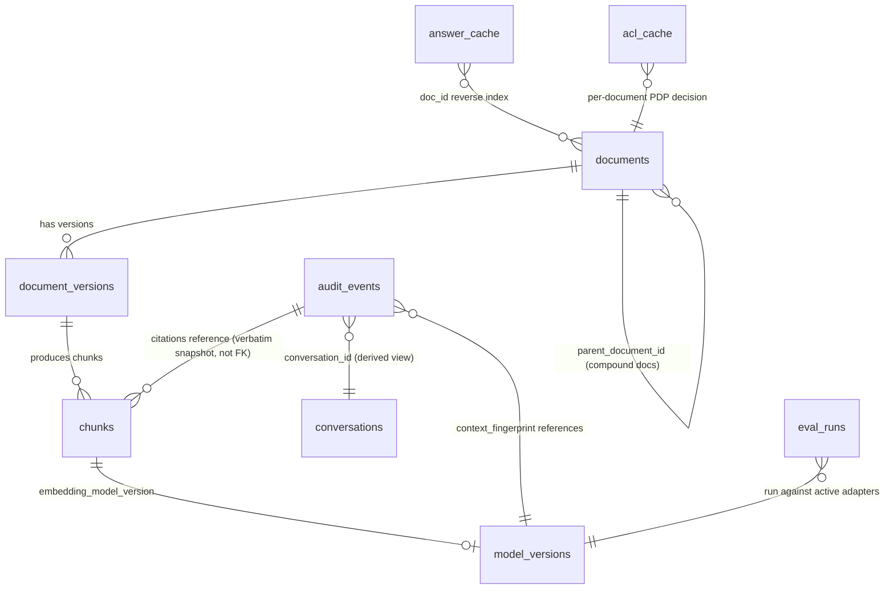
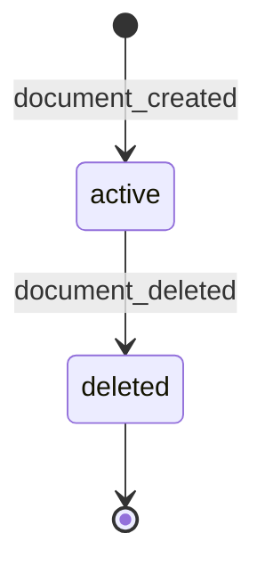
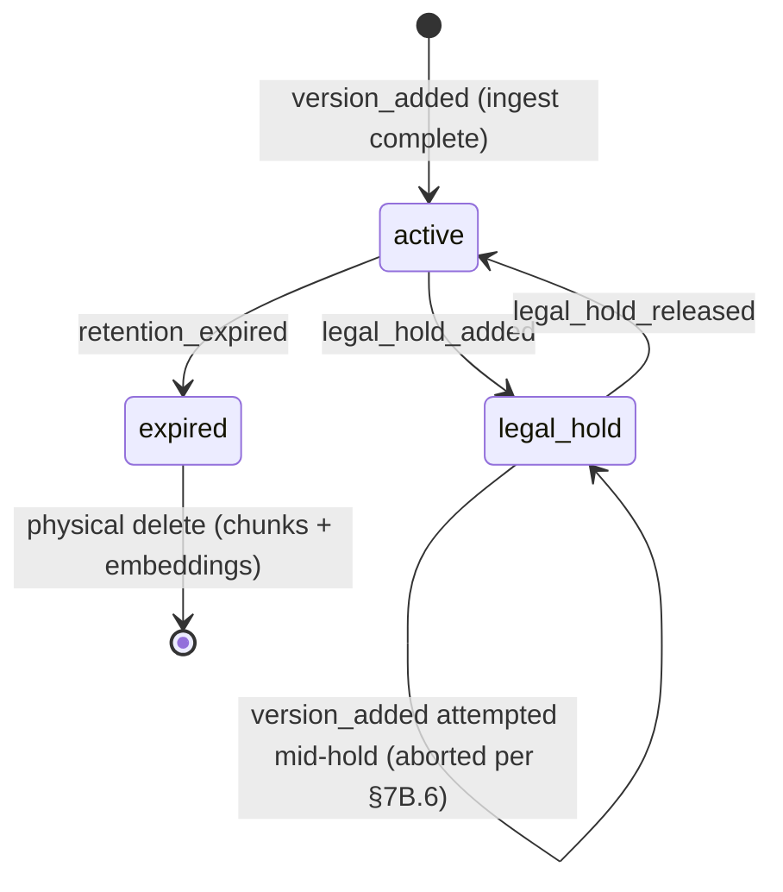

# 05 — Data Model

> Stage 7 (`spec-writer`) deliverable. Consolidates the entity sketch in `04-architecture.md` §6 into full field definitions, lifecycle, privacy classification, and retention rules.
> Does not invent new entities or change any DEC-###/REQ-### decision — every field here traces to an existing decision or requirement. Where a field was only implied (not explicitly named) in `04-architecture.md`, this is noted inline.
> Physical schema (column types, indexes, Postgres/Qdrant/Redis specifics) is `07-database.md`'s job — this file owns entity semantics, not storage mechanics.

## Plain-English Summary

This is the shape of everything GroundedDocs remembers: documents and their chunks, who is allowed to see them, every query and answer with its citations, the audit trail, and the version identifiers that make the "which model produced this" question answerable months later. The two hardest constraints shaping this model are (1) two-layer authorization (`04-architecture.md` §7B) means ACL data lives as chunk-level payload, never inside the embedding vector, and (2) audit immutability (DEC-070) means once written, `audit_events` rows are never edited or deleted — every field that might need updating later (like a citation's source text) must be captured at write time, not referenced by pointer.

## Goals

- Give every entity a precise field list, owner module, lifecycle, privacy classification, and retention rule
- Make the two-layer ACL data model (Layer 1 payload vs Layer 2 live RPC) unambiguous at the entity level
- Make audit-record evidentiary completeness concrete (DEC-087's verbatim citation snapshot, DEC-089's safety-rail fingerprint, DEC-105's per-chunk retrieval-safety verdicts)
- Specify entity lifecycle/state machines for `documents` (version-based, DEC-071), `chunks` (physical-delete-on-expiry vs freeze-on-hold, DEC-046/DEC-091), and the answer cache (DEC-116's `doc_id` reverse index)

## Non-Goals

- Physical column types, Postgres/Qdrant DDL, index definitions — see `07-database.md`
- API request/response shapes — see `06-api-contracts.md`
- V2/V3 entities not yet committed (e.g. `prompt_templates` versioning depth beyond the MVP schema-reservation, REQ-022 full registry) — noted as "V2 schema reserved" where applicable, not designed in full here

## Context

Product context: GroundedDocs is a vendor-embeddable, on-prem RAG product (`01-product-brief.md`). The data model must support: (a) hybrid dense+sparse retrieval (REQ-003, `bge-m3` per DEC-086), (b) two-layer ACL (DEC-045/046), (c) 5-class refusal taxonomy with audit (DEC-042/058), (d) append-only compliance audit (DEC-070) surviving physical chunk deletion (DEC-087), (e) LCC model-lifecycle forensics (DEC-028, context fingerprint DEC-060/089), (f) legal-hold freeze + cache invalidation across two cache layers (DEC-091, DEC-116).

## Why This Design

Two decisions dominate the shape of this model and are worth restating here (canonical rationale lives in `13-decision-log.md`):

- **Identity never enters the embedding vector** (DEC-046 §7B.3, NFR-012). ACL data is denormalized Qdrant *payload* on each chunk (`allow_principals[]`, `deny_principals[]`, `security_label`, `retention_state`), not part of the semantic embedding. This is why `chunks` carries ACL fields directly rather than joining to a separate ACL table at query time — Layer 1 filter-then-search requires the ACL fields to be in the same payload the vector search filters against.
- **Audit records are self-contained, not pointer-based, for anything that can be physically deleted later** (DEC-087). `chunks` rows are subject to mandatory physical deletion (`retention_expired`) or freeze (`legal_hold_added`). A `chunk_id`-pointer-only citation in `audit_events` would become unreconstructable once its source chunk is deleted — so `audit_events.citations` stores the cited span text verbatim at answer time. This asymmetry (chunks are deletable; audit citations referencing them are not) is the single most load-bearing design choice in this file.

## Entity Overview

| Entity | Purpose | Owner | Lifecycle | Privacy Class | Retention | Related APIs |
|---|---|---|---|---|---|---|
| `documents` | ECM-sourced or locally-uploaded document identity + lifecycle + ACL linkage | `admin/` + `ingest/` | version-based (DEC-071); active → deleted | Confidential (contains customer business content references) | Per customer retention policy; physical delete on `retention_expired` (DEC-046) | `POST /v1/ingest`, `GET/PUT /v1/admin/documents` |
| `chunks` | Retrievable unit: text + embedding + Layer 1 ACL payload | `ingest/` | active → frozen (legal hold) → deleted | Confidential | Physical delete on `retention_expired`; frozen (not deletable) during legal hold (DEC-046 §7B.6) | Internal only (Qdrant-native; no direct API) |
| `document_versions` | Version identity + ACL/content snapshot per ECM version | `ingest/` + `cdc/` | committed versions only (DEC-071); superseded on `version_added` | Confidential | Physical delete on `version_deleted` | Internal; surfaced via `GET /v1/admin/documents` |
| `conversations` | Server-side conversation memory anchor (`conversation_id`) | `api/` + `audit/` | active (last N=5 turns retained per `20-agent-behavior.md` §2.4) | Confidential (implies query content) | Bounded by `audit_events` retention (this entity is a derived view, not separately stored — see note below) | `POST /v1/query` |
| `audit_events` | Append-only compliance + forensics record of every query | `audit/` | append-only, immutable forever (DEC-070) | Confidential / Compliance-critical | Multi-year per customer policy; no deletion path in MVP (DEC-070); GDPR erasure deferred to first regulated buyer | `GET /v1/admin/audit`, `GET /v1/admin/audit/events` (NDJSON pull, REQ-043) |
| `model_versions` | Active adapter + version identity per model role | `config/` | versioned, append-only history + one active pointer per role | Internal/operational (not customer content) | Indefinite (small table; historical versions retained for LCC forensics, DEC-028) | `GET/PUT /v1/admin/config/models` |
| `prompt_templates` | Per-customer prompt template identity (schema reserved MVP; full registry V2, REQ-022) | `config/` | immutable per version; new version on edit | Internal/operational | Indefinite | (V2) prompt registry admin API |
| `eval_runs` | RAGAS run history + golden-set deltas | `eval/` | append-only run history | Internal/operational | Indefinite (small, valuable for regression history) | `POST /v1/admin/eval` |
| `answer_cache` (Redis) | Hot-path exact-match answer cache | `cache/` | TTL-bounded (600s) + event-driven invalidation | Confidential (contains answer content) | 600s TTL; not a system-of-record — losing this entity entirely causes zero data loss, only a cache-miss performance cost | Internal only (no direct API) |
| `acl_cache` (Redis) | Hot-path per-user/per-document ACL decision cache | `cache/` | TTL-bounded (60s / 30s) + event-driven force-refresh | Confidential | 60s (user) / 30s (doc); not a system-of-record | Internal + `POST /v1/admin/acl/refresh_user/{id}`, `POST /v1/admin/acl/refresh_doc/{id}` |
| `otel_spans` | Operational diagnostic trace (distinct from `audit_events`, DEC-109) | `api/` (all nodes emit spans) | short retention, admin-configurable | Internal/operational (not a compliance record) | 30-90 days recommended, admin-configurable (DEC-109 capacity-planning note) | OTLP exporter (§12.3), no direct customer-facing API |

**Note on `conversations`**: there is no standalone `conversations` table in the MVP schema. `conversation_id` is a non-null column on `audit_events` (RC-T3-02 / REQ-007), and "conversation memory" is a query — `SELECT last N audit_events WHERE conversation_id = ? ORDER BY timestamp DESC LIMIT 5` — not a separately materialized entity. This is listed above because it is a first-class *concept* the system implements, even though it has no dedicated storage; `20-agent-behavior.md` §2.4 is the authoritative behavior spec.

## Entity Relationship Diagram

Note: `audit_events.citations → chunks` is drawn as a reference, not a foreign key — per DEC-087, the citation stores a verbatim text snapshot, so this relationship is informational lineage, not a referential-integrity constraint. A `chunks` row can be physically deleted while `audit_events` rows that once cited it remain fully readable.

## Field Definitions

### `documents`

| Field | Type (semantic) | Required | Description | Source decision |
|---|---|---|---|---|
| `document_id` | UUID | Yes | Stable identity; equals the ECM's own document identifier when sourced from an ECM adapter, or a generated UUID for `LocalAdapter`/no-ECM installs | §7B.3 |
| `repository_id` | String | Yes | Which ECM repository/instance this document came from (supports multi-repository ECM installs) | §7B.3 |
| `parent_document_id` | UUID, nullable | No | Compound/virtual document hierarchy (Documentum virtual documents, OpenText compound documents). MVP indexes leaves only; this field records the parent for future V2 root-aggregated retrieval | §6, §7B.9, DEC-114 |
| `owner_user_id` | UUID, nullable | No | Reserved for V2 access-request workflow (REQ-006c); null-allowed in MVP, no functional use yet | DEC-044 |
| `approver_user_ids` | Array\<UUID\>, nullable | No | Reserved for V2 access-request workflow (REQ-006c) | DEC-044 |
| `lifecycle_state` | Enum: `active` \| `deleted` | Yes | Whole-document deletion state (distinct from version-level and retention-level state below) | §7B.5 `document_deleted` event |
| `authority_state` | Enum: `authoritative` \| `draft` \| `deprecated`, nullable | No | V2 field (REQ-021); null/unused in MVP | REQ-021 |
| `created_at` / `updated_at` | Timestamp | Yes | Standard bookkeeping | — |

### `document_versions`

| Field | Type (semantic) | Required | Description | Source decision |
|---|---|---|---|---|
| `document_id` | UUID (FK → documents) | Yes | — | — |
| `version_id` | String | Yes | ECM-native version identifier; immutable once created | §7B.9 |
| `is_committed` | Boolean | Yes | Only committed versions are queryable (DEC-071); uncommitted in-flight ECM checkouts never produce a row here | DEC-071 |
| `security_label` | String | Yes | ECM classification (e.g. `internal`, `confidential`, `restricted`); can change independently of `allow_principals[]`/`deny_principals[]` via a label-only `acl_changed` event (DEC-113) | §7B.3, DEC-113 |
| `retention_state` | Enum: `active` \| `legal_hold` \| `expired` | Yes | Drives Layer 1 filter + Layer 2 re-check | §7B.3, §7B.6 |
| `allow_principals` | Array\<String\> | Yes | Denormalized effective principal set from `get_effective_acl()` (includes inherited groups, dynamic groups, role expansions) | §7B.3 |
| `deny_principals` | Array\<String\> | Yes | Deny overrides | §7B.3 |
| `superseded_by_version_id` | String, nullable | No | Set when `version_added` supersedes this version; retained for audit retrieval, filtered out of default retrieval | §7B.9 |
| `ingested_at` | Timestamp | Yes | — | — |

Note: `allow_principals`/`deny_principals`/`security_label`/`retention_state` are logically owned at the version level (an ECM version can have its own ACL) but are physically denormalized onto every `chunks` row for Layer 1 filter-then-search performance — see `chunks` below and `07-database.md` for the denormalization mechanics.

### `chunks`

| Field | Type (semantic) | Required | Description | Source decision |
|---|---|---|---|---|
| `chunk_id` | String, immutable | Yes | Immutable per `(document_id, version_id, sequence)` | DEC-065 |
| `document_id` | UUID (FK → documents) | Yes | — | — |
| `version_id` | String (FK → document_versions) | Yes | — | §7B.9 |
| `repository_id` | String | Yes | Denormalized from `documents` for Layer 2 batch RPC grouping | §7B.4 |
| `sequence` | Integer | Yes | Position within the document version | DEC-065 |
| `text` | Text | Yes | The chunk's source text | DEC-065 |
| `chunk_size` | Integer | Yes | Token count at chunking time (1024-token target) | DEC-065 |
| `chunk_overlap` | Integer | Yes | Overlap token count (128-token target) | DEC-065 |
| `embedding_dense` | Vector | Yes | `bge-m3` dense embedding | DEC-086 |
| `embedding_sparse` | Sparse vector | Yes | `bge-m3` sparse (lexical) embedding — required for REQ-003's hybrid dense+sparse claim to hold | DEC-086 |
| `embedding_model_version` | String | Yes | Identifies which embedding model produced the vectors above; part of the `<corpus_id>_<embedding_model_version>` collection naming convention | DEC-059 |
| `allow_principals` | Array\<String\> | Yes | Denormalized from `document_versions` at ingest; refreshed on `acl_changed` | §7B.3 |
| `deny_principals` | Array\<String\> | Yes | Denormalized from `document_versions` | §7B.3 |
| `security_label` | String | Yes | Denormalized from `document_versions`; refreshed on `acl_changed` including label-only changes (DEC-113) | §7B.3, DEC-113 |
| `retention_state` | Enum: `active` \| `legal_hold` \| `expired` | Yes | Denormalized from `document_versions`; Layer 1 filter excludes non-`active` | §7B.3 |
| `frozen_at` | Timestamp, nullable | No | Set when `legal_hold_added` freezes this chunk; cleared on `legal_hold_released` | §7B.6 |
| `created_at` | Timestamp | Yes | — | — |

**Explicit exclusion**: no field on this entity may ever contain a user, role, group, or principal identifier as part of `embedding_dense`/`embedding_sparse` input text — this is a hard invariant (NFR-012), enforced by CI static check, not merely a convention.

### `audit_events`

| Field | Type (semantic) | Required | Description | Source decision |
|---|---|---|---|---|
| `audit_id` | UUID | Yes | Primary key; returned to caller as `audit_id` in the query response | §7.1 |
| `conversation_id` | String, non-null | Yes | Non-null per RC-T3-02; server-reconstructed conversation memory keys off this | §2.4 |
| `user_id` / `session_id` | String | Yes | — | REQ-007 |
| `query` | Text | Yes | The user's query text (DEBUG-only in operational logs per NFR-008; this table is the one permitted persistent store of query content) | NFR-008 |
| `retrieved_chunk_ids` | Array\<String\> | Yes | The `reranked_set` chunk IDs actually used to construct the generation prompt (not the raw `retrieval_set`) | DEC-088 |
| `answer_text` | Text | Yes | — | REQ-007 |
| `citations` | JSON array | Yes | Each element: `{chunk_id, page_number, span_offset, cited_span_text, nli_score}`. **`cited_span_text` is a verbatim snapshot captured at answer time, not merely a `chunk_id` pointer** — this is what lets the record remain evidentiary-complete after the source chunk is later physically deleted | DEC-087 |
| `retrieval_safety_verdicts` | JSON array, nullable | No | One `SafetyVerdict` per chunk in `acl_trimmed_set`, from the retrieval-rail (Llama Prompt Guard 2) scan inside `acl/`'s Layer 2 join step; captures which chunks were flagged/dropped and why, so a disputed chunk-drop decision is reconstructable | DEC-096, DEC-105 |
| `safety_input_verdict` | JSON, nullable | No | Singular verdict from `safety_input/` on the inbound query | DEC-077, §4.3 |
| `safety_output_verdict` | JSON, nullable | No | Singular verdict from `safety_output/` on the draft answer | DEC-077, §4.3 |
| `verification_result` | JSON | Yes | Mechanical check result + NLI scores per (sentence, citation) pair + which path (`mechanical_fast_path` early-exit vs full `nli_slow_path`) was taken | §8.1 |
| `refusal_reason_actual` | Enum, nullable | No | True reason: `no_recall` \| `low_grounding` \| `access_denied` \| `policy_blocked` \| `verification_unavailable`, null if answered | DEC-042 |
| `refusal_reason_shown` | Enum, nullable | No | What the user saw; differs from `refusal_reason_actual` only under `acl_denial_mode = opaque` | DEC-042, DEC-069 |
| `intent` | Enum: `granted` \| `denied` | Yes | Drives ECM audit write-back (`write_audit_access`); both paths written per DEC-064 | DEC-064 |
| `context_fingerprint` | JSON, non-null | Yes | `{model_adapter, model_version, embedding_model_version, reranker_version, prompt_template_id, verify_thresholds, safety_input_adapter, safety_input_version, safety_output_adapter, safety_output_version, policy_ruleset_version}` — every field non-null at MVP so any historical answer, **including a `policy_blocked` refusal**, is fully reconstructable | DEC-060, DEC-089 |
| `revision_count` | Integer | Yes | 0 in MVP (no feedback edge enabled); V2 mid-flight rewrite iteration count | NFR-023 |
| `policy_waiver_id` | UUID, nullable | No | V2-reserved field (REQ-051); unset in MVP | DEC-084, DEC-103 |
| `intent_class` | String, nullable | No | V2-reserved field (REQ-051); unset in MVP | DEC-084, DEC-103 |
| `nli_performed` | Boolean, nullable | No | V2-reserved field (REQ-051); unset in MVP (always effectively `true` when unset, since MVP never downgrades NLI) | DEC-084, DEC-103 |
| `latency_ms` | Integer | Yes | Total end-to-end latency for this turn | §7.1 |
| `timestamp` | Timestamp | Yes | — | — |

**Immutability**: no field on this entity is ever updated or deleted after write (DEC-070). Any correction, annotation, or downstream event (e.g. the KV-cache/answer-cache invalidation audit trail below) is a **new** `audit_events`-adjacent record, never a mutation of an existing row.

### `legal_hold_invalidation_events` (new — consolidates DEC-106 + DEC-116's audit requirements)

This is a distinct, append-only entity from `audit_events` (not a variant of it), because it records a system-initiated remediation action rather than a user query.

| Field | Type (semantic) | Required | Description | Source decision |
|---|---|---|---|---|
| `event_id` | UUID | Yes | — | — |
| `triggering_doc_id` | UUID | Yes | The document whose `legal_hold_added` event triggered this remediation | DEC-091, DEC-106 |
| `legal_hold_event_timestamp` | Timestamp | Yes | When the ECM's `legal_hold_added` event fired | DEC-106 |
| `invalidation_timestamp` | Timestamp | Yes | When the remediation (cache invalidation) completed | DEC-106 |
| `invalidation_target` | Enum: `kv_cache` \| `answer_cache` | Yes | Which cache layer was invalidated — this entity covers **both** the original DEC-106 KV-cache case and the DEC-116 answer-cache extension | DEC-106, DEC-116 |
| `conversation_id` | String, nullable | Conditionally required (required when `invalidation_target = kv_cache`) | The conversation whose KV-cache was invalidated | DEC-106 |
| `evicted_query_hashes` | Array\<String\>, nullable | Conditionally required (required when `invalidation_target = answer_cache`) | The set of answer-cache keys evicted via the `doc_id` reverse index | DEC-116 |

This is the evidentiary record a litigation-hold dispute would ask for: proof that the system-side remediation actually ran, not just that the source chunk was frozen in `chunks`/`document_versions`.

### `model_versions`

| Field | Type (semantic) | Required | Description | Source decision |
|---|---|---|---|---|
| `role` | Enum: `generation` \| `embedding` \| `rerank` \| `nli` \| `safety_input` \| `safety_output` \| `policy` | Yes | Which pipeline role this version record describes | §4.1 |
| `adapter_name` | String | Yes | e.g. `llama-3.1-8b-instruct-int4-vllm` | §3.3 |
| `model_version` | String | Yes | e.g. `20260601` | §3.3 |
| `is_active` | Boolean | Yes | Exactly one active row per `role` at a time (V2: per-customer active-adapter, REQ-033) | REQ-033 |
| `activated_at` | Timestamp | Yes | — | — |
| `deactivated_at` | Timestamp, nullable | No | Null while active; set on rollback/rotation | — |
| `pre_swap_ragas_report_id` | UUID, nullable | No | References `eval_runs`; **required non-null before a generation/embedding swap may set `is_active = true`** per the DEC-109-extended quality gate | DEC-092, DEC-109 |

### `prompt_templates` (V2 schema-reserved; MVP has one immutable default row)

| Field | Type (semantic) | Required | Description | Source decision |
|---|---|---|---|---|
| `prompt_template_id` | String | Yes | Referenced from `audit_events.context_fingerprint` | DEC-060 |
| `customer_id` | UUID, nullable | No | Null in MVP (single default template); V2 per-customer registry (REQ-022) | REQ-022 |
| `version` | Integer | Yes | Immutable once created; new edits create a new version | REQ-022 |
| `body` | Text | Yes | The template content, including the `rewrite_repair` V2 sub-template (REQ-022 V2 extension) | §8.2 |
| `created_at` | Timestamp | Yes | — | — |

### `eval_runs`

| Field | Type (semantic) | Required | Description | Source decision |
|---|---|---|---|---|
| `run_id` | UUID | Yes | — | — |
| `suite` | Enum: `golden-smoke` \| `golden-full` \| `customer-*` (V2) | Yes | Which golden-set ring was run (50-prompt smoke vs 150-200 full, DEC-078) | DEC-078 |
| `metrics` | JSON | Yes | Faithfulness, answer relevancy, context precision, context recall, citation hit-rate, refusal rate, hallucination rate, NLI accuracy | §9.1 (`01-product-brief.md`), `23-evals-guardrails.md` §2.1 |
| `model_versions_snapshot` | JSON | Yes | Which `model_versions` rows were active for this run — needed for the DEC-109 pre-swap quality gate to reference a specific run | DEC-109 |
| `pass` | Boolean | Yes | Whether all DEC-017 thresholds were met | DEC-017 |
| `run_at` | Timestamp | Yes | — | — |

### `answer_cache` (Redis, not Postgres — included here for completeness of the logical model)

| Field | Type (semantic) | Required | Description | Source decision |
|---|---|---|---|---|
| Primary key | `(query_hash, ACL_set, model_version)` | Yes | Exact-match cache key | DEC-076 |
| `cached_answer` | JSON | Yes | Same shape as the `POST /v1/query` response body | DEC-076 |
| `cited_doc_ids` | Array\<UUID\> | Yes | **Reverse-index field**: every `document_id` referenced by `cached_answer.citations`, maintained on write so `legal_hold_added(doc_id)` can look up and evict matching entries without a full-table scan | DEC-116 |
| `ttl_expires_at` | Timestamp | Yes | 600s from write; also force-expired on `model_version` rotation, embedding-model swap cutover, admin flush, or targeted `legal_hold_added` eviction | DEC-076, DEC-116 |

**Not included in the cache key or as an invalidation trigger** (explicit design conclusion, DEC-109): `--speculative-decoding` flag state and the Prompt Guard 2 eviction-policy state. Both are serving-time parameters that do not alter output content (see DEC-109's full rationale in `13-decision-log.md`).

### `acl_cache` (Redis)

| Field | Type (semantic) | Required | Description | Source decision |
|---|---|---|---|---|
| Per-user key | `effective_principals[user_id]` | Yes | 60s TTL | §7B.5 |
| Per-document key | `pdp_decision[document_id]` | Yes | 30s TTL | §7B.5 |

## State Machines

### `documents.lifecycle_state`

### `document_versions` / `chunks` combined retention state

Note: `expired` is a transient logical state, not a stored value that persists — `retention_expired` triggers immediate physical deletion (DEC-046), so there is no queryable "expired but not yet deleted" window in the data model, only in the event-processing pipeline.

## Data Ownership

| Data domain | Authoritative owner | GroundedDocs's role |
|---|---|---|
| Identity, role, group, ACL hierarchy | ECM/CCM (federation pattern, DEC-045) | Denormalized cache (Layer 1) + live authoritative re-check (Layer 2); never reimplements ECM's ACL evaluation logic |
| Document content, version history | ECM/CCM | Ingests + indexes; version-based query semantics only (DEC-071) |
| Query/answer/audit history | GroundedDocs (`audit_events`) | Authoritative for RAG-side forensics; supplementary (not sole authoritative) for ECM compliance frameworks — ECM audit write-back (§7B.7) is the compliance-authoritative sink for Documentum DAR / OpenText RM |
| Model/prompt version identity | GroundedDocs (`model_versions`, `prompt_templates`) | Authoritative |

## Privacy Classification

| Entity | Classification | Rationale |
|---|---|---|
| `documents`, `document_versions`, `chunks` | Confidential | Contains or references customer business document content |
| `audit_events` | Confidential / Compliance-critical | Contains query text, answer text, and retrieved content references — the single highest-sensitivity entity in the system, and the one with the strongest retention requirement (append-only forever, DEC-070) |
| `answer_cache`, `acl_cache` | Confidential | Transient derivative of the above; loss causes no data-integrity issue, only a performance cost |
| `model_versions`, `prompt_templates`, `eval_runs` | Internal/operational | No customer content; safe to log at INFO level |
| `otel_spans` | Internal/operational | Diagnostic only; NFR-008 requires query/document content stay out of this table (DEBUG-level detail belongs in `audit_events`, not traces) |

## Retention and Deletion Rules

| Entity | Retention rule | Deletion mechanism |
|---|---|---|
| `documents` / `document_versions` / `chunks` | Per-customer retention policy set in the ECM; enforced by `retention_expired` | **Physical delete**, never soft-flag (DEC-046) — vector DB rebuilds/migrations/restores must not be able to revive retention-killed content |
| `chunks` under legal hold | Frozen — not deletable, not updatable, not re-indexable | Unfreezes only on `legal_hold_released` |
| `audit_events` | Multi-year, per customer compliance policy; **no deletion path in MVP** | Append-only forever (DEC-070); GDPR right-to-erasure against this table explicitly deferred to first regulated AU/EU buyer engagement |
| `legal_hold_invalidation_events` | Same retention posture as `audit_events` (it is compliance evidence of the same class) | Append-only |
| `answer_cache` / `acl_cache` | 600s / 60s / 30s TTL | Automatic expiry + event-driven force-invalidation; no retention obligation (not a system-of-record) |
| `otel_spans` | 30-90 days, admin-configurable (DEC-109) | Scheduled cleanup job; explicitly **not** the same lifecycle as `audit_events` — conflating the two would either over-retain diagnostic noise or, worse, under-retain compliance evidence |

**Capacity planning note (DEC-109)**: `audit_events`'s append-only-forever posture, combined with AU/NZ regulated-vertical multi-year retention obligations (DEC-072), means this table's growth is unbounded within the single-host Postgres deployment. `09-deployment-ops.md` (this phase) documents the capacity-growth estimate and archival guidance.

## Audit Requirements

Every entity mutation that has compliance significance must be traceable:

- Every `documents`/`chunks` state transition triggered by a CDC event is itself logged (the CDC event log, not a separate audit table — `cdc/` module owns this per `04-architecture.md` §5)
- Every `legal_hold_added`-triggered cache invalidation (both KV-cache and answer-cache) is written to `legal_hold_invalidation_events`, not just performed silently (DEC-106, DEC-116)
- Every query, whether answered or refused, writes exactly one `audit_events` row before the response leaves `api/` (§8.4: "Audit persists before the response leaves api/: ensures we have forensics even on a 500 error")
- Every model/embedding swap that changes `model_versions.is_active` references the `eval_runs` row that gated the promotion (DEC-109's quality gate)

## Migration Implications

- **Embedding model version bumps** (REQ-034) use the double-collection naming convention (`<corpus_id>_<embedding_model_version>`) already in the MVP schema (DEC-059) — a new embedding version never mutates existing `chunks` rows in place; it populates a new Qdrant collection, and cutover is a `model_versions.is_active` flip, gated by the DEC-109 RAGAS-floor check
- **Safety-rail model swaps** (REQ-050 adapter swap) follow the same versioned-row pattern in `model_versions`, gated by DEC-092's hazard-detection accuracy check (distinct from the RAGAS gate — RAGAS cannot measure detection accuracy)
- **Schema changes to `audit_events`** (e.g. a future new refusal class or fingerprint field) must be additive-only, given the append-only-forever posture — a column can be added with a default for historical rows, but no historical row's existing fields may be reinterpreted or backfilled with invented values

## Dependencies

- `04-architecture.md` §5.1.1 (`QueryGraphState` typed schema — the in-flight, non-persisted version of several fields that land in `audit_events` at turn end)
- `04-architecture.md` §6, §7B.3-§7B.10 (original entity sketch and two-layer ACL detail this file expands)
- `02-requirements.md` REQ-007, REQ-034, REQ-035, REQ-050
- `13-decision-log.md` DEC-042, DEC-045, DEC-046, DEC-059, DEC-060, DEC-064, DEC-065, DEC-070, DEC-071, DEC-076, DEC-086, DEC-087, DEC-088, DEC-089, DEC-091, DEC-096, DEC-105, DEC-106, DEC-109, DEC-113, DEC-114, DEC-116
- `07-database.md` (this phase — physical schema derived from this file)
- `08-observability-logs.md` (this phase — `otel_spans` structure)

## Decision References

DEC-042, DEC-044, DEC-045, DEC-046, DEC-059, DEC-060, DEC-064, DEC-065, DEC-069, DEC-070, DEC-071, DEC-076, DEC-077, DEC-084, DEC-086, DEC-087, DEC-088, DEC-089, DEC-091, DEC-092, DEC-096, DEC-103, DEC-105, DEC-106, DEC-109, DEC-113, DEC-114, DEC-116
