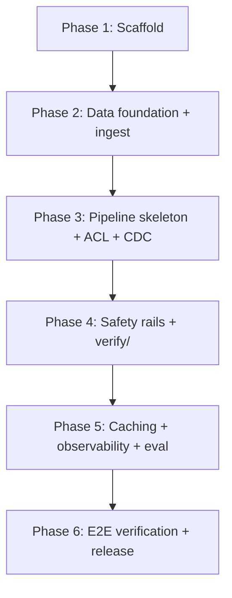

# 10 — Build Plan

> Stage 7 (`spec-writer`) deliverable. Phased TDD build plan tracing every MVP feature to its architecture/requirement source. **Applies RC-R2-X3** (Round 2's carried-forward instruction): every MVP feature/phase below is annotated with its team-path vs. solo-path delta where meaningful, per `confirmed-context.md` §6 — team demo date **2027-03-26** (DEC-080), solo path **2027-05+** (DEC-081), team-materialization checkpoint **2026-08-29** (RISK-007). `TASK-###` ids start fresh at `TASK-001` (verified: no prior usage anywhere in `specs/`).

## Phase Summary

| Phase | Objective | Team-path estimate | Solo-path estimate |
|---|---|---|---|
| 1 | Project scaffold, dependency verification, dev environment, CI baseline, first failing smoke test | ~5 days | ~10 days |
| 2 | Core domain + data foundation (Postgres/Qdrant schema, ingest pipeline) | ~15 days | ~30 days |
| 3 | LangGraph pipeline skeleton + two-layer ACL + CDC | ~25 days | ~45 days |
| 4 | Layered safety rails + verify/ (citation + NLI) | ~20 days | ~35 days |
| 5 | Redis caching, observability, eval harness | ~15 days | ~25 days |
| 6 | End-to-end verification + release readiness | ~10 days | ~15 days |

**Total team-path estimate**: ~90 working days, consistent with the +90-day buffer DEC-080 was built around (30d LangGraph adoption + 15d Redis integration + 15d guard-model integration + 15d golden-set curation + 15d customer co-deployment dry-runs, per DEC-080's own rationale breakdown — this phase table is a finer-grained decomposition of that same estimate, not a new one). **Total solo-path estimate**: ~160 working days, consistent with the 2027-05+ solo target (DEC-081) — solo does not cut scope, it extends timeline, per DEC-081's explicit "same scope, longer timeline" framing.

**Team-materialization checkpoint (2026-08-29, RISK-007)**: if no second contributor has materialized by this date, the team-path column above is retired for planning purposes and only the solo-path column governs going forward — this is a pre-committed, non-silent transition per RISK-007's mitigation, not a decision this build plan makes unilaterally when the date arrives.

## Dependency Graph

No phase is skippable or reorderable — this mirrors `00-index.md`'s "Review order... do not reorder" discipline applied to build sequencing: Phase 3's ACL/CDC work depends on Phase 2's schema; Phase 4's `verify/` depends on Phase 3's `reranked_set` existing; Phase 5's caching depends on Phase 4's node boundaries being stable enough to cache around.

## Phase 1: Project Setup and Verification

**Objective**: a working dev environment, CI baseline, and first failing smoke test — nothing functional yet, but everything needed to start building functionally.

**Entry conditions**: none (this is the first phase).

**Exit gate**: `docker compose up` on the dev rig reaches a container-healthy state for every service (even if they're not yet wired together); CI runs and fails the deliberately-failing smoke test; a new contributor following only `NFR-011`'s dev profile reaches this state in ≤ 2 hours.

### TASK-001: Project Scaffold

**Phase**: Phase 1
**Verification Pattern**: TDD-Exempt — Infrastructure-as-Code
**Related Requirements**: NFR-001, REQ-011
**Owner Role**: Backend
**Dependencies**: None
**Team-path**: ~1 day | **Solo-path**: ~2 days

#### Why TDD-Exempt
Project scaffolding (directory structure, `pyproject.toml`, docker-compose skeleton) has no red→green→refactor cycle — there's no failing test for "does the directory structure exist."

#### Verification Plan
- `docker compose config` validates the compose file without error
- Directory structure matches the module map (`04-architecture.md` §5): `api/`, `retrieve/`, `acl/`, `rerank/`, `generate/`, `verify/`, `audit/`, `ingest/`, `admin/`, `eval/`, `config/`, `widget/`, `cdc/`, `safety_input/`, `safety_output/`, `policy/`, `cache/`

#### Rollback Plan
- Revert the scaffold commit; no data or running state exists yet to roll back

#### Acceptance Criteria
- [ ] `docker compose config` passes
- [ ] Every module directory from §5's module map exists with a placeholder `__init__.py`

#### Verification Evidence
- Command: `docker compose config`
- Expected: valid YAML output, no error

### TASK-002: Dependency Verification + Install

**Phase**: Phase 1
**Verification Pattern**: TDD-Exempt — Vendor SDK/dependency installation
**Related Requirements**: NFR-011
**Owner Role**: Backend
**Dependencies**: TASK-001
**Team-path**: ~1 day | **Solo-path**: ~2 days (first-time LangGraph/vLLM/TEI dependency learning curve, per RISK-012's "stack the user is learning while renting cloud GPU")

#### Why TDD-Exempt
Dependency pinning is a vendor-SDK-class task per `spec-templates.md`'s exempt-type table.

#### Verification Plan
- Pin exact versions: Python 3.14, FastAPI, LangGraph 1.2.x, vLLM, TEI client, Qdrant client, Postgres driver, Redis client, **`llama-cpp-python`** (DEC-033, DEC-075, DEC-012, DEC-035, DEC-034, DEC-076; LangGraph version corrected DEC-131; `llama-cpp-python` added DEC-133; Python version re-pinned 3.12→3.14 DEC-134 — DEC-033's 3.12 was not stale, this matches the actual Phase 1 execution environment instead — DEC-130's RAGAS judge model runs on `llama.cpp`, and this was the missing link between that decision and the dependency-pinning task)
- Smoke-import every pinned dependency in a throwaway script

#### Rollback Plan
- Pin to the previously-working version set; document why the upgrade was reverted

#### Acceptance Criteria
- [ ] `pip install` (or equivalent) succeeds with zero conflicts
- [ ] Every pinned dependency importable

#### Verification Evidence
- Command: dependency install + smoke-import script
- Expected: exit 0, no import errors

### TASK-003: Dev Rig Verification (RunPod Template)

**Phase**: Phase 1
**Verification Pattern**: TDD-Exempt — Infrastructure-as-Code
**Related Requirements**: NFR-011, DEC-021
**Owner Role**: DevOps
**Dependencies**: TASK-001
**Team-path**: ~1 day | **Solo-path**: ~2 days

#### Why TDD-Exempt
**(Added 2026-07-06, Stage 8 audit finding, Gate 7)** Provisioning and verifying a cloud-rented dev rig (RunPod template + Network Volume) is infrastructure configuration, not application code — there is no unit under test with a red→green→refactor cycle; the correctness question is "does the provisioned environment behave as documented," verified by the walkthrough below, not by a failing assertion.

#### Verification Plan
- RunPod template + Network Volume boots; model cache survives pod restart
- A new contributor following only the dev profile reaches a working eval run in ≤ 2 hours (NFR-011 acceptance criterion, verified literally with a fresh team member if the team has materialized by this phase, or by the solo developer re-running the profile from a clean rig otherwise)

#### Rollback Plan
- Revert to the prior known-good RunPod template image

#### Acceptance Criteria
- [ ] Dev profile documented (ports, volumes, model cache layout)
- [ ] Fresh-rig timing measured and ≤ 2 hours

#### Verification Evidence
- Timed walkthrough log

### TASK-004: CI Baseline

**Phase**: Phase 1
**Verification Pattern**: TDD-Exempt — Infrastructure-as-Code
**Related Requirements**: `09-deployment-ops.md`'s CI/CD Pipeline section
**Owner Role**: DevOps
**Dependencies**: TASK-001, TASK-002
**Team-path**: ~1 day | **Solo-path**: ~2 days

#### Why TDD-Exempt
**(Added 2026-07-06, Stage 8 audit finding, Gate 7)** Setting up the CI pipeline itself (lint/type-check job, import-graph check step) is infrastructure configuration — there is no application code under test yet at this point in Phase 1, so a red→green→refactor cycle does not apply. Correctness is verified by confirming the pipeline runs and gates correctly, not by a failing test.

#### Verification Plan
- Lint + type check job runs on every push
- Architecture import-graph check (§5.1's CI-enforced call-direction rules) runs and passes against the empty scaffold (trivially, since no cross-layer imports exist yet)

#### Rollback Plan
**(Added 2026-07-06, Stage 8 audit finding, Gate 7)** Revert the CI configuration commit; no application state depends on CI configuration, so rollback is a simple config revert with no data or running-service impact.

#### Acceptance Criteria
- [ ] CI pipeline green on the scaffold commit
- [ ] Import-graph check step exists (even though it has nothing to catch yet)

#### Verification Evidence
- CI run URL/log

### TASK-005: First Failing Smoke Test

**Phase**: Phase 1
**Verification Pattern**: TDD
**Related Requirements**: REQ-011
**Owner Role**: Backend
**Dependencies**: TASK-001, TASK-004
**Team-path**: ~0.5 day | **Solo-path**: ~1 day

#### TDD Red
- Write a test asserting `GET /ready` returns `{ready: true, services: {...all true...}}` (per DEC-117's full-dependency contract, `06-api-contracts.md`) — this fails because `/ready` doesn't exist yet

#### TDD Green
- Implement the minimal `api/` FastAPI app with a stub `/ready` that always returns `ready: false` (services not yet wired) — test still fails, but for the *expected* reason (all services false), confirming the test itself is correctly wired before real service health checks exist

#### TDD Refactor
- N/A yet — this is the very first slice

#### Acceptance Criteria
- [ ] `GET /ready` endpoint exists and returns the DEC-117 schema shape (even with all-false values)

#### Verification Evidence
- Test run showing the test correctly fails against the stub, confirming test wiring before real implementation

## Phase 2: Core Domain and Data Foundation

**Objective**: Postgres schema, Qdrant collections, and the ingest pipeline — the system can accept a document and make it queryable, with no query answering yet.

**Entry conditions**: Phase 1 exit gate met.

**Exit gate**: a 100-page born-digital PDF reaches `ready` status in ≤ 60s on reference hardware (REQ-002); Layer 1 ACL payload correctly populated per `07-database.md`'s payload-index requirements.

### TASK-006: Postgres Schema Migration

**Phase**: Phase 2
**Verification Pattern**: TDD-Exempt — DB schema migration
**Related Requirements**: REQ-007, REQ-034, REQ-035, DEC-059, DEC-060
**Owner Role**: Backend
**Dependencies**: TASK-001
**Team-path**: ~3 days | **Solo-path**: ~5 days

#### Why TDD-Exempt
Schema migrations are the DB-migration exempt type.

#### Verification Plan
- Alembic migration creates every table in `07-database.md`'s Postgres Schema section
- Dry-run against a staging snapshot; reversible-down migration verified
- Post-migration assertion: `model_versions`'s partial unique active-row constraint rejects a seeded conflicting insert; `audit_events`'s runtime role has no `UPDATE`/`DELETE` grant (verified by attempting both and confirming rejection)

#### Rollback Plan
- Alembic downgrade; re-run dry-run against the pre-migration snapshot to confirm reversibility

#### Acceptance Criteria
- [ ] All tables from `07-database.md` exist with stated constraints
- [ ] `audit_events` immutability enforced at the database role level, verified by test

#### Verification Evidence
- Migration dry-run log + constraint-rejection test output

### TASK-007: Qdrant Collection Setup + Payload Indexes

**Phase**: Phase 2
**Verification Pattern**: TDD-Exempt — Infrastructure-as-Code
**Related Requirements**: REQ-003, NFR-003 (added post-Stage-8, DEC-129), DEC-059, DEC-086
**Owner Role**: Backend
**Dependencies**: TASK-001
**Team-path**: ~2 days | **Solo-path**: ~4 days

#### Why TDD-Exempt
**(Added 2026-07-06, Stage 8 audit finding, Gate 7)** Creating a Qdrant collection and its payload indexes is infrastructure/schema setup, not application logic — there is no function under test with a meaningful red state; correctness is verified by inspecting the resulting collection configuration against `07-database.md`'s documented requirements, the same pattern as TASK-006's DB-migration exemption.

#### Verification Plan
- Collection created per the `<corpus_id>_<embedding_model_version>` naming convention
- Mandatory payload indexes created before any ingest (`07-database.md`'s Payload Indexes table) — verified by a `gpu-check`-analogous script confirming index existence
- **NFR-003 schema-neutrality review (added post-Stage-8)**: inspect the `chunks` payload schema for hardcoded English-only field names or assumptions (e.g. a field named `english_text` instead of `text`, or a tokenizer config baked into the schema rather than the embedding-model config) — the collection schema must not block a future multilingual extension even though MVP content is English-only (NFR-003)

#### Rollback Plan
**(Added 2026-07-06, Stage 8 audit finding, Gate 7)** Drop the collection and recreate it with the corrected configuration; since this task runs before any ingest (TASK-008/009 depend on it), no chunk data exists yet to migrate or lose — rollback is a clean collection recreation, not a data migration.

#### Acceptance Criteria
- [ ] Collection exists with dense + sparse vector configuration
- [ ] All 5 mandatory payload indexes present
- [ ] NFR-003: no field name or schema constraint in the `chunks` payload hardcodes an English-only assumption

#### Verification Evidence
- Qdrant collection-info API response showing vector config + payload indexes

### TASK-008: Ingest Pipeline — Parse + Chunk

**Phase**: Phase 2
**Verification Pattern**: TDD
**Related Requirements**: REQ-001, REQ-002, DEC-036, DEC-065, DEC-143
**Owner Role**: Backend
**Dependencies**: TASK-006, TASK-007
**Team-path**: ~4 days | **Solo-path**: ~8 days

#### TDD Red
- Test: uploading a supported-format document returns a `document_id` within 1s and an initial `pending` status; uploading an unsupported format returns 415

#### TDD Green
- Implement `POST /v1/ingest` + `pdfminer.six` primary parser (PDF) + PyMuPDF rescue + `python-docx` (Word) + 1024-token/128-overlap chunking (recursive primary, structural fallback)

#### TDD Refactor
- Extract parse/chunk as independently testable steps, matching `03-workflows.md`'s checkpoint-boundary design (each step's output persists before the next starts, enabling ingest resume)

#### Acceptance Criteria
- [ ] Unsupported format → 415 with format list, no `document_id` issued
- [ ] Supported format → `document_id` + `status_url` within 1s
- [ ] Chunk boundaries are immutable per `(document_id, version_id, sequence)` (DEC-065)

#### Verification Evidence
- Test suite output; sample 100-page PDF end-to-end timing

### TASK-009: Ingest Pipeline — Embed + Layer 1 ACL Enrichment + Index

**Phase**: Phase 2
**Verification Pattern**: TDD
**Related Requirements**: REQ-003, REQ-037, NFR-012, DEC-046, DEC-086
**Owner Role**: Backend
**Dependencies**: TASK-008
**Team-path**: ~5 days | **Solo-path**: ~9 days

**Cross-reference correction (Stage 8 audit finding, 2026-07-06)**: this task already implements REQ-037's capture-at-ingest half (`retention_state` populated from `ECMAdapter.get_retention_state()` into the Qdrant payload, per the TDD Red test below) — the "Related Requirements" field previously omitted REQ-037, which the Stage 8 auditor's independent grep correctly flagged as an orphaned requirement. REQ-037's enforcement-at-retrieval half is TASK-013's `acl/` Layer 2 re-check (already correctly covered there via REQ-036/DEC-046).

#### TDD Red
- Test: a chunk's embedding input never contains an ACL/identity field (NFR-012 static check); a chunk's Qdrant payload contains `allow_principals[]`, `deny_principals[]`, `security_label`, `retention_state` populated from `get_effective_acl()` / `get_retention_state()` (using `LocalAdapter` for this test, per §5A's no-ECM fast-path)

#### TDD Green
- Implement `bge-m3` dense+sparse embedding call via TEI; Layer 1 payload construction from `ECMAdapter.get_effective_acl()`; Qdrant index write

#### TDD Refactor
- Confirm the ingest job is resumable at this step boundary independent of parse/chunk (per `03-workflows.md`'s ingest-resume contract)

#### Acceptance Criteria
- [ ] NFR-012 static check passes (CI-enforceable, not just a runtime test)
- [ ] Ingest reaches `ready` status; document is retrievable via a direct Qdrant query

#### Verification Evidence
- End-to-end ingest test + NFR-012 CI check output

### TASK-010: Ingest Resume + Job Queue

**Phase**: Phase 2
**Verification Pattern**: TDD-Exempt — Data backfill/reindex jobs (ingest is a reindex-adjacent job type)
**Related Requirements**: `03-workflows.md` Workflow 1, DEC-038
**Owner Role**: Backend
**Dependencies**: TASK-008, TASK-009
**Team-path**: ~2 days | **Solo-path**: ~4 days

#### Why TDD-Exempt
**(Added 2026-07-06, Stage 8 audit finding, Gate 7)** Verifying resumability under a kill/restart chaos scenario is not a unit-testable red→green→refactor cycle — the failure mode under test (process termination mid-job) cannot be deterministically triggered inside a normal test runner; it requires the chaos-test procedure named in Verification Plan, matching the `spec-templates.md` data-backfill/reindex exempt-type pattern.

#### Verification Plan
- Kill the ingest process mid-embed step; restart; confirm the job resumes from the last completed checkpoint (parse/chunk output already persisted), not from upload
- Idempotency: re-running `embed` against the same chunks with the same model version produces identical embeddings

#### Rollback Plan
- N/A — this is the resume mechanism itself; there's no "rollback" beyond the existing job-failure path already covered

#### Acceptance Criteria
- [ ] Mid-ingest restart resumes correctly, verified by killing the process at each of the 4 step boundaries
- [ ] Operator-visible `status`/`progress` holds steady (not reset) across the restart

#### Verification Evidence
- Chaos-test log showing kill + restart + successful resume at each checkpoint

### TASK-033: HTTP API Surface (`api/` Route Scaffold) + Admin API

**Phase**: Phase 2
**Verification Pattern**: TDD
**Related Requirements**: REQ-008, REQ-010
**Owner Role**: Backend
**Dependencies**: TASK-006, TASK-009
**Team-path**: ~5 days | **Solo-path**: ~9 days

**Added 2026-07-06 (Stage 8 audit finding, Gate 8)**: TASK-001's scaffold only creates directory placeholders — no task previously implemented the actual HTTP route surface. This task closes that gap for REQ-008 (the stable HTTP API) and REQ-010 (admin API), placed at the end of Phase 2 because the query-path (`POST /v1/query`) route depends on Phase 3's graph existing, but the *route registration + OpenAPI generation + admin document/ACL endpoints* do not — they only need Phase 2's schema (TASK-006) and ingest pipeline (TASK-009) to have something to expose. `POST /v1/query`'s route is registered here but returns a stub until TASK-011 onward wires the real graph invocation.

#### TDD Red
- Test: `06-api-contracts.md`'s OpenAPI schema is auto-generated from the FastAPI app and matches the committed schema snapshot (schema-drift contract test); `GET/PUT /v1/admin/documents` performs list/soft-delete/ACL-edit correctly against TASK-006's schema; pagination cursor is stable under concurrent inserts

#### TDD Green
- Implement every route in `06-api-contracts.md`'s Query/Ingest/Admin/Operational surfaces as FastAPI routes; wire `POST /v1/ingest` to TASK-008/009's pipeline; wire `GET/PUT /v1/admin/documents`, `GET /v1/admin/audit` (paginated) against the schema from TASK-006; `POST /v1/query` registered but stubbed (returns `501` until Phase 3 lands) — this stub is deliberate and temporary, not a placeholder left unresolved: it is fully replaced by TASK-011 onward's real graph wiring before Phase 3 exits

#### TDD Refactor
- Confirm JWT bearer / admin API key auth is enforced on every route per `06-api-contracts.md`'s Auth section, with `GET /ready` as the sole correctly-unauthenticated exception

#### Acceptance Criteria
- [ ] OpenAPI 3.x spec auto-generated, matches `06-api-contracts.md`'s documented shapes
- [ ] Every admin-surface endpoint (REQ-010) functional against TASK-006's schema
- [ ] Auth enforced on every route except `GET /ready`

#### Verification Evidence
- OpenAPI schema-drift test + admin-surface integration test suite

### TASK-034: Embeddable Widget (`widget/`)

**Phase**: Phase 2
**Verification Pattern**: TDD
**Related Requirements**: REQ-009
**Owner Role**: Frontend
**Dependencies**: TASK-033
**Team-path**: ~4 days | **Solo-path**: ~7 days

**Added 2026-07-06 (Stage 8 audit finding, Gate 8)**: `widget/` previously appeared only as a directory-name mention in TASK-001's scaffold list, with VG-009 pointing at a "manual widget-load test" that no task ever scheduled the implementation for. Closes that gap.

#### TDD Red
- Test: widget loads via iframe tag from the system origin; host can pass theme tokens (color, font) via URL params; widget makes zero cross-origin reads of host-page DOM or storage (source-level static check, not just a runtime observation)

#### TDD Green
- Implement the Web Component + iframe dual-mode widget (DEC-040) as static assets served by the `widget/` nginx-static service (`04-architecture.md` §9.1); wire the CSP `frame-ancestors` allowlist, postMessage origin allowlist, `X-Frame-Options` legacy header, and SRI hashes on the JS bundle (NFR-018)

#### TDD Refactor
- Confirm the widget calls `api/` over HTTPS only — no direct Qdrant/Postgres/Redis access from client-side code

#### Acceptance Criteria
- [ ] Widget loads via iframe; theme tokens honored
- [ ] Zero cross-origin host-state reads (source review + TEST-029's CSP scan)

#### Verification Evidence
- Manual widget-load test + TEST-029 (widget CSP/postMessage scan, `11-test-plan.md`)

### TASK-035: Audit-Pull API + ECM Audit Write-Back

**Phase**: Phase 4 (placed after Phase 2 in this file's linear task listing for narrative continuity with TASK-033/034, but its actual dependency is Phase 4's `audit/` node — see Dependencies below)
**Verification Pattern**: TDD
**Related Requirements**: REQ-043, REQ-045
**Owner Role**: Backend
**Dependencies**: TASK-024, TASK-033
**Team-path**: ~5 days | **Solo-path**: ~9 days

**Added 2026-07-06 (Stage 8 audit finding, Gate 8)**: two distinct gaps closed together because both extend `audit/` beyond TASK-024's local-only write: (a) REQ-043's `GET /v1/admin/audit/events` NDJSON pull endpoint for vendor SIEM forwarding had zero coverage anywhere (no TASK, no TEST, no VG) despite being fully specified in `06-api-contracts.md` API-A-04 — the auditor's most severe single finding; (b) REQ-045's async ECM audit write-back (`ECMAdapter.write_audit_access()`) was implied by VG-016 but never scheduled as an implementation task — TASK-024 only ever built the local `audit_events` write, never the ECM-side dual-write.

#### TDD Red
- Test: `GET /v1/admin/audit/events?from=...&to=...&user_id=...&format=ndjson&cursor=...` returns a correctly cursor-paginated NDJSON stream, idempotent across repeated pulls with the same cursor (REQ-043); a query that retrieves (or attempts to retrieve) ECM-sourced documents triggers `write_audit_access()` with the correct `intent` (`granted`/`denied`) — verified against a stub `ECMAdapter`, async and non-blocking to the user-facing response (REQ-045, NFR-013)

#### TDD Green
- Implement the NDJSON pull endpoint against `audit_events` (cursor shape per `06-api-contracts.md`'s Pagination section); implement the async best-effort `write_audit_access()` call with exponential-backoff retry, wired into `audit/`'s existing write path from TASK-024 as an additional (not replacing) async step

#### TDD Refactor
- Confirm a persistent `write_audit_access()` failure surfaces as an ops alert (per `08-observability-logs.md`'s Alerts table) without ever failing or delaying the user-facing query response

#### Acceptance Criteria
- [ ] REQ-043's NDJSON pull endpoint idempotent and correctly paginated
- [ ] REQ-045's dual-write covers both `granted` and `denied` intents (DEC-064), async, non-blocking

#### Verification Evidence
- NDJSON pull idempotency test + ECM write-back integration test against a stub adapter

### TASK-036: `SafetyRailAdapter` Protocol (Swappable Interface)

**Phase**: Phase 4 (placed after Phase 2 in this file's linear task listing for narrative continuity with TASK-033/034/035, but its actual dependency is TASK-020's hardcoded output rail — see Dependencies below)
**Verification Pattern**: TDD
**Related Requirements**: REQ-050
**Owner Role**: AI
**Dependencies**: TASK-020
**Team-path**: ~4 days | **Solo-path**: ~7 days

**Added 2026-07-06 (Stage 8 audit finding, Gate 8)**: TASK-020 implements only the hardcoded `Llama Guard 3 8B int4 AWQ` output rail — it never builds the `SafetyRailAdapter` Protocol abstraction itself (`classify(text) -> SafetyVerdict`, `health() -> bool`, `model_version() -> str`) that REQ-050 specifies, nor the customer-side swap mechanism (`config/safety_rails.yaml`) that makes alternative adapters (ShieldGemma 2B, BERT-class fine-tune) pluggable without code change. VG-020 already claimed evidence this task should have produced; this closes that gap.

#### TDD Red
- Test: define the `SafetyRailAdapter` Protocol; wrap TASK-018's `LlamaPromptGuard2Adapter` and TASK-020's `LlamaGuard3AWQAdapter` behind it; swap the active output adapter to a stub (`StubFlaggyAdapter` returning `flagged=true` for all inputs) via `config/safety_rails.yaml` with no code change — verify every query refuses with `policy_blocked` and `audit_events.safety_output_verdict` reflects the stub's verdict

#### TDD Green
- Implement the `SafetyRailAdapter` Protocol (`typing.Protocol`, per `04-architecture.md` §4.3) as a config-driven adapter-selection layer sitting in front of TASK-018/TASK-020's existing model calls — this refactors those tasks' hardcoded calls to route through the Protocol, it does not reimplement the underlying model logic

#### TDD Refactor
- Confirm the goldset swap-regression prompts (`23-evals-guardrails.md` §2.2's "SafetyRailAdapter swap-regression prompts", +10) pass against both the default adapter and a stub adapter, verifying protocol-contract and verdict-to-refusal-mapping correctness (not detection-accuracy parity, which is DEC-092's separate red-team check)

#### Acceptance Criteria
- [ ] Adapter swap via `config/safety_rails.yaml` requires no code change (REQ-050's own acceptance criterion)
- [ ] Swap-regression goldset prompts pass against both default and stub adapters

#### Verification Evidence
- Adapter-swap integration test + goldset swap-regression report

### TASK-037: Periodic Full-Reconciliation Crawl

**Phase**: Phase 5 (placed after Phase 2 in this file's linear task listing for narrative continuity with the other new tasks, but its actual dependency is Phase 5's CDC/observability infrastructure — see Dependencies below)
**Verification Pattern**: TDD-Exempt — Data backfill/reindex jobs
**Related Requirements**: REQ-056
**Owner Role**: Backend
**Dependencies**: TASK-015, TASK-028
**Team-path**: ~3 days | **Solo-path**: ~5 days

**Added 2026-07-06 (Stage 8 audit finding, Gate 8)**: REQ-056's weekly reconciliation crawl (comparing the ECM's document inventory against the RAG `documents` table) had a `VG-021`/`TEST-020` pair but no implementing task — closes that gap.

#### Why TDD-Exempt
This is a scheduled batch job (a reindex-adjacent data-consistency job, the same exempt category TASK-010's ingest-resume job falls under), not a request/response code path with a natural red→green→refactor unit-test shape — its correctness is verified by running it against a seeded drift scenario and inspecting the resulting alert, not by a unit test asserting a function's return value.

#### Verification Plan
- Seed a `documents` row with no corresponding ECM document (simulated drift); run the reconciliation job; confirm it flags the orphan in an ops-facing report/alert (TEST-020) with **no auto-remediation performed** (MVP scope is detect + alert only, per REQ-056's own acceptance criterion)
- Confirm the default schedule is weekly and admin-configurable

#### Rollback Plan
- Disable the scheduled job via admin config; no data-mutation occurs from this job in MVP scope (detect-only), so there is nothing to roll back beyond stopping the schedule itself

#### Acceptance Criteria
- [ ] Seeded orphan document correctly flagged in an ops-facing report/alert
- [ ] No auto-remediation action taken
- [ ] Schedule is weekly by default, admin-configurable

#### Verification Evidence
- TEST-020 output (reconciliation-crawl integration test)

### TASK-038: Generation Model Adapter Abstraction (`config/` Model Swap, V2)

**Phase**: V2 (post-MVP; placed here for narrative continuity with the other Gate-8-remediation tasks, not part of the MVP Phase 1-6 sequence)
**Verification Pattern**: TDD
**Related Requirements**: REQ-033
**Owner Role**: Backend
**Dependencies**: TASK-014
**Team-path**: V2-scoped, not estimated against the MVP demo-date envelope (DEC-080/DEC-081) | **Solo-path**: same

**Added 2026-07-06 (Stage 8 audit finding, Gate 8)**: REQ-033 (the generation-model adapter abstraction enabling a config-only swap with no service restart) is tagged **V2** in `02-requirements.md`, so it is not required by this file's MVP-scoped "Definition of Done" claim. However, `11-test-plan.md`'s TEST-017 and `12-verification.md`'s implied verification already exercise this capability with no task building it — the same class of gap Gate 8 exists to catch, independent of MVP/V2 tagging. This task is recorded here as the V2 implementation task TEST-017 was implicitly written against, so that when V2 work begins, the test-to-task link already exists rather than being rediscovered.

#### TDD Red
- Test (already specified as TEST-017 in `11-test-plan.md`): a generation-model swap blocked on a simulated post-swap RAGAS-floor regression; adapter pointer not promoted; rollback confirmed within ≤10 seconds (REQ-033's own acceptance criterion)

#### TDD Green
- Implement the `config/` model adapter abstraction: admin-triggered adapter swap, RAGAS golden-set re-run against the new adapter, promotion gated on the DEC-109 quality-floor check (extends the DEC-092 safety-rail discipline to generation-model swaps, per `04-architecture.md` §4.3's cross-reference)

#### TDD Refactor
- Confirm the swap takes effect for new turns within ≤10 seconds without a service restart, and that in-flight turns at swap time complete against whichever adapter they started with (no mid-turn adapter change)

#### Acceptance Criteria
- [ ] Adapter swap via admin API takes effect within ≤10 seconds, no restart
- [ ] Post-swap RAGAS regression blocks promotion (DEC-109 gate)

#### Verification Evidence
- TEST-017's output (already specified; this task is what makes that test meaningful rather than referencing unbuilt work)

## Phase 3: Pipeline Skeleton + Two-Layer ACL + CDC

**Objective**: the LangGraph query pipeline exists end-to-end (without safety rails or full verify/ yet), Layer 2 JIT authorization works, and CDC keeps Layer 1 in sync.

**Entry conditions**: Phase 2 exit gate met.

**Exit gate**: a query traverses `retrieve → acl → rerank → generate` and produces a draft answer (unverified); an `acl_changed` CDC event correctly updates Qdrant payload within the webhook-path SLA.

### TASK-011: LangGraph Skeleton (`QueryGraphState` + Core Nodes)

**Phase**: Phase 3
**Verification Pattern**: TDD
**Related Requirements**: REQ-046, DEC-075
**Owner Role**: Backend
**Dependencies**: TASK-009
**Team-path**: ~8 days (LangGraph onboarding, per DEC-080's own ~30d estimate for the fuller scope this task is the first slice of) | **Solo-path**: ~15 days

#### TDD Red
- Test: constructing a `QueryGraphState` and invoking a minimal graph (`retrieve → acl → rerank → generate`, no rails/verify yet) produces a traversal matching the canonical sequence

#### TDD Green
- Implement the typed `QueryGraphState` (`04-architecture.md` §5.1.1) and the four core nodes as LangGraph 1.2.x node functions

#### TDD Refactor
- Confirm node internals import no LangGraph primitives directly (§3.2's "framework-agnostic node internals" discipline) — verified by the same AST-based import-graph check from Phase 1, extended to check this specific rule

#### Acceptance Criteria
- [ ] Graph traversal matches `04-architecture.md` §8.1's canonical sequence for the 4-node subset
- [ ] Node internals are framework-agnostic (no LangGraph import inside node logic)

#### Verification Evidence
- Graph-traversal test output + import-graph check output

### TASK-012: Layer 1 Filter-Then-Search + `retrieve/`

**Phase**: Phase 3
**Verification Pattern**: TDD
**Related Requirements**: REQ-003, DEC-046
**Owner Role**: Backend
**Dependencies**: TASK-011
**Team-path**: ~4 days | **Solo-path**: ~8 days

#### TDD Red
- Test: a query from a user with a restricted `effective_principals[]` set never receives a chunk outside their `allow_principals[]` in `retrieval_set` — verified against a seeded corpus with mixed ACL

#### TDD Green
- Implement `retrieve/`: hybrid dense+sparse Qdrant query with Layer 1 filter pushdown

#### TDD Refactor
- Extract the `effective_principals[] → Qdrant filter clause` translation into a shared helper rather than inlining it in the query builder — Layer 2's `acl/` join (TASK-013) reasons about the same principal set when building its `batch_check_access` input, and two independent translations of "what counts as accessible" risk silently drifting apart

#### Acceptance Criteria
- [ ] Filter-then-search recall matches the unfiltered baseline recall on non-restricted content (confirms the filter doesn't silently break HNSW recall, per `93-stage5r2-benchmark.md` §Topic 4's documented risk)

#### Verification Evidence
- Recall-comparison test output

### TASK-013: Layer 2 JIT Authorization + `acl/` Join

**Phase**: Phase 3
**Verification Pattern**: TDD
**Related Requirements**: REQ-036, DEC-046, DEC-063
**Owner Role**: Backend
**Dependencies**: TASK-012
**Team-path**: ~6 days | **Solo-path**: ~11 days

#### TDD Red
- Test: a chunk present in Layer 1's filtered set but subsequently ACL-revoked (simulated stale-Layer-1 scenario) is correctly dropped by Layer 2's `batch_check_access`

#### TDD Green
- Implement `acl/`: batched `batch_check_access` + `get_retention_state` RPC via `ECMAdapter` (`LocalAdapter` for this task); PDP circuit breaker (DEC-063)

#### TDD Refactor
- Confirm the circuit breaker trips correctly under a simulated PDP timeout, returning `verification_unavailable`, never a silent skip

#### Acceptance Criteria
- [ ] Stale-Layer-1 revoked chunk correctly dropped at Layer 2
- [ ] Circuit breaker trips at the configured threshold and returns the correct refusal class

#### Verification Evidence
- Stale-ACL test + circuit-breaker chaos test

### TASK-014: `rerank/` + `generate/` (Draft, No Verify Yet)

**Phase**: Phase 3
**Verification Pattern**: TDD
**Related Requirements**: REQ-004, NFR-028 (added post-Stage-8, DEC-129), DEC-093
**Owner Role**: Backend
**Dependencies**: TASK-013
**Team-path**: ~5 days | **Solo-path**: ~9 days

#### TDD Red
- Test: `rerank/` produces `reranked_set` from `acl_trimmed_set`; `generate/` produces a draft answer with citation tokens referencing `reranked_set` chunk IDs
- Test (added, NFR-028): `vllm.config` introspection shows `--enable-chunked-prefill` is enabled unconditionally; `--speculative-decoding` reflects the tier default (`false` on floor tier, `true` on comfort tier) unless `09-deployment-ops.md`'s validation run measured < 4 GB free VRAM at peak concurrency, in which case it is `false` regardless of tier

#### TDD Green
- Implement TEI rerank (ONNX Runtime backend, DEC-093) + vLLM generation call with structural-separator prompt construction (`24-prompt-registry.md`'s `default-v1`), with vLLM serving flags per NFR-028: `--enable-chunked-prefill` mandatory; `--speculative-decoding` set from the tier default, downgraded to `false` if the measured-VRAM validation run (TASK-032) shows insufficient headroom

#### TDD Refactor
- Extract the `reranked_set` → prompt-context assembly (structural-separator formatting) as a function independent of the vLLM call itself, so `verify/`'s later citation check can reuse the identical reranked_set-to-context mapping instead of re-deriving which chunks were actually shown to the model — keeps DEC-088's "verify checks what generate saw" invariant enforceable at one source of truth

#### Acceptance Criteria
- [ ] `reranked_set` correctly derived from `acl_trimmed_set`, not `retrieval_set` (DEC-088's invariant, tested here even before `verify/` exists, since the invariant is about what `generate/` sees, not just what `verify/` checks)
- [ ] NFR-028: `vllm.config` introspection confirms flag values match the tier/VRAM-conditional rule above

#### Verification Evidence
- Draft-answer generation test output
- `vllm.config` introspection output confirming flag values (NFR-028, TEST-040)

### TASK-015: CDC Consumer — Webhook Transport

**Phase**: Phase 3
**Verification Pattern**: TDD
**Related Requirements**: REQ-041, DEC-051, DEC-056
**Owner Role**: Backend
**Dependencies**: TASK-009
**Team-path**: ~5 days | **Solo-path**: ~9 days

#### TDD Red
- Test: an `acl_changed` webhook event, HMAC-verified, updates the corresponding Qdrant chunk payloads within the 60s SLA (NFR-014)

#### TDD Green
- Implement the webhook receiver + HMAC verification + idempotency dedup (7-day window) + event routing per `03-workflows.md` Workflow 4

#### TDD Refactor
- Extract the per-event-type routing/dispatch logic from the webhook-specific transport concerns (HTTP receiver, HMAC verification) so TASK-016's poll-only transport can call the same routing function directly — matching this task's own note that poll-only "reuses the existing re-poll code path" rather than re-implementing event dispatch

#### Acceptance Criteria
- [ ] All 8 event types (`document_created` through `legal_hold_released`) correctly routed
- [ ] Duplicate event delivery is a no-op

#### Verification Evidence
- Event-routing test suite + idempotency redelivery test

### TASK-016: CDC Consumer — Poll-Only Transport

**Phase**: Phase 3
**Verification Pattern**: TDD
**Related Requirements**: REQ-057, NFR-032, DEC-102
**Owner Role**: Backend
**Dependencies**: TASK-015
**Team-path**: ~3 days | **Solo-path**: ~5 days

#### TDD Red
- Test: `poll_changes(cursor)` correctly advances the cursor across two consecutive calls with no event loss or duplication

#### TDD Green
- Implement the outbound poller reusing TASK-015's event-routing logic (§7B.5: "reuses the existing re-poll code path")

#### TDD Refactor
- Keep `poll_changes(cursor) -> events` isolated from the routing call it feeds into, so cursor-advancement bookkeeping is independently testable from event dispatch — this also leaves the door open for TASK-037's reconciliation crawl to call the same poll primitive for incremental drift checks instead of only full-inventory comparison

#### Acceptance Criteria
- [ ] Cursor advancement is correct and gap-free
- [ ] No inbound port opened when `cdc_transport_mode = poll_only`

#### Verification Evidence
- Cursor-advancement test + network-port verification (confirming no inbound listener)

### TASK-017: Retention + Legal Hold

**Phase**: Phase 3
**Verification Pattern**: TDD
**Related Requirements**: NFR-014, NFR-015, DEC-046, DEC-091, DEC-106, DEC-116
**Owner Role**: Backend
**Dependencies**: TASK-015
**Team-path**: ~4 days | **Solo-path**: ~7 days

#### TDD Red
- Test: `retention_expired` produces a physical delete (zero orphan rows in Qdrant or Postgres); `legal_hold_added` freezes chunks and refuses a re-ingest attempt with a hold-active reason

#### TDD Green
- Implement physical-delete and freeze semantics per `03-workflows.md` Workflow 5

#### TDD Refactor
- Extract a single `legal_hold_added`/`legal_hold_released`/`retention_expired` event-fan-out point from the physical delete/freeze mechanics themselves, so TASK-026's cross-store cache invalidation hooks into that one dispatch point instead of independently re-detecting the same CDC events — avoids two separate handlers for the same event drifting out of sync

#### Acceptance Criteria
- [ ] Retention-expiry integration test passes (NFR-014's stated acceptance criterion)
- [ ] Legal-hold freeze test passes (NFR-015's stated acceptance criterion)

#### Verification Evidence
- Both integration tests' output

## Phase 4: Layered Safety Rails + `verify/`

**Objective**: the full DEC-077 layered-rail stack is live, and `verify/` (mechanical + NLI) produces real refusal decisions — this is the phase where the product's core differentiator becomes real.

**Entry conditions**: Phase 3 exit gate met.

**Exit gate**: all 5 refusal classes correctly triggerable end-to-end; the golden-set smoke ring runs and produces a baseline report.

### TASK-018: `safety_input/` + Parallel Fan-Out

**Phase**: Phase 4
**Verification Pattern**: TDD
**Related Requirements**: REQ-048, NFR-021 (added post-Stage-8, DEC-129 — near-duplicate of REQ-048, cross-cited so the NFR resolves to a task, not just the REQ), DEC-077, DEC-082
**Owner Role**: AI
**Dependencies**: TASK-012
**Team-path**: ~5 days | **Solo-path**: ~9 days

#### TDD Red
- Test: a jailbreak-pattern query flags at `safety_input/`; the `acl/` join correctly discards the in-flight `retrieve/` result and routes to `policy_blocked`

#### TDD Green
- Implement Llama Prompt Guard 2 as the input rail; parallel fan-out from `api/` per DEC-082

#### TDD Refactor
- Confirm the OTEL trace shows two child spans starting simultaneously (parallel-span verification, NFR-029's acceptance criterion)

#### Acceptance Criteria
- [ ] Injection-trigger query → `policy_blocked` with `safety_input` verdict in audit
- [ ] Parallel span structure confirmed in trace inspection

#### Verification Evidence
- Injection test + trace inspection screenshot/export

### TASK-019: Retrieval Rail (Inside `acl/`)

**Phase**: Phase 4
**Verification Pattern**: TDD
**Related Requirements**: DEC-077, DEC-096
**Owner Role**: AI
**Dependencies**: TASK-018, TASK-013
**Team-path**: ~3 days | **Solo-path**: ~5 days

#### TDD Red
- Test: a poisoned-content chunk in `acl_trimmed_set` is flagged and dropped before `rerank/`; a high enough drop rate triggers `verification_unavailable`

#### TDD Green
- Implement the retrieval-rail scan (same Llama Prompt Guard 2 model instance, batched over `acl_trimmed_set`, post-PDP-trim per §8.1/DEC-096)

#### TDD Refactor
- Extract a shared "safety-rail batch scan" function parameterized by input list and drop-rate threshold, reused by both TASK-018's input-rail scan and this task's retrieval-rail scan against the same model instance — the two call sites should differ only in what they scan and their threshold, not in duplicated model-loading/batching code

#### Acceptance Criteria
- [ ] Flagged chunks dropped, `retrieval_safety_verdicts` populated in audit (DEC-105)
- [ ] Excessive drop rate → `verification_unavailable`, distinct from `policy_blocked`

#### Verification Evidence
- Poisoned-corpus test + audit-record inspection

### TASK-020: `safety_output/`

**Phase**: Phase 4
**Verification Pattern**: TDD
**Related Requirements**: REQ-048, NFR-021 (added post-Stage-8, DEC-129), DEC-077, DEC-082, DEC-092
**Owner Role**: AI
**Dependencies**: TASK-014
**Team-path**: ~5 days | **Solo-path**: ~9 days

#### TDD Red
- Test: a harmful-content draft answer flags at `safety_output/` and is discarded pre-emit

#### TDD Green
- Implement Llama Guard 3 8B int4 AWQ as the output rail

#### TDD Refactor
- **Before promoting int4 AWQ as the default**: run the DEC-092 hazard-detection accuracy-preservation check (before/after F1/recall on a HarmBench-derived subset) — this is a mandatory gate, not an optional validation step

#### Acceptance Criteria
- [ ] Harmful-draft test → `policy_blocked` with `safety_output` verdict in audit
- [ ] DEC-092 accuracy-preservation check recorded in `23-evals-guardrails.md` or `09-deployment-ops.md` before AWQ ships as default

#### Verification Evidence
- Harmful-content test + DEC-092 accuracy-check report

### TASK-021: `policy/` (NeMo Guardrails Orchestration Rail)

**Phase**: Phase 4
**Verification Pattern**: TDD
**Related Requirements**: REQ-048, NFR-021 (added post-Stage-8, DEC-129), DEC-077
**Owner Role**: AI
**Dependencies**: TASK-018, TASK-020
**Team-path**: ~3 days | **Solo-path**: ~5 days

#### TDD Red
- Test: a declarative policy rule correctly escalates a normal-path answer into a refusal, with the escalating rule recorded in audit

#### TDD Green
- Implement NeMo Guardrails declarative ruleset intercepting graph state transitions

#### TDD Refactor
- Extract the which-rule-fired → audit-trail mapping into a plain function separate from NeMo's runtime interception callback, so the audit-writing logic has test coverage that doesn't require mocking the NeMo SDK's own callback interface

#### Acceptance Criteria
- [ ] Policy escalation correctly recorded with the triggering rule identified

#### Verification Evidence
- Policy-escalation test output

### TASK-022: `verify/.mechanical_fast_path`

**Phase**: Phase 4
**Verification Pattern**: TDD
**Related Requirements**: REQ-005, NFR-004, DEC-088
**Owner Role**: Backend
**Dependencies**: TASK-014
**Team-path**: ~3 days | **Solo-path**: ~5 days

#### TDD Red
- Test (adversarial, per DEC-088's stated test plan): construct a citation to a `chunk_id` present in `retrieval_set` but absent from `reranked_set` → must be rejected, not silently accepted

#### TDD Green
- Implement the mechanical check against `reranked_set` (not `retrieval_set`) with early-exit on any fabrication

#### TDD Refactor
- Extract citation-token → `(chunk_id, cited-span-text)` resolution as a helper independent of the accept/reject check itself — the NLI slow-path needs the identical span-to-chunk mapping, and duplicating the parsing logic in both stages risks them disagreeing about what text was actually cited

#### Acceptance Criteria
- [ ] DEC-088's adversarial test passes
- [ ] Early-exit confirmed (NLI span not invoked when mechanical fails)

#### Verification Evidence
- Adversarial test output + trace showing absent `nli_slow_path` span on failure

### TASK-023: `verify/.nli_slow_path` + Refusal Decision

**Phase**: Phase 4
**Verification Pattern**: TDD
**Related Requirements**: REQ-005, REQ-006, REQ-006a, REQ-006d, DEC-042
**Owner Role**: AI
**Dependencies**: TASK-022
**Team-path**: ~5 days | **Solo-path**: ~9 days

**Cross-reference correction (Stage 8 audit finding, 2026-07-06)**: REQ-006a (neighboring-docs suggestion on `no_recall`) and REQ-006d (the 5-class taxonomy + `acl_denial_mode` specifics) were previously functionally implemented here (the TDD Red test below already covers "all 5 refusal classes... correctly typed") but not named in "Related Requirements" — the Stage 8 auditor's grep correctly flagged both as orphaned. No new implementation is added by this correction; `refusal_decision()`'s implementation already produces the 5-class taxonomy (REQ-006d) and the neighboring-docs fallback is part of the same `no_recall` code path (REQ-006a).

#### TDD Red
- Test: all 5 refusal classes triggerable end-to-end with the correct typed `refusal_reason`, always as HTTP 200; `no_recall` refusals additionally return up to 3 ACL-already-filtered neighboring `doc_id`s from the post-Layer-2 retained low-score set (REQ-006a), with no second ACL check performed; `acl_denial_mode` config flip (`transparent`/`opaque`) changes only the user-facing `refusal_reason_shown` field, never `refusal_reason_actual` (REQ-006d)

#### TDD Green
- Implement `deberta-v3-base-mnli` NLI check (CPU-resident per DEC-109) + `refusal_decision()` per §8.1's pseudocode

#### TDD Refactor
- Keep `refusal_decision()` a standalone function of `(refusal_class, acl_denial_mode)` rather than embedding the 5-class taxonomy inline in the NLI-check call site — other short-circuit paths (the retrieval-rail's excessive-drop-rate case, policy escalation) already need to produce the same typed refusal shape, and a single decision function is the one place that mapping can stay correct

#### Acceptance Criteria
- [ ] All 5 refusal classes independently triggerable and correctly typed
- [ ] Every refusal is HTTP 200, never a 4xx/5xx

#### Verification Evidence
- Full refusal-taxonomy test suite output

### TASK-024: `audit/` + Context Fingerprint

**Phase**: Phase 4
**Verification Pattern**: TDD
**Related Requirements**: REQ-007, REQ-035, DEC-060, DEC-087, DEC-089
**Owner Role**: Backend
**Dependencies**: TASK-023
**Team-path**: ~4 days | **Solo-path**: ~7 days

#### TDD Red
- Test: every answered or refused turn writes exactly one `audit_events` row, with `context_fingerprint` fully non-null and `citations` containing verbatim cited-span text (not just `chunk_id` pointers)

#### TDD Green
- Implement `audit/` node; write path completes before `api/` returns (§8.4)

#### TDD Refactor
- Extract `context_fingerprint` field assembly as a pure function of `QueryGraphState`, separate from the Postgres write call — DEC-087's citation-survival guarantee and the fingerprint's non-null completeness can then each be unit-tested independent of the DB write path, instead of only observable through an actual insert

#### Acceptance Criteria
- [ ] `context_fingerprint` non-null on every row, including `policy_blocked` refusals
- [ ] Citation verbatim-snapshot survives a simulated subsequent chunk deletion (DEC-087's test scenario)

#### Verification Evidence
- Fingerprint-completeness test + citation-survival-after-deletion test

## Phase 5: Redis Caching, Observability, Eval Harness

**Objective**: warm-cache concurrency targets become achievable; traces/metrics/alerts are live; the golden-set eval harness produces a real baseline report.

**Entry conditions**: Phase 4 exit gate met.

**Exit gate**: warm-cache concurrency of 5-8 in-flight queries achieved at ≥60% cache-hit ratio; the 50-prompt smoke ring runs in ≤5 min and produces a pass/fail report against DEC-017 thresholds.

### TASK-025: Redis Cache Layer

**Phase**: Phase 5
**Verification Pattern**: TDD
**Related Requirements**: REQ-047, DEC-076
**Owner Role**: Backend
**Dependencies**: TASK-024
**Team-path**: ~6 days | **Solo-path**: ~11 days

#### TDD Red
- Test: an identical repeated query (same `query_hash`/`ACL_set`/`model_version`) hits the answer cache; a TTL-expired or invalidated entry correctly misses

#### TDD Green
- Implement prompt cache, answer cache (with `docref:{doc_id}` reverse index, DEC-116), ACL cache with TTL discipline

#### TDD Refactor
- Expose the `docref:{doc_id}` reverse-index lookup as its own callable interface rather than inlining it inside the answer-cache write path — TASK-026's cross-store legal-hold invalidation needs the same doc_id→cache-key lookup, and a shared interface avoids two independent derivations of that mapping

#### Acceptance Criteria
- [ ] Cache-hit test passes; TTL/force-refresh discipline (NFR-025) verified

#### Verification Evidence
- Cache-hit/invalidation test suite

### TASK-026: Legal-Hold Cache Invalidation (Both Layers)

**Phase**: Phase 5
**Verification Pattern**: TDD
**Related Requirements**: DEC-091, DEC-106, DEC-116
**Owner Role**: Backend
**Dependencies**: TASK-017, TASK-025
**Team-path**: ~3 days | **Solo-path**: ~5 days

#### TDD Red
- Test: `legal_hold_added(doc_id)` invalidates both the KV-cache (active conversations referencing the doc) and the Redis answer cache (via the `doc_id` reverse index), and both invalidation actions are written to `legal_hold_invalidation_events`

#### TDD Green
- Implement the cross-store invalidation sequence per `03-workflows.md` Workflow 5

#### TDD Refactor
- Extract a single `invalidate_for_legal_hold(doc_id)` orchestration function that calls both the KV-cache and Redis answer-cache invalidators and writes both `legal_hold_invalidation_events` rows, rather than growing a new inline branch per store inside the event handler — gives any future third cache layer one integration point instead of a third bespoke branch

#### Acceptance Criteria
- [ ] Both cache layers correctly invalidated
- [ ] Both invalidation actions independently audited

#### Verification Evidence
- Cross-store consistency test (mirrors `07-database.md`'s "Legal-hold cross-store consistency" database test)

### TASK-027: OTel Instrumentation

**Phase**: Phase 5
**Verification Pattern**: TDD
**Related Requirements**: NFR-026, NFR-033 (added post-Stage-8, DEC-128), NFR-024 (added post-Stage-8, DEC-129)
**Owner Role**: Backend
**Dependencies**: TASK-011
**Team-path**: ~4 days | **Solo-path**: ~7 days

#### TDD Red
- Test: a query's trace shows the full span tree from `08-observability-logs.md`'s Span Structure, with all required GenAI attributes (NFR-026) present
- Test (added, NFR-033): the same trace's `retrieve`/`rerank`/`verify` spans carry their respective domain-specific attributes (`candidate_count`/`retrieval_top1_score`; `rerank_score_delta`/`top_k`; `mechanical_fast_path`/`nli_slow_path` verdict + per-claim NLI scores), and the root span carries the five version identifiers (`prompt_version`, `embedding_model_version`, `reranker_model_version`, `safety_input_version`, `safety_output_version`)
- Test (added, NFR-024): `cost_per_turn` is emitted as a histogram observation per query, computed per `08-observability-logs.md`'s formula (`gpu_hourly_rate × gen_ai.request.duration / 3600`), using the configured (or default) `gpu_hourly_rate`

#### TDD Green
- Implement OTel spans per node, `otel_spans` persistence, OTLP exporter config, NFR-033's domain-specific span attributes, the `nli_entailment_score` histogram metric, and `cost_per_turn` computation from `gen_ai.request.duration` × the configured GPU-hourly rate

#### TDD Refactor
- Extract per-node span lifecycle (start span, set GenAI attributes, end span, persist to `otel_spans`) into a single instrumentation wrapper applied uniformly across graph nodes, rather than each node hand-rolling its own span calls — gives TASK-018's parallel-fan-out span-structure check (NFR-029) one place to guarantee correct parent/child linkage instead of trusting every node author to wire it correctly (DEC-127)
- Within that wrapper, extract per-node **domain-specific** attribute collection (NFR-033's set) into its own shared helper, separate from the generic GenAI-attribute step above, rather than duplicating attribute-setting logic in each of `retrieve`/`rerank`/`verify` — keeps the generic-vs-domain-specific attribute split (NFR-026 vs NFR-033) enforced in one place instead of per-node, so a future sixth domain attribute only needs one edit (DEC-128)

#### Acceptance Criteria
- [ ] Span tree matches the documented structure
- [ ] All NFR-026 GenAI attributes present
- [ ] All NFR-033 domain-specific and version attributes present (retrieve/rerank/verify per-span, plus root-span version identifiers)
- [ ] `nli_entailment_score` histogram metric emitted and queryable
- [ ] `cost_per_turn` histogram metric emitted per query, value consistent with the documented formula (NFR-024)
- [ ] OTLP export verified against a test collector

#### Verification Evidence
- Trace export test output, including a span-attribute assertion covering both NFR-026 and NFR-033
- `cost_per_turn` metric assertion against the documented formula (NFR-024, TEST-039)

### TASK-028: Alerts + Dashboards

**Phase**: Phase 5
**Verification Pattern**: TDD-Exempt — Infrastructure-as-Code
**Related Requirements**: `08-observability-logs.md`'s Alerts table
**Owner Role**: DevOps
**Dependencies**: TASK-027
**Team-path**: ~4 days | **Solo-path**: ~7 days

#### Why TDD-Exempt
**(Added 2026-07-06, Stage 8 audit finding, Gate 7)** Alert/dashboard configuration is observability infrastructure, not application logic with a natural unit-test boundary — each alert's "correctness" is whether its configured trigger condition and threshold match `08-observability-logs.md`'s specification, verified by simulating the trigger condition directly, not by a red→green unit test.

#### Verification Plan
- Every alert row in `08-observability-logs.md` has a corresponding, testable trigger condition; simulate each alert's trigger condition and confirm it fires

#### Rollback Plan
**(Added 2026-07-06, Stage 8 audit finding, Gate 7)** Revert the alert/dashboard configuration to the prior version; alert configuration carries no data-migration risk, so rollback is a straightforward config revert.

#### Acceptance Criteria
- [ ] All alerts from `08-observability-logs.md` implemented and independently triggerable

#### Verification Evidence
- Per-alert simulated-trigger test log

### TASK-029: Golden-Set Eval Harness

**Phase**: Phase 5
**Verification Pattern**: TDD
**Related Requirements**: REQ-013, REQ-014, REQ-049, NFR-003 (added post-Stage-8, DEC-129), NFR-024 (added post-Stage-8, DEC-129), NFR-002 (judge model must be local/air-gap-compliant — DEC-130), DEC-017, DEC-078, DEC-130 (added post-Stage-8 — RAGAS judge model), DEC-133 (added post-Stage-8 — judge model dependency/weight-presence closure)
**Owner Role**: AI
**Dependencies**: TASK-024
**Team-path**: ~8 days (includes the ~15d golden-set curation from DEC-080's estimate, split between this task's harness build and the actual prompt-writing effort, which is manual curation work rather than a build task per se) | **Solo-path**: ~15 days

#### TDD Red
- Test: `cli eval run --suite golden-smoke` completes in ≤5 min and produces a structured pass/fail report against DEC-017 thresholds
- Test (added, NFR-024): the eval run report includes a per-run cost-per-turn summary (mean, p95) aggregated from the `cost_per_turn` metric (NFR-024, `08-observability-logs.md`) emitted during the run

#### TDD Green
- Implement the RAGAS runner + smoke-ring (50 prompts) + full-ring (150-200 prompts) per `23-evals-guardrails.md` §2.2; report aggregation includes cost-per-turn mean/p95 alongside the existing metric breakdown (NFR-024's "eval harness reports cost per turn" acceptance seed)
- Wire the RAGAS faithfulness/answer_relevancy scorer to the DEC-130 judge model (`Qwen2.5-14B-Instruct` int4 GGUF, CPU inference via `llama.cpp`, loaded only for the run's duration) — **do not** point the RAGAS judge at the same generation model/endpoint used by `generate/` (self-evaluation bias is the specific anti-pattern DEC-130 exists to prevent; the golden-set thresholds in DEC-017 are only meaningful if scored by a model independent of the one being evaluated)

#### TDD Refactor
- Extract the metric-computation-and-threshold-check core as a single function parameterized by prompt set, shared by the smoke and full rings — they should differ only in prompt-set size, not risk silently diverging into two independent scoring implementations if a DEC-017 threshold changes and only one ring's code path gets updated

#### Acceptance Criteria
- [ ] Smoke ring runs in ≤5 min
- [ ] Full ring produces per-metric pass/fail against DEC-017 thresholds
- [ ] Eval report includes cost-per-turn mean/p95 (NFR-024)
- [ ] English-only golden set passes MVP thresholds (NFR-003 — the schema-neutrality half of NFR-003 is TASK-007's concern, not this task's)
- [ ] RAGAS judge model is `Qwen2.5-14B-Instruct` (DEC-130) — config/code inspection confirms the judge invocation targets a distinct local model, not the `generate/` vLLM endpoint, and makes no outbound network call (NFR-002)
- [ ] Judge model GGUF weights are present in the model cache and loadable via `llama.cpp` before the eval run proceeds (DEC-133) — a missing weight file fails fast with a clear error, not a silent fallback to some other model (which would quietly reintroduce the self-evaluation-bias anti-pattern DEC-130 exists to prevent)

#### Verification Evidence
- Eval run report (both rings), including cost-per-turn summary (NFR-024, TEST-039)
- Judge-model independence check: eval-run trace or config dump showing the judge model identifier differs from the generation model identifier for that run
- Judge-model weight-presence check: a startup check (or first-run script) confirming the GGUF file loads via `llama-cpp-python`, with its failure mode being an explicit error, not a fallback (DEC-133)

## Phase 6: End-to-End Verification and Release Readiness

**Objective**: the full system passes the demo scenario end-to-end, air-gap mode verified, install time verified, and every remaining RC/DEC-tracked item confirmed closed or explicitly deferred.

**Entry conditions**: Phase 5 exit gate met.

**Exit gate**: full acceptance matrix in `12-verification.md` passes; demo script runs clean.

### TASK-030: Air-Gap Verification

**Phase**: Phase 6
**Verification Pattern**: TDD-Exempt — Infrastructure-as-Code
**Related Requirements**: REQ-012, NFR-002, NFR-020 (added post-Stage-8, DEC-129 — this task's zero-outbound-call verification is what NFR-020's "reviewer can trace every call to customer-controlled or explicitly disabled" acceptance criterion actually checks)
**Owner Role**: DevOps
**Dependencies**: TASK-029
**Team-path**: ~3 days | **Solo-path**: ~5 days

#### Why TDD-Exempt
**(Added 2026-07-06, Stage 8 audit finding, Gate 7)** Verifying air-gap compatibility requires blocking the OS network namespace and observing system-wide behavior — this is an environment-level verification, not a unit-testable code path; no single function's red→green cycle can represent "the whole system makes zero outbound calls."

#### Verification Plan
- Block the OS network namespace; run the full eval suite; confirm 100% pass with zero outbound calls attempted

#### Rollback Plan
**(Added 2026-07-06, Stage 8 audit finding, Gate 7)** Unblock the network namespace to restore normal operation; this is a verification-only task with no persistent configuration change to roll back — if the eval suite fails under air-gap conditions, the rollback is to the prior working commit that last passed this same test, per the standard whole-system rollback procedure in `09-deployment-ops.md`.

#### Acceptance Criteria
- [ ] 100% eval-suite pass under network-namespace-blocked conditions

#### Verification Evidence
- Air-gap test log

### TASK-031: Install-Time Verification (30-Minute Target)

**Phase**: Phase 6
**Verification Pattern**: TDD-Exempt — Infrastructure-as-Code
**Related Requirements**: REQ-011, DEC-067, DEC-117
**Owner Role**: DevOps
**Dependencies**: TASK-030
**Team-path**: ~2 days | **Solo-path**: ~4 days

#### Why TDD-Exempt
**(Added 2026-07-06, Stage 8 audit finding, Gate 7)** Timing a fresh-rig install end-to-end is a real-world timed walkthrough, not a unit-testable code path — there is no function whose red→green cycle represents "the whole install completed within 30 minutes on real hardware."

#### Verification Plan
- Fresh-rig `docker compose up` timed to `/ready: true` (full-dependency check); confirm ≤30 min including offline model bundle transfer

#### Rollback Plan
**(Added 2026-07-06, Stage 8 audit finding, Gate 7)** If the timed install fails or exceeds 30 minutes, roll back to the prior release's install artifact (docker-compose file + offline model bundle) known to meet the target, and treat the regression as a release blocker (per `12-verification.md`'s VG-011) until the root cause (e.g. bundle size growth, a newly slow-starting service) is fixed.

#### Acceptance Criteria
- [ ] Cold-start to `/ready: true` measured at ≤30 min on reference hardware

#### Verification Evidence
- Timed installation log, per `09-deployment-ops.md`'s "Runbook: First Customer Install"

### TASK-032: Hardware Validation Rig Run (Closes RC-T3-01's Measurement Step)

**Phase**: Phase 6
**Verification Pattern**: TDD-Exempt — Infrastructure-as-Code
**Related Requirements**: `09-deployment-ops.md`'s Measured VRAM Occupancy section
**Owner Role**: DevOps
**Dependencies**: TASK-025
**Team-path**: ~2 days | **Solo-path**: ~3 days

#### Why TDD-Exempt
**(Added 2026-07-06, Stage 8 audit finding, Gate 7)** This task executes a hardware measurement procedure (sampling real GPU VRAM occupancy under load) against physical/rented hardware — there is no code path to unit-test; correctness is whether the measured numbers are recorded and compared against the design-time estimate, per `09-deployment-ops.md`'s own validation methodology.

#### Verification Plan
- Execute the validation methodology already specified in `09-deployment-ops.md`; record actual measured VRAM numbers in that file's results table

#### Rollback Plan
**(Added 2026-07-06, Stage 8 audit finding, Gate 7)** N/A in the data-mutation sense — this task only records measurements, it does not change running configuration. If the measured numbers reveal the design-time estimate was materially wrong, the "rollback" is reverting any hardware-tier recommendation already communicated to a customer based on the stale estimate, until `04-architecture.md` §4.2.2 is corrected per this task's own acceptance criterion.

#### Acceptance Criteria
- [ ] Measured numbers recorded, compared against the design-time estimates, and any material deviation (beyond reasonable tolerance) is flagged back to `04-architecture.md` §4.2.2

#### Verification Evidence
- Validation-run results table (appended to `09-deployment-ops.md`)

### TASK-039: Restart-Durability Verification (Closes NFR-007)

**Phase**: Phase 6
**Verification Pattern**: TDD-Exempt — Infrastructure-as-Code
**Related Requirements**: NFR-007 (added post-Stage-8, DEC-129)
**Owner Role**: DevOps
**Dependencies**: TASK-006, TASK-007, TASK-009
**Team-path**: ~1 day | **Solo-path**: ~2 days

#### Why TDD-Exempt
Verifying that durable state survives a container restart is a whole-system infrastructure property, not a unit-testable code path — the same class as TASK-030's air-gap check and TASK-031's install-time check, which this task's exit criterion parallels. There is no function whose red→green cycle represents "the host volume actually persisted the data."

#### Verification Plan
- Ingest a document and run at least one query to populate Postgres (`audit_events`, `documents`) and Qdrant (`chunks`) with real data
- `docker compose down` (not just container restart — a full stop, to exercise the actual failure mode a host reboot or maintenance window represents) followed by `docker compose up`
- Confirm the previously-ingested document is still queryable and the previously-run query's `audit_events` row still exists, with no re-ingest or data loss
- Distinct from TASK-003 (dev-rig model-cache-only restart check) and TASK-010 (ingest-*job*-resume for a job still in flight): this task verifies already-completed, at-rest data survives, not an in-progress job or the model cache

#### Rollback Plan
N/A — this is a verification-only task with no persistent configuration change to roll back. If data is found not to survive, the defect is in the docker-compose volume-mount configuration (`09-deployment-ops.md`'s Infrastructure Components), not in this verification task itself.

#### Acceptance Criteria
- [ ] Post-restart, the previously-ingested document is queryable with an unchanged answer
- [ ] Post-restart, the previously-written `audit_events` row is intact and unchanged (byte-for-byte, given `audit_events`'s append-only/immutable design, DEC-070)
- [ ] No re-ingest or data-loss event logged

#### Verification Evidence
- Before/after data-integrity comparison log (`docker compose down && docker compose up`, NFR-007, VG-036)

### TASK-040: Admin-Scope JWT Claims Verification (Closes DEC-145's Known Gap)

**Phase**: Phase 2
**Verification Pattern**: TDD
**Related Requirements**: REQ-010, NFR-009
**Owner Role**: Backend
**Dependencies**: TASK-033
**Team-path**: ~2 days | **Solo-path**: ~3 days

**Added 2026-07-16 (DEC-145, `api-surface`/TASK-033 code review follow-up, `RISK-023`)**: TASK-033 implemented JWT signature verification (`api/auth.py`) but never added scope/role claim enforcement — `06-api-contracts.md`'s admin-surface rows document JWT bearer "(admin scope)" and `403` for an insufficiently-scoped token, neither of which the shipped code checks; any correctly-signed JWT is currently accepted on every admin route regardless of claims. Not folded into TASK-033 itself because no end-user JWT issuance path existed yet at TASK-033's implementation time (2026-07-15/16) to design the claim shape against — see DEC-145 for the full gap history and why this is tracked as a separate, explicit task rather than left as an unresolved code comment. Explicit precondition for any real (non-demo, non-internal-test) deployment, per `RISK-023`.

#### TDD Red
- Test: a validly-signed JWT lacking the required admin scope/role claim is rejected with `403` (not `401` — the token itself is valid, only insufficiently privileged) on every admin-surface route (`POST /v1/ingest`, `GET /v1/ingest/{document_id}`, `GET`/`PUT /v1/admin/documents`, `GET /v1/admin/audit`, `GET /v1/admin/config/models`, and every other `06-api-contracts.md` Admin-surface row as its own route ships)

#### TDD Green
- Extend `api/auth.py`'s `AuthContext`/`require_auth` with a scope/role claim check — claim name and accepted value(s) are this task's own design decision, not pinned here (no spec anywhere defines a JWT claim schema for this today); the admin API key path is unaffected — it has no claims to check and already implies admin intent by construction, matching `api/auth.py`'s own existing docstring framing ("a flat, config-driven alternative to JWT on admin-scoped routes")

#### TDD Refactor
- Confirm every admin-surface route shipped by `api-surface` Issues 02-04 (`api/ingest_routes.py`, `api/admin_routes.py`, `api/audit_routes.py`, `api/config_routes.py`) picks up the new check with no route-by-route special-casing — the check belongs in `require_auth`'s shared dependency, not duplicated per route

#### Acceptance Criteria
- [ ] A validly-signed, insufficiently-scoped JWT returns `403` (not `401`, not `200`) on every currently-shipped admin-surface route
- [ ] A validly-signed, correctly-scoped JWT and the admin API key both continue to work exactly as before (no regression against the already-passing `api-surface` Issues 01-04 test suites)
- [ ] `06-api-contracts.md`'s documented `403` (insufficient scope) becomes reachable for the first time — confirmed by an actual `403` response in a test, not just a route's `responses={}` declaration

#### Verification Evidence
- Scope-enforcement test suite covering every admin-surface route, plus a full regression run of `api-surface`'s existing suite

## Definition of Done (MVP)

- [ ] Every REQ-### tagged MVP in `02-requirements.md` has at least one TASK-### above tracing to it
- [ ] Every NFR-### tagged MVP has a verification step somewhere in Phases 1-6
- [ ] Full acceptance matrix in `12-verification.md` passes
- [ ] Air-gap test passes 100%
- [ ] Install time ≤30 minutes measured, not estimated
- [ ] `RC-R2-X3` per-feature timeline annotation present on every phase and task above (this file's own compliance with that carried-forward instruction)

## Dependencies

- `04-architecture.md`, `20-agent-behavior.md`, `23-evals-guardrails.md` (behavior source for every task's TDD Red/Green content)
- `02-requirements.md` (REQ/NFR traceability)
- `05-data-model.md`, `07-database.md` (schema tasks trace to these)
- `06-api-contracts.md` (endpoint tasks trace to these)
- `03-workflows.md`, `09-deployment-ops.md` (ingest-resume, install, hardware-validation task detail)
- `11-test-plan.md`, `12-verification.md` (this phase — the test/verification artifacts this build plan's tasks produce evidence for)
- `confirmed-context.md` §6 (RC-R2-X3's source requirement), RISK-007 (team-materialization checkpoint)

## Decision References

DEC-012, DEC-021, DEC-033, DEC-034, DEC-035, DEC-036, DEC-038, DEC-042, DEC-046, DEC-051, DEC-056, DEC-059, DEC-060, DEC-063, DEC-065, DEC-067, DEC-068, DEC-075, DEC-076, DEC-077, DEC-078, DEC-080, DEC-081, DEC-082, DEC-086, DEC-087, DEC-088, DEC-089, DEC-091, DEC-092, DEC-093, DEC-096, DEC-102, DEC-105, DEC-106, DEC-109, DEC-116, DEC-117, DEC-127, DEC-128, DEC-129, DEC-131, DEC-133, DEC-134, DEC-143, DEC-144, DEC-145
